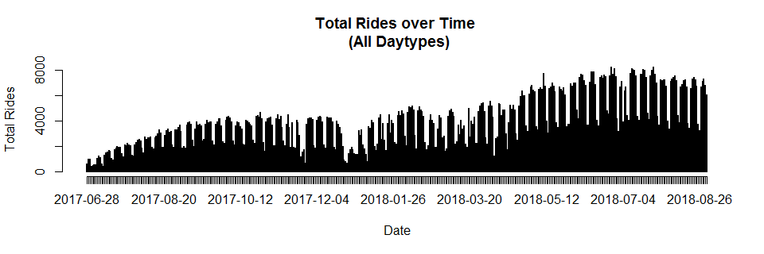
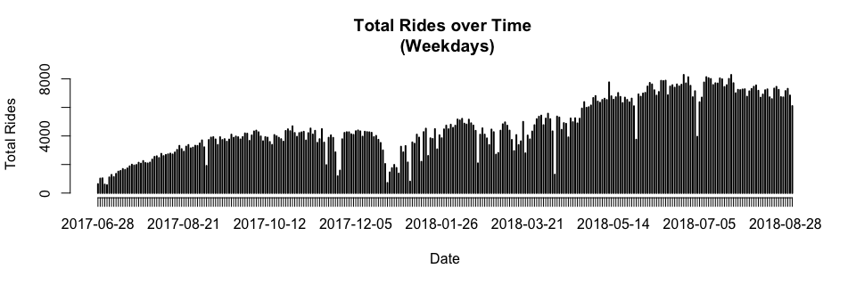
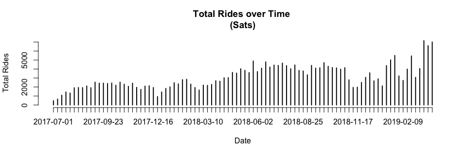
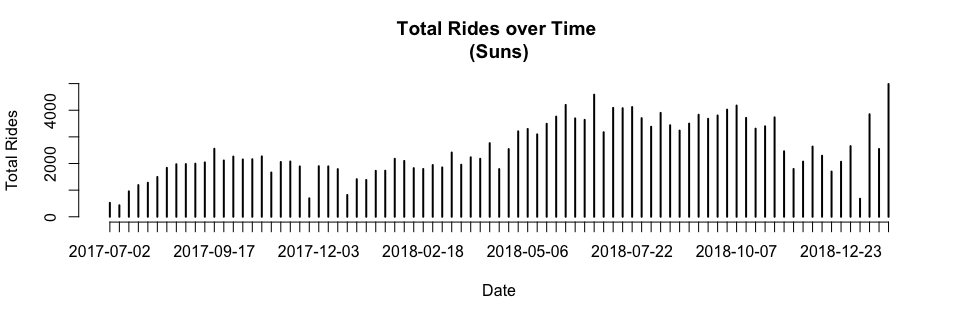

### Load Data

```r
setwd("~/Ford-GoBike/Clean Data")
load("FGB.RData")
```


```r
abs=table(FGB[["start city"]][!is.na(FGB[["start city"]]) & !is.na(FGB[["end city"]])],
FGB[["end city"]][!is.na(FGB[["start city"]]) & !is.na(FGB[["end city"]])])
abs=cbind(abs,"Origin Total"=apply(abs,1,sum))
abs=rbind(abs,"Destination Total"=apply(abs,2,sum))
abs[,]=prettyNum(abs,",")
abs
```

```
##                   Berkeley Emeryville Oakland   San Francisco San Jose
## Berkeley          "79,728" "4,054"    "14,673"  "12"          "0"     
## Emeryville        "2,734"  "5,126"    "6,017"   "15"          "0"     
## Oakland           "11,267" "7,520"    "217,810" "60"          "2"     
## San Francisco     "7"      "5"        "25"      "1,257,951"   "1"     
## San Jose          "0"      "0"        "0"       "1"           "72,149"
## Destination Total "93,736" "16,705"   "238,525" "1,258,039"   "72,152"
##                   Origin Total
## Berkeley          "98,467"    
## Emeryville        "13,892"    
## Oakland           "236,659"   
## San Francisco     "1,257,989" 
## San Jose          "72,150"    
## Destination Total "1,679,157"
```
Note: Rows=Origins, Columns=Destinations

<!-- #sum(na.omit(FGB[["start city"]]=="Berkeley" & FGB[["end city"]]=="Emeryville")) -->
<!-- #Rows=Origins -->
<!-- #Columns=Destination -->


```r
options(scipen=999)
rel=round(table(FGB[["start city"]][!is.na(FGB[["start city"]]) & !is.na(FGB[["end city"]])],
      FGB[["end city"]][!is.na(FGB[["start city"]]) & !is.na(FGB[["end city"]])])/sum(
        table(FGB[["start city"]][!is.na(FGB[["start city"]]) & !is.na(FGB[["end city"]])],
              FGB[["end city"]][!is.na(FGB[["start city"]]) & !is.na(FGB[["end city"]])])
      ),3)
rel=cbind(rel,"Origin Total"=apply(rel,1,sum))
rel=rbind(rel,"Destination Total"=apply(rel,2,sum))
rel
```

```
##                   Berkeley Emeryville Oakland San Francisco San Jose
## Berkeley             0.047      0.002   0.009         0.000    0.000
## Emeryville           0.002      0.003   0.004         0.000    0.000
## Oakland              0.007      0.004   0.130         0.000    0.000
## San Francisco        0.000      0.000   0.000         0.749    0.000
## San Jose             0.000      0.000   0.000         0.000    0.043
## Destination Total    0.056      0.009   0.143         0.749    0.043
##                   Origin Total
## Berkeley                 0.058
## Emeryville               0.009
## Oakland                  0.141
## San Francisco            0.749
## San Jose                 0.043
## Destination Total        1.000
```
Note: Rows=Origins, Columns=Destinations

2 Dimension Filter Functions

```r
filter_data=function(dt=FGB,var1,var2){
  dt=dt[!is.na(dt[[var1]]) & !is.na(dt[[var2]]) & dt[[var1]]!="NULL" & dt[[var2]]!="NULL"]
  return(dt)
}
table_data=function(dt=FGB,var1,var2,col1,col2,select1,select2){
  out=paste(
    dt[dt[[col1]]==select1][[var1]],
    dt[dt[[col2]]==select2][[var2]],sep=" , ")
  return(table(out))
}
```

### Popular ods by City

```r
ss=filter_data(FGB,"start_station_name","end_station_name")
x1=as.matrix(sort(table_data(ss,"start_station_name","end_station_name","start city","end city","San Francisco","San Francisco"),decreasing=T)[1:10])
x2=as.matrix(sort(table_data(ss,"start_station_name","end_station_name","start city","end city","Oakland","Oakland"),decreasing=T)[1:10])
x3=as.matrix(sort(table_data(ss,"start_station_name","end_station_name","start city","end city","Berkeley","Berkeley"),decreasing=T)[1:10])
x4=as.matrix(sort(table_data(ss,"start_station_name","end_station_name","start city","end city","San Jose","San Jose"),decreasing=T)[1:10])
x5=as.matrix(sort(table_data(ss,"start_station_name","end_station_name","start city","end city","Emeryville","Emeryville"),decreasing=T)[1:10])
ods=cbind(rownames(x1),x1,
              rownames(x2),x2,
              rownames(x3),x3,
              rownames(x4),x4,
              rownames(x5),x5)
rownames(ods)=NULL
colnames(ods)=c(rep("San Francisco",2),rep("Oakland",2),rep("Berkeley",2),rep("san Jose",2),rep("Emeryville",2))
colnames(x1)="San Francisco";colnames(x2)="Oakland";colnames(x3)="Berkeley";colnames(x4)="San Jose";colnames(x5)="Emeryville"
x1;x2;x3;x4;x5
```

```
##                                                                                                   San Francisco
## San Francisco Ferry Building (Harry Bridges Plaza) , The Embarcadero at Sansome St                         9028
## The Embarcadero at Sansome St , Steuart St at Market St                                                    5129
## Berry St at 4th St , San Francisco Ferry Building (Harry Bridges Plaza)                                    4858
## The Embarcadero at Sansome St , San Francisco Ferry Building (Harry Bridges Plaza)                         4416
## San Francisco Ferry Building (Harry Bridges Plaza) , Berry St at 4th St                                    3688
## Steuart St at Market St , The Embarcadero at Sansome St                                                    3606
## The Embarcadero at Sansome St , The Embarcadero at Sansome St                                              3054
## Howard St at Beale St , San Francisco Caltrain (Townsend St at 4th St)                                     3012
## Market St at 10th St , San Francisco Caltrain Station 2  (Townsend St at 4th St)                           3011
## Montgomery St BART Station (Market St at 2nd St) , San Francisco Caltrain (Townsend St at 4th St)          2833
```

```
##                                                             Oakland
## 19th Street BART Station , Bay Pl at Vernon St                 3913
## Grand Ave at Perkins St , 19th Street BART Station             3798
## Bay Pl at Vernon St , 19th Street BART Station                 3791
## Lake Merritt BART Station , El Embarcadero at Grand Ave        2215
## 19th Street BART Station , Lakeshore Ave at Trestle Glen Rd    2009
## El Embarcadero at Grand Ave , Grand Ave at Perkins St          1747
## 19th Street BART Station , Genoa St at 55th St                 1745
## Broadway at 40th St , MacArthur BART Station                   1723
## 2nd Ave at E 18th St , 2nd Ave at E 18th St                    1566
## 2nd Ave at E 18th St , College Ave at Harwood Ave              1557
```

```
##                                                             Berkeley
## Bancroft Way at College Ave , Fulton St at Bancroft Way         2676
## Bancroft Way at Telegraph Ave , Berkeley Civic Center           2023
## Bancroft Way at College Ave , Milvia St at Derby St             1241
## Derby St at College Ave , Bancroft Way at Telegraph Ave         1116
## Telegraph Ave at Ashby Ave , Downtown Berkeley BART             1068
## Downtown Berkeley BART , Bancroft Way at College Ave            1011
## College Ave at Alcatraz Ave , Bancroft Way at Telegraph Ave      996
## Downtown Berkeley BART , Downtown Berkeley BART                  968
## Ashby BART Station , Haste St at Telegraph Ave                   917
## Bancroft Way at Telegraph Ave , Ashby BART Station               889
```

```
##                                                           San Jose
## 5th St at Virginia St , San Fernando at 7th St                1193
## San Fernando at 7th St , 5th St at Virginia St                 808
## San Fernando St at 4th St , Ryland Park                        706
## San Jose Diridon Station , San Fernando St at 4th St           682
## Ryland Park , San Fernando St at 4th St                        651
## Ryland Park , San Fernando at 7th St                           626
## San Jose Diridon Station , Santa Clara St at Almaden Blvd      571
## 5th St at Virginia St , San Salvador St at 9th St              536
## Santa Clara St at Almaden Blvd , San Jose Diridon Station      536
## San Jose City Hall , San Jose Diridon Station                  520
```

```
##                                                  Emeryville
## Horton St at 40th St , 65th St at Hollis St             771
## Horton St at 40th St , Horton St at 40th St             638
## Adeline St at 40th St , 47th St at San Pablo Ave        562
## Emeryville Town Hall , 65th St at Hollis St             525
## Adeline St at 40th St , 65th St at Hollis St            408
## 59th St at Horton St , Adeline St at 40th St            398
## Emeryville Town Hall , Horton St at 40th St             378
## 65th St at Hollis St , Emeryville Town Hall             345
## 47th St at San Pablo Ave , 65th St at Hollis St         344
## 65th St at Hollis St , Adeline St at 40th St            344
```

```r
#as.data.table(ods)
```

1 Dimension Filter Functions

```r
filter_data_1d=function(dt=FGB,var1,col=c(),vars=c(),not=T){
  if (length(vars)==0 & length(col)==0){
    dt=dt[!is.na(dt[[var1]]) & dt[[var1]]!="NULL"]
  } else{
    if (not){
      dt=dt[!is.na(dt[[var1]]) & dt[[var1]]!="NULL" & !(dt[[col]] %in% vars)]
    } else {
      dt=dt[!is.na(dt[[var1]]) & dt[[var1]]!="NULL" & (dt[[col]] %in% vars)]
    }
  }
  return(dt)
}
table_data_1d=function(dt=FGB,var1,col1,select1){
  out=paste(
    dt[dt[[col1]]==select1][[var1]])
  return(table(out))
}
```

### Popular Origins by City

```r
ss=filter_data_1d(FGB,"start_station_name")

x1=as.matrix(sort(table_data_1d(ss,"start_station_name","start city","San Francisco"),decreasing=T)[1:10])
x2=as.matrix(sort(table_data_1d(ss,"start_station_name","start city","Oakland"),decreasing=T)[1:10])
x3=as.matrix(sort(table_data_1d(ss,"start_station_name","start city","Berkeley"),decreasing=T)[1:10])
x4=as.matrix(sort(table_data_1d(ss,"start_station_name","start city","San Jose"),decreasing=T)[1:10])
x5=as.matrix(sort(table_data_1d(ss,"start_station_name","start city","Emeryville"),decreasing=T)[1:10])
origins=cbind(rownames(x1),x1,
              rownames(x2),x2,
              rownames(x3),x3,
              rownames(x4),x4,
              rownames(x5),x5)
rownames(origins)=NULL
colnames(origins)=c(rep("San Francisco",2),rep("Oakland",2),rep("Berkeley",2),rep("san Jose",2),rep("Emeryville",2))
colnames(x1)="San Francisco";colnames(x2)="Oakland";colnames(x3)="Berkeley";colnames(x4)="San Jose";colnames(x5)="Emeryville"
x1;x2;x3;x4;x5
```

```
##                                                           San Francisco
## San Francisco Ferry Building (Harry Bridges Plaza)                41301
## San Francisco Caltrain (Townsend St at 4th St)                    36451
## The Embarcadero at Sansome St                                     36328
## San Francisco Caltrain Station 2  (Townsend St at 4th St)         35291
## Market St at 10th St                                              34158
## Berry St at 4th St                                                33798
## Montgomery St BART Station (Market St at 2nd St)                  32738
## Powell St BART Station (Market St at 4th St)                      30337
## Steuart St at Market St                                           28108
## Howard St at Beale St                                             27602
```

```
##                             Oakland
## 19th Street BART Station      17294
## MacArthur BART Station        13435
## Lake Merritt BART Station     10121
## El Embarcadero at Grand Ave    9832
## Grand Ave at Perkins St        9406
## Bay Pl at Vernon St            9298
## Frank H Ogawa Plaza            8957
## 2nd Ave at E 18th St           8530
## Grand Ave at Webster St        8441
## West Oakland BART Station      7186
```

```
##                               Berkeley
## Bancroft Way at College Ave      11592
## Bancroft Way at Telegraph Ave     8213
## Downtown Berkeley BART            6953
## Ashby BART Station                6279
## Haste St at Telegraph Ave         5355
## Parker St at Fulton St            4058
## Berkeley Civic Center             3800
## Telegraph Ave at Ashby Ave        3796
## Hearst Ave at Euclid Ave          3364
## Fulton St at Bancroft Way         2994
```

```
##                                San Jose
## San Jose Diridon Station           6381
## San Fernando St at 4th St          5096
## Ryland Park                        4225
## 5th St at Virginia St              4204
## San Fernando at 7th St             3506
## Paseo De San Antonio at 2nd St     3043
## San Salvador St at 9th St          2947
## Julian St at The Alameda           2717
## San Jose City Hall                 2682
## San Pedro Square                   2508
```

```
##                           Emeryville
## 65th St at Hollis St            2200
## Horton St at 40th St            2185
## Adeline St at 40th St           1896
## Emeryville Town Hall            1525
## 59th St at Horton St            1335
## Doyle St at 59th St             1174
## Stanford Ave at Hollis St       1082
## Emeryville Public Market        1046
## 47th St at San Pablo Ave         985
## 53rd St at Hollis St             481
```

```r
#as.data.table(origins)
```

### Popular Destinations by City

```r
ss=filter_data_1d(FGB,"end_station_name")
x1=as.matrix(sort(table_data_1d(ss,"end_station_name","end city","San Francisco"),decreasing=T)[1:10])
x2=as.matrix(sort(table_data_1d(ss,"end_station_name","end city","Oakland"),decreasing=T)[1:10])
x3=as.matrix(sort(table_data_1d(ss,"end_station_name","end city","Berkeley"),decreasing=T)[1:10])
x4=as.matrix(sort(table_data_1d(ss,"end_station_name","end city","San Jose"),decreasing=T)[1:10])
x5=as.matrix(sort(table_data_1d(ss,"end_station_name","end city","Emeryville"),decreasing=T)[1:10])
destinations=cbind(rownames(x1),x1,
              rownames(x2),x2,
              rownames(x3),x3,
              rownames(x4),x4,
              rownames(x5),x5)
rownames(destinations)=NULL
colnames(destinations)=c(rep("San Francisco",2),rep("Oakland",2),rep("Berkeley",2),rep("san Jose",2),rep("Emeryville",2))
colnames(x1)="San Francisco";colnames(x2)="Oakland";colnames(x3)="Berkeley";colnames(x4)="San Jose";colnames(x5)="Emeryville"
x1;x2;x3;x4;x5
```

```
##                                                           San Francisco
## San Francisco Caltrain (Townsend St at 4th St)                    47375
## San Francisco Ferry Building (Harry Bridges Plaza)                46835
## San Francisco Caltrain Station 2  (Townsend St at 4th St)         44716
## The Embarcadero at Sansome St                                     43383
## Montgomery St BART Station (Market St at 2nd St)                  37973
## Market St at 10th St                                              32757
## Berry St at 4th St                                                32697
## Powell St BART Station (Market St at 4th St)                      32357
## Steuart St at Market St                                           28033
## Powell St BART Station (Market St at 5th St)                      25709
```

```
##                             Oakland
## 19th Street BART Station      18324
## MacArthur BART Station        14282
## El Embarcadero at Grand Ave   10854
## Grand Ave at Perkins St       10450
## 2nd Ave at E 18th St           9342
## Frank H Ogawa Plaza            9093
## Bay Pl at Vernon St            8814
## Grand Ave at Webster St        8360
## West Oakland BART Station      7223
## Lake Merritt BART Station      7171
```

```
##                               Berkeley
## Downtown Berkeley BART           10455
## Bancroft Way at Telegraph Ave     7127
## Ashby BART Station                6768
## Berkeley Civic Center             4440
## Parker St at Fulton St            4336
## Haste St at Telegraph Ave         3952
## Bancroft Way at College Ave       3905
## Fulton St at Bancroft Way         3659
## Telegraph Ave at Ashby Ave        3608
## Addison St at Fourth St           3367
```

```
##                                San Jose
## San Jose Diridon Station           6511
## San Fernando St at 4th St          5372
## Ryland Park                        4048
## San Fernando at 7th St             3992
## 5th St at Virginia St              3617
## Paseo De San Antonio at 2nd St     3217
## San Salvador St at 9th St          3128
## Julian St at The Alameda           2703
## The Alameda at Bush St             2524
## San Pedro Square                   2482
```

```
##                           Emeryville
## 65th St at Hollis St            3348
## Horton St at 40th St            2439
## Adeline St at 40th St           1987
## 59th St at Horton St            1595
## Emeryville Town Hall            1516
## Emeryville Public Market        1324
## Stanford Ave at Hollis St       1301
## Doyle St at 59th St             1264
## 47th St at San Pablo Ave        1151
## 53rd St at Hollis St             798
```

```r
#as.data.table(destinations)
```


### Total Rides Over Time

```r
ss=filter_data_1d(FGB,"start_date",col="start_daytype")[['start_date']]
plot(table(ss),xlab="Date",ylab="Total Rides",main="Total Rides over Time \n (All Daytypes)")
```

<!-- -->

```r
plot(table(filter_data_1d(FGB,"start_date",col="start_daytype",vars=c("Saturday","Sunday"),not=T)[["start_date"]]),xlab="Date",ylab="Total Rides",main="Total Rides over Time \n (Weekdays)")
```

<!-- -->


```r
plot(table(filter_data_1d(FGB,"start_date",col="start_daytype",vars=c("Saturday"),not=F)[["start_date"]]),xlab="Date",ylab="Total Rides",main="Total Rides over Time \n (Saturdays)")
```

<!-- -->


```r
plot(table(filter_data_1d(FGB,"start_date",col="start_daytype",vars=c("Sunday"),not=F)[["start_date"]]),xlab="Date",ylab="Total Rides",main="Total Rides over Time \n (Sundays)")
```

<!-- -->
