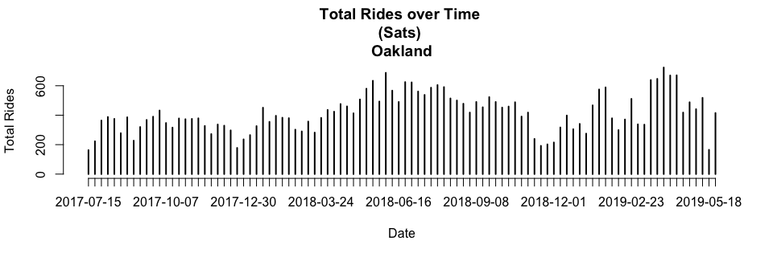

### Load Data

```r
setwd("~/Desktop/Projects/Ford-GoBike/Clean Data")
load("FGB.RData")
```

```r
abs=table(FGB[["StartCity"]][!is.na(FGB[["StartCity"]]) & !is.na(FGB[["EndCity"]])],
FGB[["EndCity"]][!is.na(FGB[["StartCity"]]) & !is.na(FGB[["EndCity"]])])
abs=cbind(abs,"Origin Total"=apply(abs,1,sum))
abs=rbind(abs,"Destination Total"=apply(abs,2,sum))
abs[,]=prettyNum(abs,",")
abs
```

```
##                   Berkeley  Emeryville Oakland   San Francisco San Jose 
## Berkeley          "139,867" "6,561"    "22,275"  "15"          "0"      
## Emeryville        "4,392"   "7,246"    "8,994"   "15"          "0"      
## Oakland           "17,308"  "10,981"   "306,694" "79"          "3"      
## San Francisco     "8"       "5"        "32"      "1,878,313"   "1"      
## San Jose          "0"       "0"        "0"       "1"           "112,017"
## Destination Total "161,575" "24,793"   "337,995" "1,878,423"   "112,021"
##                   Origin Total
## Berkeley          "168,718"   
## Emeryville        "20,647"    
## Oakland           "335,065"   
## San Francisco     "1,878,359" 
## San Jose          "112,018"   
## Destination Total "2,514,807"
```
Note: Rows=Origins, Columns=Destinations

<!-- #sum(na.omit(FGB[["StartCity"]]=="Berkeley" & FGB[["EndCity"]]=="Emeryville")) -->
<!-- #Rows=Origins -->
<!-- #Columns=Destination -->


```r
options(scipen=999)
rel=round(table(FGB[["StartCity"]][!is.na(FGB[["StartCity"]]) & !is.na(FGB[["EndCity"]])],
      FGB[["EndCity"]][!is.na(FGB[["StartCity"]]) & !is.na(FGB[["EndCity"]])])/sum(
        table(FGB[["StartCity"]][!is.na(FGB[["StartCity"]]) & !is.na(FGB[["EndCity"]])],
              FGB[["EndCity"]][!is.na(FGB[["StartCity"]]) & !is.na(FGB[["EndCity"]])])
      ),3)
rel=cbind(rel,"Origin Total"=apply(rel,1,sum))
rel=rbind(rel,"Destination Total"=apply(rel,2,sum))
rel
```

```
##                   Berkeley Emeryville Oakland San Francisco San Jose
## Berkeley             0.056      0.003   0.009         0.000    0.000
## Emeryville           0.002      0.003   0.004         0.000    0.000
## Oakland              0.007      0.004   0.122         0.000    0.000
## San Francisco        0.000      0.000   0.000         0.747    0.000
## San Jose             0.000      0.000   0.000         0.000    0.045
## Destination Total    0.065      0.010   0.135         0.747    0.045
##                   Origin Total
## Berkeley                 0.068
## Emeryville               0.009
## Oakland                  0.133
## San Francisco            0.747
## San Jose                 0.045
## Destination Total        1.002
```
Note: Rows=Origins, Columns=Destinations

2 Dimension Filter Functions

```r
filter_data=function(dt=FGB,var1,var2){
  dt=dt[!is.na(dt[[var1]]) & !is.na(dt[[var2]]) & dt[[var1]]!="NULL" & dt[[var2]]!="NULL"]
  return(dt)
}
table_data=function(dt=FGB,var1,var2,col1,col2,select1,select2){
  out=paste(
    dt[dt[[col1]]==select1][[var1]],
    dt[dt[[col2]]==select2][[var2]],sep=" , ")
  return(table(out))
}
```

### Popular ods by City

```r
ss=filter_data(FGB,"StartStationName","EndStationName")
x1=as.matrix(sort(table_data(ss,"StartStationName","EndStationName","StartCity","EndCity","San Francisco","San Francisco"),decreasing=T)[1:10])
rownames(x1)[10]=paste0(strsplit(rownames(x1)[10],"")[[1]][1:(length(strsplit(rownames(x1)[10],"")[[1]])-24)],collapse="")
x2=as.matrix(sort(table_data(ss,"StartStationName","EndStationName","StartCity","EndCity","Oakland","Oakland"),decreasing=T)[1:10])
x3=as.matrix(sort(table_data(ss,"StartStationName","EndStationName","StartCity","EndCity","Berkeley","Berkeley"),decreasing=T)[1:10])
x4=as.matrix(sort(table_data(ss,"StartStationName","EndStationName","StartCity","EndCity","San Jose","San Jose"),decreasing=T)[1:10])
x5=as.matrix(sort(table_data(ss,"StartStationName","EndStationName","StartCity","EndCity","Emeryville","Emeryville"),decreasing=T)[1:10])
ods=cbind(rownames(x1),x1,
              rownames(x2),x2,
              rownames(x3),x3,
              rownames(x4),x4,
              rownames(x5),x5)
rownames(ods)=NULL
colnames(ods)=c(rep("San Francisco",2),rep("Oakland",2),rep("Berkeley",2),rep("san Jose",2),rep("Emeryville",2))
colnames(x1)="San Francisco";colnames(x2)="Oakland";colnames(x3)="Berkeley";colnames(x4)="San Jose";colnames(x5)="Emeryville"
x1;x2;x3;x4;x5
```

```
##                                                                                    San Francisco
## San Francisco Ferry Building (Harry Bridges Plaza) , The Embarcadero at Sansome St         11382
## The Embarcadero at Sansome St , Steuart St at Market St                                     6911
## Berry St at 4th St , San Francisco Ferry Building (Harry Bridges Plaza)                     6587
## The Embarcadero at Sansome St , San Francisco Ferry Building (Harry Bridges Plaza)          5733
## San Francisco Ferry Building (Harry Bridges Plaza) , Berry St at 4th St                     4849
## Steuart St at Market St , The Embarcadero at Sansome St                                     4848
## Market St at 10th St , San Francisco Caltrain Station 2  (Townsend St at 4th St)            4223
## Montgomery St BART Station (Market St at 2nd St) , S Park St at 3rd St                      3965
## Townsend St at 7th St , San Francisco Caltrain Station 2  (Townsend St at 4th St)           3938
## The Embarcadero at Sansome St , The E                                                       3883
```

```
##                                                         Oakland
## Grand Ave at Perkins St , 19th Street BART Station         5642
## 19th Street BART Station , Bay Pl at Vernon St             5267
## Bay Pl at Vernon St , 19th Street BART Station             4984
## Lake Merritt BART Station , El Embarcadero at Grand Ave    3121
## MacArthur BART Station , Webster St at 2nd St              2778
## 2nd Ave at E 18th St , 2nd Ave at E 18th St                2381
## Broadway at 40th St , MacArthur BART Station               2371
## 19th Street BART Station , Genoa St at 55th St             2322
## Telegraph Ave at 27th St , Grand Ave at Webster St         2240
## 2nd Ave at E 18th St , College Ave at Harwood Ave          2203
```

```
##                                                             Berkeley
## Bancroft Way at College Ave , Fulton St at Bancroft Way         2941
## Bancroft Way at Telegraph Ave , Berkeley Civic Center           2548
## Bancroft Way at College Ave , Ashby BART Station                2483
## College Ave at Alcatraz Ave , Bancroft Way at Telegraph Ave     1954
## North Berkeley BART Station , Parker St at Fulton St            1616
## Downtown Berkeley BART , Downtown Berkeley BART                 1372
## Downtown Berkeley BART , Milvia St at Derby St                  1371
## Telegraph Ave at Ashby Ave , Downtown Berkeley BART             1306
## Ashby BART Station , Bancroft Way at Telegraph Ave              1286
## Bancroft Way at College Ave , North Berkeley BART Station       1274
```

```
##                                                      San Jose
## 5th St at Virginia St , San Fernando St at 4th St        1638
## San Fernando St at 4th St , 5th St at Virginia St        1570
## 5th St at Virginia St , San Fernando at 7th St           1240
## 5th St at Virginia St , San Salvador St at 9th St        1183
## San Fernando St at 4th St , Ryland Park                  1145
## Ryland Park , San Fernando St at 4th St                  1017
## San Salvador St at 9th St , 5th St at Virginia St         916
## San Jose Diridon Station , San Fernando St at 4th St      901
## San Fernando at 7th St , 5th St at Virginia St            808
## Julian St at The Alameda , The Alameda at Bush St         778
```

```
##                                                  Emeryville
## Horton St at 40th St , 65th St at Hollis St             954
## Horton St at 40th St , Horton St at 40th St             831
## Adeline St at 40th St , 47th St at San Pablo Ave        718
## 65th St at Hollis St , Emeryville Public Market         613
## Emeryville Town Hall , 65th St at Hollis St             593
## Adeline St at 40th St , 59th St at Horton St            575
## 47th St at San Pablo Ave , 65th St at Hollis St         567
## 59th St at Horton St , Adeline St at 40th St            565
## 65th St at Hollis St , Adeline St at 40th St            521
## Horton St at 40th St , 59th St at Horton St             515
```

```r
#as.data.table(ods)
```

1 Dimension Filter Functions


```r
filter_data_1d=function(dt=FGB,var1,col=c(),vars=c(),not=T){
  if (length(vars)==0 & length(col)==0){
    dt=dt[!is.na(dt[[var1]]) & dt[[var1]]!="NULL"]
  } else{
    if (not){
      dt=dt[!is.na(dt[[var1]]) & !(dt[[col]] %in% vars)]
    } else {
      dt=dt[!is.na(dt[[var1]]) & (dt[[col]] %in% vars)]
    }
  }
  return(dt)
}
table_data_1d=function(dt=FGB,var1,col1,select1){
  out=paste(
    dt[dt[[col1]]==select1][[var1]])
  return(table(out))
}
```

### Popular Origins by City

```r
ss=filter_data_1d(FGB,"StartStationName")

x1=as.matrix(sort(table_data_1d(ss,"StartStationName","StartCity","San Francisco"),decreasing=T)[1:10])
x2=as.matrix(sort(table_data_1d(ss,"StartStationName","StartCity","Oakland"),decreasing=T)[1:10])
x3=as.matrix(sort(table_data_1d(ss,"StartStationName","StartCity","Berkeley"),decreasing=T)[1:10])
x4=as.matrix(sort(table_data_1d(ss,"StartStationName","StartCity","San Jose"),decreasing=T)[1:10])
x5=as.matrix(sort(table_data_1d(ss,"StartStationName","StartCity","Emeryville"),decreasing=T)[1:10])
origins=cbind(rownames(x1),x1,
              rownames(x2),x2,
              rownames(x3),x3,
              rownames(x4),x4,
              rownames(x5),x5)
rownames(origins)=NULL
colnames(origins)=c(rep("San Francisco",2),rep("Oakland",2),rep("Berkeley",2),rep("san Jose",2),rep("Emeryville",2))
colnames(x1)="San Francisco";colnames(x2)="Oakland";colnames(x3)="Berkeley";colnames(x4)="San Jose";colnames(x5)="Emeryville"
x1;x2;x3;x4;x5
```

```
##                                                           San Francisco
## San Francisco Ferry Building (Harry Bridges Plaza)                56763
## San Francisco Caltrain Station 2  (Townsend St at 4th St)         53447
## Market St at 10th St                                              50731
## San Francisco Caltrain (Townsend St at 4th St)                    50693
## The Embarcadero at Sansome St                                     49332
## Berry St at 4th St                                                47805
## Montgomery St BART Station (Market St at 2nd St)                  46631
## Powell St BART Station (Market St at 4th St)                      44911
## Steuart St at Market St                                           40340
## Howard St at Beale St                                             39095
```

```
##                             Oakland
## 19th Street BART Station      23438
## MacArthur BART Station        17598
## Lake Merritt BART Station     13978
## Grand Ave at Perkins St       13119
## El Embarcadero at Grand Ave   12978
## Frank H Ogawa Plaza           12459
## Bay Pl at Vernon St           12331
## 2nd Ave at E 18th St          12067
## Grand Ave at Webster St       11504
## West Oakland BART Station     11267
```

```
##                               Berkeley
## Bancroft Way at College Ave      18665
## Bancroft Way at Telegraph Ave    13946
## Downtown Berkeley BART           11585
## Ashby BART Station                9786
## Haste St at Telegraph Ave         7911
## Parker St at Fulton St            6692
## Hearst Ave at Euclid Ave          6626
## Berkeley Civic Center             6364
## Telegraph Ave at Ashby Ave        5525
## Fulton St at Bancroft Way         5352
```

```
##                                San Jose
## San Fernando St at 4th St          9289
## San Jose Diridon Station           8603
## 5th St at Virginia St              8426
## Ryland Park                        6243
## San Salvador St at 9th St          5120
## Julian St at The Alameda           4596
## Paseo De San Antonio at 2nd St     4297
## The Alameda at Bush St             3950
## San Pedro Square                   3622
## San Jose City Hall                 3584
```

```
##                           Emeryville
## 65th St at Hollis St            3091
## Horton St at 40th St            3036
## Adeline St at 40th St           2779
## 59th St at Horton St            2136
## Emeryville Town Hall            2055
## Emeryville Public Market        1936
## Stanford Ave at Hollis St       1738
## Doyle St at 59th St             1715
## 47th St at San Pablo Ave        1686
## 53rd St at Hollis St             767
```

```r
#as.data.table(origins)
```

### Popular Destinations by City

```r
ss=filter_data_1d(FGB,"EndStationName")
x1=as.matrix(sort(table_data_1d(ss,"EndStationName","EndCity","San Francisco"),decreasing=T)[1:10])
x2=as.matrix(sort(table_data_1d(ss,"EndStationName","EndCity","Oakland"),decreasing=T)[1:10])
x3=as.matrix(sort(table_data_1d(ss,"EndStationName","EndCity","Berkeley"),decreasing=T)[1:10])
x4=as.matrix(sort(table_data_1d(ss,"EndStationName","EndCity","San Jose"),decreasing=T)[1:10])
x5=as.matrix(sort(table_data_1d(ss,"EndStationName","EndCity","Emeryville"),decreasing=T)[1:10])
destinations=cbind(rownames(x1),x1,
              rownames(x2),x2,
              rownames(x3),x3,
              rownames(x4),x4,
              rownames(x5),x5)
rownames(destinations)=NULL
colnames(destinations)=c(rep("San Francisco",2),rep("Oakland",2),rep("Berkeley",2),rep("san Jose",2),rep("Emeryville",2))
colnames(x1)="San Francisco";colnames(x2)="Oakland";colnames(x3)="Berkeley";colnames(x4)="San Jose";colnames(x5)="Emeryville"
x1;x2;x3;x4;x5
```

```
##                                                           San Francisco
## San Francisco Caltrain Station 2  (Townsend St at 4th St)         68902
## San Francisco Ferry Building (Harry Bridges Plaza)                64914
## San Francisco Caltrain (Townsend St at 4th St)                    63930
## The Embarcadero at Sansome St                                     58505
## Montgomery St BART Station (Market St at 2nd St)                  53131
## Market St at 10th St                                              49648
## Powell St BART Station (Market St at 4th St)                      47389
## Berry St at 4th St                                                46435
## Steuart St at Market St                                           40576
## Powell St BART Station (Market St at 5th St)                      37058
```

```
##                             Oakland
## 19th Street BART Station      25949
## MacArthur BART Station        19410
## El Embarcadero at Grand Ave   14801
## Grand Ave at Perkins St       14239
## 2nd Ave at E 18th St          13143
## Frank H Ogawa Plaza           12605
## Bay Pl at Vernon St           11883
## West Oakland BART Station     11604
## Grand Ave at Webster St       11519
## Lake Merritt BART Station     10087
```

```
##                               Berkeley
## Downtown Berkeley BART           15939
## Bancroft Way at Telegraph Ave    12608
## Ashby BART Station               10745
## Parker St at Fulton St            7468
## Berkeley Civic Center             7302
## Bancroft Way at College Ave       7043
## Haste St at Telegraph Ave         6071
## Fulton St at Bancroft Way         6008
## MLK Jr Way at University Ave      5487
## Telegraph Ave at Ashby Ave        5335
```

```
##                                San Jose
## San Fernando St at 4th St          9638
## San Jose Diridon Station           8698
## 5th St at Virginia St              7668
## Ryland Park                        6028
## San Salvador St at 9th St          5385
## Julian St at The Alameda           4621
## Paseo De San Antonio at 2nd St     4491
## The Alameda at Bush St             4203
## San Fernando at 7th St             3992
## San Pedro Square                   3620
```

```
##                           Emeryville
## 65th St at Hollis St            4573
## Horton St at 40th St            3354
## Adeline St at 40th St           3018
## 59th St at Horton St            2669
## Emeryville Public Market        2452
## Stanford Ave at Hollis St       2078
## Emeryville Town Hall            2028
## Doyle St at 59th St             1954
## 47th St at San Pablo Ave        1949
## 53rd St at Hollis St            1182
```

```r
#as.data.table(destinations)
```


### Total Rides Over Time

```r
ss=filter_data_1d(FGB,"StartDate",col="StartDayType")[['StartDate']]
```


```r
plot(table(ss),xlab="Date",ylab="Total Rides",main="Total Rides over Time \n(All Daytypes)")
```

<!-- -->


```r
plot(table(filter_data_1d(FGB,"StartDate",col="StartDayType",vars=wday(c(1,7),T),not=T)[["StartDate"]]),xlab="Date",ylab="Total Rides",main="Total Rides over Time \n(Weekdays)")
```

<!-- -->


```r
plot(table(filter_data_1d(FGB,"StartDate",col="StartDayType",vars=c("Sat"),not=F)[["StartDate"]]),xlab="Date",ylab="Total Rides",main="Total Rides over Time \n(Sats)")
```

<!-- -->


```r
plot(table(filter_data_1d(FGB,"StartDate",col="StartDayType",vars=c("Sun"),not=F)[["StartDate"]]),xlab="Date",ylab="Total Rides",main="Total Rides over Time \n(Suns)")
```

<!-- -->


```r
berk=FGB[FGB[["StartCity"]]=="Berkeley" & FGB[["EndCity"]]=="Berkeley",]
ss=filter_data_1d(berk,"StartDate",col="StartDayType")[['StartDate']]
```

```r
plot(table(ss),xlab="Date",ylab="Total Rides",main="Total Rides over Time \n(All Daytypes) \nBerkeley")
```

<!-- -->

```r
plot(table(filter_data_1d(berk,"StartDate",col="StartDayType",vars=c("Sat"),not=F)[["StartDate"]]),
     xlab="Date",ylab="Total Rides",main="Total Rides over Time \n(Sats) \nBerkeley")
```

<!-- -->

```r
plot(table(filter_data_1d(berk,"StartDate",col="StartDayType",vars=c("Sun"),not=F)[["StartDate"]]),
     xlab="Date",ylab="Total Rides",main="Total Rides over Time \n(Suns) \nBerkeley")
```

<!-- -->

```r
sanjose=FGB[FGB[["StartCity"]]=="San Jose" & FGB[["EndCity"]]=="San Jose",]
ss=filter_data_1d(sanjose,"StartDate",col="StartDayType")[['StartDate']]
```

```r
plot(table(ss),xlab="Date",ylab="Total Rides",main="Total Rides over Time \n(All Daytypes) \nSan Jose")
```

<!-- -->

```r
plot(table(filter_data_1d(sanjose,"StartDate",col="StartDayType",vars=c("Sat"),not=F)[["StartDate"]]),
     xlab="Date",ylab="Total Rides",main="Total Rides over Time \n(Sats) \nSan Jose")
```

<!-- -->

```r
plot(table(filter_data_1d(sanjose,"StartDate",col="StartDayType",vars=c("Sun"),not=F)[["StartDate"]]),
     xlab="Date",ylab="Total Rides",main="Total Rides over Time \n(Suns) \nSan Jose")
```

<!-- -->

```r
sanFrancisco=FGB[FGB[["StartCity"]]=="San Francisco" & FGB[["EndCity"]]=="San Francisco",]
ss=filter_data_1d(sanFrancisco,"StartDate",col="StartDayType")[['StartDate']]
```

```r
plot(table(ss),xlab="Date",ylab="Total Rides",main="Total Rides over Time \n(All Daytypes) \nSan Francisco")
```

<!-- -->

```r
plot(table(filter_data_1d(sanFrancisco,"StartDate",col="StartDayType",vars=c("Sat"),not=F)[["StartDate"]]),
     xlab="Date",ylab="Total Rides",main="Total Rides over Time \n(Sats) \nSan Francisco")
```

<!-- -->

```r
plot(table(filter_data_1d(sanFrancisco,"StartDate",col="StartDayType",vars=c("Sun"),not=F)[["StartDate"]]),
     xlab="Date",ylab="Total Rides",main="Total Rides over Time \n(Suns) \nSan Francisco")
```

<!-- -->

```r
Oakland=FGB[FGB[["StartCity"]]=="Oakland" & FGB[["EndCity"]]=="Oakland",]
ss=filter_data_1d(Oakland,"StartDate",col="StartDayType")[['StartDate']]
```

```r
plot(table(ss),xlab="Date",ylab="Total Rides",main="Total Rides over Time \n(All Daytypes) \nOakland")
```

<!-- -->

```r
plot(table(filter_data_1d(Oakland,"StartDate",col="StartDayType",vars=c("Sat"),not=F)[["StartDate"]]),
     xlab="Date",ylab="Total Rides",main="Total Rides over Time \n(Sats) \nOakland")
```

<!-- -->

```r
plot(table(filter_data_1d(Oakland,"StartDate",col="StartDayType",vars=c("Sun"),not=F)[["StartDate"]]),
     xlab="Date",ylab="Total Rides",main="Total Rides over Time \n(Suns) \nOakland")
```

<!-- -->

```r
Emeryville=FGB[FGB[["StartCity"]]=="Emeryville" & FGB[["EndCity"]]=="Emeryville",]
ss=filter_data_1d(Emeryville,"StartDate",col="StartDayType")[['StartDate']]
```

```r
plot(table(ss),xlab="Date",ylab="Total Rides",main="Total Rides over Time \n(All Daytypes) \nEmeryville")
```

<!-- -->

```r
plot(table(filter_data_1d(Emeryville,"StartDate",col="StartDayType",vars=c("Sat"),not=F)[["StartDate"]]),
     xlab="Date",ylab="Total Rides",main="Total Rides over Time \n(Sats) \nEmeryville")
```

<!-- -->

```r
plot(table(filter_data_1d(Emeryville,"StartDate",col="StartDayType",vars=c("Sun"),not=F)[["StartDate"]]),
     xlab="Date",ylab="Total Rides",main="Total Rides over Time \n(Suns) \nEmeryville")
```

<!-- -->
