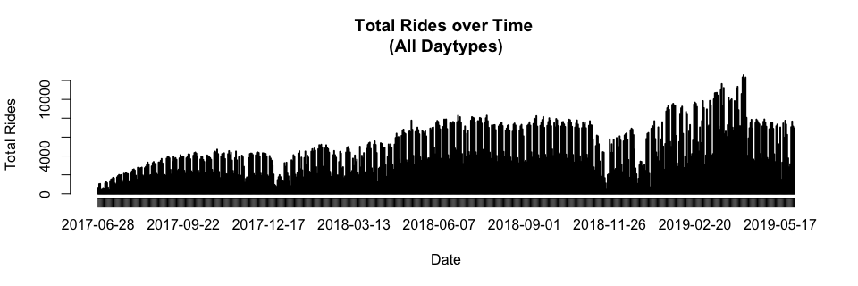
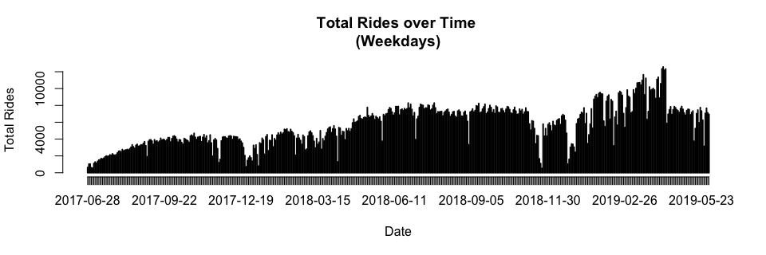
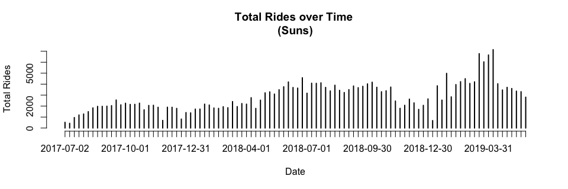
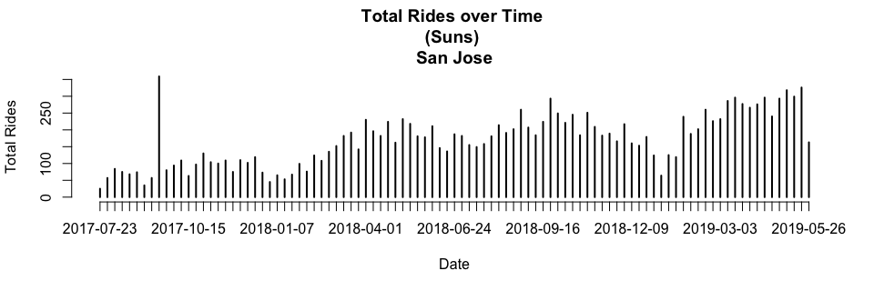
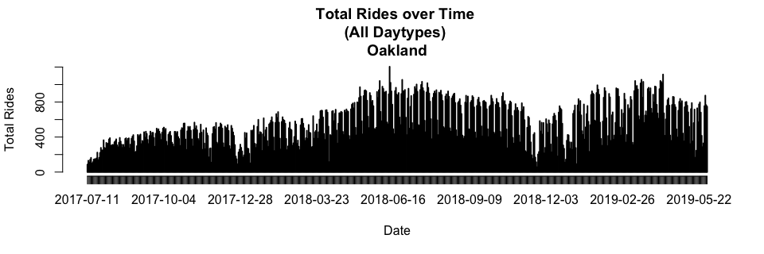
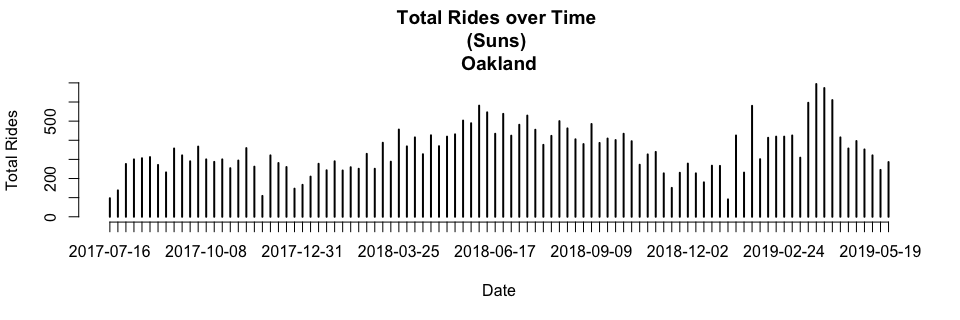

### Load Data

```r
setwd("~/Ford-GoBike/Clean Data")
load("FGB.RData")
```


```r
abs=table(FGB[["start city"]][!is.na(FGB[["start city"]]) & !is.na(FGB[["end city"]])],
FGB[["end city"]][!is.na(FGB[["start city"]]) & !is.na(FGB[["end city"]])])
abs=cbind(abs,"Origin Total"=apply(abs,1,sum))
abs=rbind(abs,"Destination Total"=apply(abs,2,sum))
abs[,]=prettyNum(abs,",")
abs
```

```
##                   Berkeley  Emeryville Oakland   San Francisco San Jose
## Berkeley          "109,460" "5,274"    "18,499"  "15"          "0"     
## Emeryville        "3,522"   "5,959"    "7,247"   "15"          "0"     
## Oakland           "14,296"  "8,974"    "259,166" "69"          "2"     
## San Francisco     "8"       "5"        "27"      "1,539,887"   "1"     
## San Jose          "0"       "0"        "0"       "1"           "90,871"
## Destination Total "127,286" "20,212"   "284,939" "1,539,987"   "90,874"
##                   Origin Total
## Berkeley          "133,248"   
## Emeryville        "16,743"    
## Oakland           "282,507"   
## San Francisco     "1,539,928" 
## San Jose          "90,872"    
## Destination Total "2,063,298"
```
Note: Rows=Origins, Columns=Destinations

<!-- #sum(na.omit(FGB[["start city"]]=="Berkeley" & FGB[["end city"]]=="Emeryville")) -->
<!-- #Rows=Origins -->
<!-- #Columns=Destination -->


```r
options(scipen=999)
rel=round(table(FGB[["start city"]][!is.na(FGB[["start city"]]) & !is.na(FGB[["end city"]])],
      FGB[["end city"]][!is.na(FGB[["start city"]]) & !is.na(FGB[["end city"]])])/sum(
        table(FGB[["start city"]][!is.na(FGB[["start city"]]) & !is.na(FGB[["end city"]])],
              FGB[["end city"]][!is.na(FGB[["start city"]]) & !is.na(FGB[["end city"]])])
      ),3)
rel=cbind(rel,"Origin Total"=apply(rel,1,sum))
rel=rbind(rel,"Destination Total"=apply(rel,2,sum))
rel
```

```
##                   Berkeley Emeryville Oakland San Francisco San Jose
## Berkeley             0.053      0.003   0.009         0.000    0.000
## Emeryville           0.002      0.003   0.004         0.000    0.000
## Oakland              0.007      0.004   0.126         0.000    0.000
## San Francisco        0.000      0.000   0.000         0.746    0.000
## San Jose             0.000      0.000   0.000         0.000    0.044
## Destination Total    0.062      0.010   0.139         0.746    0.044
##                   Origin Total
## Berkeley                 0.065
## Emeryville               0.009
## Oakland                  0.137
## San Francisco            0.746
## San Jose                 0.044
## Destination Total        1.001
```
Note: Rows=Origins, Columns=Destinations

2 Dimension Filter Functions

```r
filter_data=function(dt=FGB,var1,var2){
  dt=dt[!is.na(dt[[var1]]) & !is.na(dt[[var2]]) & dt[[var1]]!="NULL" & dt[[var2]]!="NULL"]
  return(dt)
}
table_data=function(dt=FGB,var1,var2,col1,col2,select1,select2){
  out=paste(
    dt[dt[[col1]]==select1][[var1]],
    dt[dt[[col2]]==select2][[var2]],sep=" , ")
  return(table(out))
}
```

### Popular ods by City

```r
ss=filter_data(FGB,"start_station_name","end_station_name")
x1=as.matrix(sort(table_data(ss,"start_station_name","end_station_name","start city","end city","San Francisco","San Francisco"),decreasing=T)[1:10])
rownames(x1)[10]=paste0(strsplit(rownames(x1)[10],"")[[1]][1:(length(strsplit(rownames(x1)[10],"")[[1]])-24)],collapse="")
x2=as.matrix(sort(table_data(ss,"start_station_name","end_station_name","start city","end city","Oakland","Oakland"),decreasing=T)[1:10])
x3=as.matrix(sort(table_data(ss,"start_station_name","end_station_name","start city","end city","Berkeley","Berkeley"),decreasing=T)[1:10])
x4=as.matrix(sort(table_data(ss,"start_station_name","end_station_name","start city","end city","San Jose","San Jose"),decreasing=T)[1:10])
x5=as.matrix(sort(table_data(ss,"start_station_name","end_station_name","start city","end city","Emeryville","Emeryville"),decreasing=T)[1:10])
ods=cbind(rownames(x1),x1,
              rownames(x2),x2,
              rownames(x3),x3,
              rownames(x4),x4,
              rownames(x5),x5)
rownames(ods)=NULL
colnames(ods)=c(rep("San Francisco",2),rep("Oakland",2),rep("Berkeley",2),rep("san Jose",2),rep("Emeryville",2))
colnames(x1)="San Francisco";colnames(x2)="Oakland";colnames(x3)="Berkeley";colnames(x4)="San Jose";colnames(x5)="Emeryville"
x1;x2;x3;x4;x5
```

```
##                                                                                    San Francisco
## San Francisco Ferry Building (Harry Bridges Plaza) , The Embarcadero at Sansome St         10196
## The Embarcadero at Sansome St , Steuart St at Market St                                     5977
## Berry St at 4th St , San Francisco Ferry Building (Harry Bridges Plaza)                     5659
## The Embarcadero at Sansome St , San Francisco Ferry Building (Harry Bridges Plaza)          5097
## San Francisco Ferry Building (Harry Bridges Plaza) , Berry St at 4th St                     4286
## Steuart St at Market St , The Embarcadero at Sansome St                                     4186
## The Embarcadero at Sansome St , The Embarcadero at Sansome St                               3546
## Market St at 10th St , San Francisco Caltrain Station 2  (Townsend St at 4th St)            3527
## Howard St at Beale St , San Francisco Caltrain (Townsend St at 4th St)                      3459
## Montgomery St BART Station (Market St at 2nd S                                              3349
```

```
##                                                         Oakland
## Grand Ave at Perkins St , 19th Street BART Station         4692
## 19th Street BART Station , Bay Pl at Vernon St             4531
## Bay Pl at Vernon St , 19th Street BART Station             4317
## Lake Merritt BART Station , El Embarcadero at Grand Ave    2608
## MacArthur BART Station , Webster St at 2nd St              2206
## Broadway at 40th St , MacArthur BART Station               2045
## 19th Street BART Station , Genoa St at 55th St             2037
## El Embarcadero at Grand Ave , Grand Ave at Perkins St      2006
## 2nd Ave at E 18th St , 2nd Ave at E 18th St                1930
## 2nd Ave at E 18th St , College Ave at Harwood Ave          1867
```

```
##                                                               Berkeley
## Bancroft Way at College Ave , Fulton St at Bancroft Way           3049
## Bancroft Way at Telegraph Ave , Berkeley Civic Center             2375
## Bancroft Way at College Ave , Milvia St at Derby St               1754
## College Ave at Alcatraz Ave , Bancroft Way at Telegraph Ave       1478
## Derby St at College Ave , Bancroft Way at Telegraph Ave           1287
## Bancroft Way at College Ave , Ashby BART Station                  1207
## Downtown Berkeley BART , Downtown Berkeley BART                   1135
## Telegraph Ave at Ashby Ave , Downtown Berkeley BART               1086
## Bancroft Way at Telegraph Ave , Ashby BART Station                1083
## Bancroft Way at College Ave , California St at University Ave     1052
```

```
##                                                           San Jose
## 5th St at Virginia St , San Fernando at 7th St                1240
## 5th St at Virginia St , San Fernando St at 4th St              991
## San Fernando St at 4th St , 5th St at Virginia St              941
## San Fernando St at 4th St , Ryland Park                        939
## 5th St at Virginia St , San Salvador St at 9th St              882
## Ryland Park , San Fernando St at 4th St                        865
## San Fernando at 7th St , 5th St at Virginia St                 808
## San Jose Diridon Station , San Fernando St at 4th St           782
## San Salvador St at 9th St , 5th St at Virginia St              697
## San Jose Diridon Station , Santa Clara St at Almaden Blvd      662
```

```
##                                                  Emeryville
## Horton St at 40th St , 65th St at Hollis St             847
## Horton St at 40th St , Horton St at 40th St             706
## Adeline St at 40th St , 47th St at San Pablo Ave        633
## Emeryville Town Hall , 65th St at Hollis St             530
## 59th St at Horton St , Adeline St at 40th St            480
## Adeline St at 40th St , 59th St at Horton St            455
## 65th St at Hollis St , Emeryville Public Market         448
## Adeline St at 40th St , 65th St at Hollis St            443
## 47th St at San Pablo Ave , 65th St at Hollis St         419
## Emeryville Town Hall , Horton St at 40th St             419
```

```r
#as.data.table(ods)
```

1 Dimension Filter Functions

```r
filter_data_1d=function(dt=FGB,var1,col=c(),vars=c(),not=T){
  if (length(vars)==0 & length(col)==0){
    dt=dt[!is.na(dt[[var1]]) & dt[[var1]]!="NULL"]
  } else{
    if (not){
      dt=dt[!is.na(dt[[var1]]) & dt[[var1]]!="NULL" & !(dt[[col]] %in% vars)]
    } else {
      dt=dt[!is.na(dt[[var1]]) & dt[[var1]]!="NULL" & (dt[[col]] %in% vars)]
    }
  }
  return(dt)
}
table_data_1d=function(dt=FGB,var1,col1,select1){
  out=paste(
    dt[dt[[col1]]==select1][[var1]])
  return(table(out))
}
```

### Popular Origins by City

```r
ss=filter_data_1d(FGB,"start_station_name")

x1=as.matrix(sort(table_data_1d(ss,"start_station_name","start city","San Francisco"),decreasing=T)[1:10])
x2=as.matrix(sort(table_data_1d(ss,"start_station_name","start city","Oakland"),decreasing=T)[1:10])
x3=as.matrix(sort(table_data_1d(ss,"start_station_name","start city","Berkeley"),decreasing=T)[1:10])
x4=as.matrix(sort(table_data_1d(ss,"start_station_name","start city","San Jose"),decreasing=T)[1:10])
x5=as.matrix(sort(table_data_1d(ss,"start_station_name","start city","Emeryville"),decreasing=T)[1:10])
origins=cbind(rownames(x1),x1,
              rownames(x2),x2,
              rownames(x3),x3,
              rownames(x4),x4,
              rownames(x5),x5)
rownames(origins)=NULL
colnames(origins)=c(rep("San Francisco",2),rep("Oakland",2),rep("Berkeley",2),rep("san Jose",2),rep("Emeryville",2))
colnames(x1)="San Francisco";colnames(x2)="Oakland";colnames(x3)="Berkeley";colnames(x4)="San Jose";colnames(x5)="Emeryville"
x1;x2;x3;x4;x5
```

```
##                                                           San Francisco
## San Francisco Ferry Building (Harry Bridges Plaza)                48956
## San Francisco Caltrain Station 2  (Townsend St at 4th St)         43725
## The Embarcadero at Sansome St                                     43050
## San Francisco Caltrain (Townsend St at 4th St)                    42879
## Market St at 10th St                                              41486
## Berry St at 4th St                                                40291
## Montgomery St BART Station (Market St at 2nd St)                  39308
## Powell St BART Station (Market St at 4th St)                      37092
## Steuart St at Market St                                           33893
## Howard St at Beale St                                             32858
```

```
##                             Oakland
## 19th Street BART Station      20042
## MacArthur BART Station        15265
## Lake Merritt BART Station     11913
## El Embarcadero at Grand Ave   11315
## Grand Ave at Perkins St       11228
## Bay Pl at Vernon St           10716
## Frank H Ogawa Plaza           10552
## 2nd Ave at E 18th St          10090
## Grand Ave at Webster St        9887
## West Oakland BART Station      9135
```

```
##                               Berkeley
## Bancroft Way at College Ave      15245
## Bancroft Way at Telegraph Ave    11077
## Downtown Berkeley BART            8812
## Ashby BART Station                7868
## Haste St at Telegraph Ave         6610
## Parker St at Fulton St            5329
## Berkeley Civic Center             4990
## Hearst Ave at Euclid Ave          4914
## Telegraph Ave at Ashby Ave        4608
## Derby St at College Ave           4119
```

```
##                                San Jose
## San Jose Diridon Station           7416
## San Fernando St at 4th St          7154
## 5th St at Virginia St              6142
## Ryland Park                        5183
## San Salvador St at 9th St          4143
## Paseo De San Antonio at 2nd St     3544
## Julian St at The Alameda           3538
## San Fernando at 7th St             3506
## San Jose City Hall                 3107
## The Alameda at Bush St             3085
```

```
##                           Emeryville
## 65th St at Hollis St            2539
## Horton St at 40th St            2487
## Adeline St at 40th St           2287
## Emeryville Town Hall            1737
## 59th St at Horton St            1670
## Emeryville Public Market        1428
## Doyle St at 59th St             1388
## Stanford Ave at Hollis St       1342
## 47th St at San Pablo Ave        1308
## 53rd St at Hollis St             574
```

```r
#as.data.table(origins)
```

### Popular Destinations by City

```r
ss=filter_data_1d(FGB,"end_station_name")
x1=as.matrix(sort(table_data_1d(ss,"end_station_name","end city","San Francisco"),decreasing=T)[1:10])
x2=as.matrix(sort(table_data_1d(ss,"end_station_name","end city","Oakland"),decreasing=T)[1:10])
x3=as.matrix(sort(table_data_1d(ss,"end_station_name","end city","Berkeley"),decreasing=T)[1:10])
x4=as.matrix(sort(table_data_1d(ss,"end_station_name","end city","San Jose"),decreasing=T)[1:10])
x5=as.matrix(sort(table_data_1d(ss,"end_station_name","end city","Emeryville"),decreasing=T)[1:10])
destinations=cbind(rownames(x1),x1,
              rownames(x2),x2,
              rownames(x3),x3,
              rownames(x4),x4,
              rownames(x5),x5)
rownames(destinations)=NULL
colnames(destinations)=c(rep("San Francisco",2),rep("Oakland",2),rep("Berkeley",2),rep("san Jose",2),rep("Emeryville",2))
colnames(x1)="San Francisco";colnames(x2)="Oakland";colnames(x3)="Berkeley";colnames(x4)="San Jose";colnames(x5)="Emeryville"
x1;x2;x3;x4;x5
```

```
##                                                           San Francisco
## San Francisco Caltrain Station 2  (Townsend St at 4th St)         56116
## San Francisco Ferry Building (Harry Bridges Plaza)                55627
## San Francisco Caltrain (Townsend St at 4th St)                    54662
## The Embarcadero at Sansome St                                     51008
## Montgomery St BART Station (Market St at 2nd St)                  44848
## Market St at 10th St                                              40124
## Powell St BART Station (Market St at 4th St)                      39243
## Berry St at 4th St                                                38993
## Steuart St at Market St                                           33995
## Powell St BART Station (Market St at 5th St)                      30837
```

```
##                             Oakland
## 19th Street BART Station      21882
## MacArthur BART Station        16535
## El Embarcadero at Grand Ave   12848
## Grand Ave at Perkins St       12263
## 2nd Ave at E 18th St          10987
## Frank H Ogawa Plaza           10637
## Bay Pl at Vernon St           10237
## Grand Ave at Webster St        9919
## West Oakland BART Station      9209
## Lake Merritt BART Station      8489
```

```
##                               Berkeley
## Downtown Berkeley BART           12846
## Bancroft Way at Telegraph Ave     9822
## Ashby BART Station                8529
## Parker St at Fulton St            5964
## Berkeley Civic Center             5817
## Bancroft Way at College Ave       5563
## Haste St at Telegraph Ave         4980
## Fulton St at Bancroft Way         4706
## Telegraph Ave at Ashby Ave        4414
## Addison St at Fourth St           4264
```

```
##                                San Jose
## San Jose Diridon Station           7551
## San Fernando St at 4th St          7453
## 5th St at Virginia St              5493
## Ryland Park                        4995
## San Salvador St at 9th St          4352
## San Fernando at 7th St             3992
## Paseo De San Antonio at 2nd St     3710
## Julian St at The Alameda           3555
## The Alameda at Bush St             3368
## San Pedro Square                   3008
```

```
##                           Emeryville
## 65th St at Hollis St            3865
## Horton St at 40th St            2774
## Adeline St at 40th St           2436
## 59th St at Horton St            2064
## Emeryville Public Market        1778
## Emeryville Town Hall            1720
## Stanford Ave at Hollis St       1613
## Doyle St at 59th St             1525
## 47th St at San Pablo Ave        1522
## 53rd St at Hollis St             933
```

```r
#as.data.table(destinations)
```


### Total Rides Over Time

```r
ss=filter_data_1d(FGB,"start_date",col="start_daytype")[['start_date']]
```


```r
plot(table(ss),xlab="Date",ylab="Total Rides",main="Total Rides over Time \n(All Daytypes)")
```

<!-- -->


```r
plot(table(filter_data_1d(FGB,"start_date",col="start_daytype",vars=c("Saturday","Sunday"),not=T)[["start_date"]]),xlab="Date",ylab="Total Rides",main="Total Rides over Time \n(Weekdays)")
```

<!-- -->


```r
plot(table(filter_data_1d(FGB,"start_date",col="start_daytype",vars=c("Saturday"),not=F)[["start_date"]]),xlab="Date",ylab="Total Rides",main="Total Rides over Time \n(Saturdays)")
```

<!-- -->


```r
plot(table(filter_data_1d(FGB,"start_date",col="start_daytype",vars=c("Sunday"),not=F)[["start_date"]]),xlab="Date",ylab="Total Rides",main="Total Rides over Time \n(Sundays)")
```

<!-- -->


```r
berk=FGB[FGB[["start city"]]=="Berkeley" & FGB[["end city"]]=="Berkeley",]
ss=filter_data_1d(berk,"start_date",col="start_daytype")[['start_date']]
```

```r
plot(table(ss),xlab="Date",ylab="Total Rides",main="Total Rides over Time \n(All Daytypes) \nBerkeley")
```

<!-- -->

```r
plot(table(filter_data_1d(berk,"start_date",col="start_daytype",vars=c("Saturday"),not=F)[["start_date"]]),
     xlab="Date",ylab="Total Rides",main="Total Rides over Time \n(Saturdays) \nBerkeley")
```

<!-- -->

```r
plot(table(filter_data_1d(berk,"start_date",col="start_daytype",vars=c("Sunday"),not=F)[["start_date"]]),
     xlab="Date",ylab="Total Rides",main="Total Rides over Time \n(Sundays) \nBerkeley")
```

<!-- -->

```r
sanjose=FGB[FGB[["start city"]]=="San Jose" & FGB[["end city"]]=="San Jose",]
ss=filter_data_1d(sanjose,"start_date",col="start_daytype")[['start_date']]
```

```r
plot(table(ss),xlab="Date",ylab="Total Rides",main="Total Rides over Time \n(All Daytypes) \nSan Jose")
```

<!-- -->

```r
plot(table(filter_data_1d(sanjose,"start_date",col="start_daytype",vars=c("Saturday"),not=F)[["start_date"]]),
     xlab="Date",ylab="Total Rides",main="Total Rides over Time \n(Saturdays) \nSan Jose")
```

<!-- -->

```r
plot(table(filter_data_1d(sanjose,"start_date",col="start_daytype",vars=c("Sunday"),not=F)[["start_date"]]),
     xlab="Date",ylab="Total Rides",main="Total Rides over Time \n(Sundays) \nSan Jose")
```

<!-- -->

```r
sanFrancisco=FGB[FGB[["start city"]]=="San Francisco" & FGB[["end city"]]=="San Francisco",]
ss=filter_data_1d(sanFrancisco,"start_date",col="start_daytype")[['start_date']]
```

```r
plot(table(ss),xlab="Date",ylab="Total Rides",main="Total Rides over Time \n(All Daytypes) \nSan Francisco")
```

<!-- -->

```r
plot(table(filter_data_1d(sanFrancisco,"start_date",col="start_daytype",vars=c("Saturday"),not=F)[["start_date"]]),
     xlab="Date",ylab="Total Rides",main="Total Rides over Time \n(Saturdays) \nSan Francisco")
```

<!-- -->

```r
plot(table(filter_data_1d(sanFrancisco,"start_date",col="start_daytype",vars=c("Sunday"),not=F)[["start_date"]]),
     xlab="Date",ylab="Total Rides",main="Total Rides over Time \n(Sundays) \nSan Francisco")
```

<!-- -->

```r
Oakland=FGB[FGB[["start city"]]=="Oakland" & FGB[["end city"]]=="Oakland",]
ss=filter_data_1d(Oakland,"start_date",col="start_daytype")[['start_date']]
```

```r
plot(table(ss),xlab="Date",ylab="Total Rides",main="Total Rides over Time \n(All Daytypes) \nOakland")
```

<!-- -->

```r
plot(table(filter_data_1d(Oakland,"start_date",col="start_daytype",vars=c("Saturday"),not=F)[["start_date"]]),
     xlab="Date",ylab="Total Rides",main="Total Rides over Time \n(Saturdays) \nOakland")
```

<!-- -->

```r
plot(table(filter_data_1d(Oakland,"start_date",col="start_daytype",vars=c("Sunday"),not=F)[["start_date"]]),
     xlab="Date",ylab="Total Rides",main="Total Rides over Time \n(Sundays) \nOakland")
```

<!-- -->

```r
Emeryville=FGB[FGB[["start city"]]=="Emeryville" & FGB[["end city"]]=="Emeryville",]
ss=filter_data_1d(Emeryville,"start_date",col="start_daytype")[['start_date']]
```

```r
plot(table(ss),xlab="Date",ylab="Total Rides",main="Total Rides over Time \n(All Daytypes) \nEmeryville")
```

<!-- -->

```r
plot(table(filter_data_1d(Emeryville,"start_date",col="start_daytype",vars=c("Saturday"),not=F)[["start_date"]]),
     xlab="Date",ylab="Total Rides",main="Total Rides over Time \n(Saturdays) \nEmeryville")
```

<!-- -->

```r
plot(table(filter_data_1d(Emeryville,"start_date",col="start_daytype",vars=c("Sunday"),not=F)[["start_date"]]),
     xlab="Date",ylab="Total Rides",main="Total Rides over Time \n(Sundays) \nEmeryville")
```

<!-- -->
