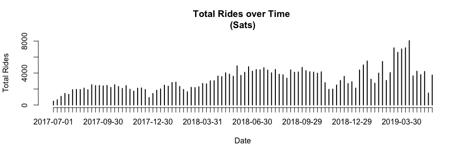
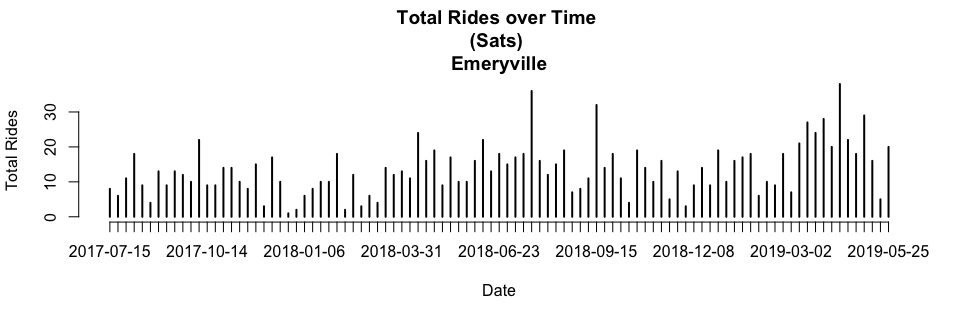

### Load Data

```r
setwd("~/Desktop/Projects/Ford-GoBike/Clean Data")
load("FGB.RData")
```

```r
abs=table(FGB[["StartCity"]][!is.na(FGB[["StartCity"]]) & !is.na(FGB[["EndCity"]])],
FGB[["EndCity"]][!is.na(FGB[["StartCity"]]) & !is.na(FGB[["EndCity"]])])
abs=cbind(abs,"Origin Total"=apply(abs,1,sum))
abs=rbind(abs,"Destination Total"=apply(abs,2,sum))
abs[,]=prettyNum(abs,",")
abs
```

```
##                   Berkeley  Emeryville Oakland   San Francisco San Jose 
## Berkeley          "212,993" "9,341"    "30,449"  "23"          "0"      
## Emeryville        "6,784"   "9,635"    "12,565"  "17"          "0"      
## Oakland           "24,152"  "15,134"   "390,680" "107"         "3"      
## San Francisco     "9"       "5"        "40"      "2,510,255"   "3"      
## San Jose          "0"       "0"        "0"       "1"           "153,033"
## Destination Total "243,938" "34,115"   "433,734" "2,510,403"   "153,039"
##                   Origin Total
## Berkeley          "252,806"   
## Emeryville        "29,001"    
## Oakland           "430,076"   
## San Francisco     "2,510,312" 
## San Jose          "153,034"   
## Destination Total "3,375,229"
```
Note: Rows=Origins, Columns=Destinations

<!-- #sum(na.omit(FGB[["StartCity"]]=="Berkeley" & FGB[["EndCity"]]=="Emeryville")) -->
<!-- #Rows=Origins -->
<!-- #Columns=Destination -->


```r
options(scipen=999)
rel=round(table(FGB[["StartCity"]][!is.na(FGB[["StartCity"]]) & !is.na(FGB[["EndCity"]])],
      FGB[["EndCity"]][!is.na(FGB[["StartCity"]]) & !is.na(FGB[["EndCity"]])])/sum(
        table(FGB[["StartCity"]][!is.na(FGB[["StartCity"]]) & !is.na(FGB[["EndCity"]])],
              FGB[["EndCity"]][!is.na(FGB[["StartCity"]]) & !is.na(FGB[["EndCity"]])])
      ),3)
rel=cbind(rel,"Origin Total"=apply(rel,1,sum))
rel=rbind(rel,"Destination Total"=apply(rel,2,sum))
rel
```

```
##                   Berkeley Emeryville Oakland San Francisco San Jose
## Berkeley             0.063      0.003   0.009         0.000    0.000
## Emeryville           0.002      0.003   0.004         0.000    0.000
## Oakland              0.007      0.004   0.116         0.000    0.000
## San Francisco        0.000      0.000   0.000         0.744    0.000
## San Jose             0.000      0.000   0.000         0.000    0.045
## Destination Total    0.072      0.010   0.129         0.744    0.045
##                   Origin Total
## Berkeley                 0.075
## Emeryville               0.009
## Oakland                  0.127
## San Francisco            0.744
## San Jose                 0.045
## Destination Total        1.000
```
Note: Rows=Origins, Columns=Destinations

2 Dimension Filter Functions

```r
filter_data=function(dt=FGB,var1,var2){
  dt=dt[!is.na(dt[[var1]]) & !is.na(dt[[var2]]) & dt[[var1]]!="NULL" & dt[[var2]]!="NULL"]
  return(dt)
}
table_data=function(dt=FGB,var1,var2,col1,col2,select1,select2){
  out=paste(
    dt[dt[[col1]]==select1][[var1]],
    dt[dt[[col2]]==select2][[var2]],sep=" , ")
  return(table(out))
}
```

### Popular ods by City

```r
ss=filter_data(FGB,"StartStationName","EndStationName")
x1=as.matrix(sort(table_data(ss,"StartStationName","EndStationName","StartCity","EndCity","San Francisco","San Francisco"),decreasing=T)[1:10])
rownames(x1)[10]=paste0(strsplit(rownames(x1)[10],"")[[1]][1:(length(strsplit(rownames(x1)[10],"")[[1]])-24)],collapse="")
x2=as.matrix(sort(table_data(ss,"StartStationName","EndStationName","StartCity","EndCity","Oakland","Oakland"),decreasing=T)[1:10])
x3=as.matrix(sort(table_data(ss,"StartStationName","EndStationName","StartCity","EndCity","Berkeley","Berkeley"),decreasing=T)[1:10])
x4=as.matrix(sort(table_data(ss,"StartStationName","EndStationName","StartCity","EndCity","San Jose","San Jose"),decreasing=T)[1:10])
x5=as.matrix(sort(table_data(ss,"StartStationName","EndStationName","StartCity","EndCity","Emeryville","Emeryville"),decreasing=T)[1:10])
ods=cbind(rownames(x1),x1,
              rownames(x2),x2,
              rownames(x3),x3,
              rownames(x4),x4,
              rownames(x5),x5)
rownames(ods)=NULL
colnames(ods)=c(rep("San Francisco",2),rep("Oakland",2),rep("Berkeley",2),rep("san Jose",2),rep("Emeryville",2))
colnames(x1)="San Francisco";colnames(x2)="Oakland";colnames(x3)="Berkeley";colnames(x4)="San Jose";colnames(x5)="Emeryville"
x1;x2;x3;x4;x5
```

```
##                                                                                    San Francisco
## San Francisco Ferry Building (Harry Bridges Plaza) , The Embarcadero at Sansome St         13291
## The Embarcadero at Sansome St , Steuart St at Market St                                     8300
## Berry St at 4th St , San Francisco Ferry Building (Harry Bridges Plaza)                     7943
## The Embarcadero at Sansome St , San Francisco Ferry Building (Harry Bridges Plaza)          6704
## Steuart St at Market St , The Embarcadero at Sansome St                                     5794
## San Francisco Ferry Building (Harry Bridges Plaza) , Berry St at 4th St                     5774
## Townsend St at 7th St , San Francisco Caltrain Station 2  (Townsend St at 4th St)           5441
## Market St at 10th St , San Francisco Caltrain Station 2  (Townsend St at 4th St)            5353
## Market St at 10th St , Powell St BART Station (Market St at 4th St)                         4839
## Steuart St at Market                                                                        4480
```

```
##                                                         Oakland
## Grand Ave at Perkins St , 19th Street BART Station         6866
## 19th Street BART Station , Bay Pl at Vernon St             6203
## Bay Pl at Vernon St , 19th Street BART Station             5748
## Lake Merritt BART Station , El Embarcadero at Grand Ave    3741
## MacArthur BART Station , Webster St at 2nd St              3426
## 19th Street BART Station , Grand Ave at Santa Clara Ave    3226
## 2nd Ave at E 18th St , 2nd Ave at E 18th St                2942
## Broadway at 40th St , MacArthur BART Station               2914
## 19th Street BART Station , Genoa St at 55th St             2723
## Telegraph Ave at 27th St , Grand Ave at Webster St         2711
```

```
##                                                             Berkeley
## Bancroft Way at College Ave , Ashby BART Station                3741
## Bancroft Way at College Ave , Fulton St at Bancroft Way         3026
## Bancroft Way at Telegraph Ave , Berkeley Civic Center           2965
## College Ave at Alcatraz Ave , Bancroft Way at Telegraph Ave     2544
## Ashby BART Station , Bancroft Way at Telegraph Ave              2185
## North Berkeley BART Station , Parker St at Fulton St            2055
## Downtown Berkeley BART , Downtown Berkeley BART                 1820
## Bancroft Way at Telegraph Ave , Derby St at College Ave         1815
## Downtown Berkeley BART , Ashby BART Station                     1729
## Bancroft Way at Telegraph Ave , Hearst Ave at Euclid Ave        1672
```

```
##                                                   San Jose
## 5th St at Virginia St , San Fernando St at 4th St     2557
## San Fernando St at 4th St , 5th St at Virginia St     2516
## 5th St at Virginia St , San Salvador St at 9th St     1654
## San Fernando St at 4th St , Ryland Park               1521
## Ryland Park , San Fernando St at 4th St               1357
## San Salvador St at 9th St , 5th St at Virginia St     1266
## 5th St at Virginia St , San Fernando at 7th St        1240
## San Fernando St at 7th St , 5th St at Virginia St     1168
## Julian St at The Alameda , The Alameda at Bush St     1126
## 5th St at Virginia St , 5th St at San Salvador St     1093
```

```
##                                                  Emeryville
## Horton St at 40th St , 65th St at Hollis St            1297
## Horton St at 40th St , Horton St at 40th St             961
## Adeline St at 40th St , 47th St at San Pablo Ave        875
## 65th St at Hollis St , Emeryville Public Market         784
## 65th St at Hollis St , 65th St at Hollis St             666
## 59th St at Horton St , Adeline St at 40th St            659
## Adeline St at 40th St , 65th St at Hollis St            658
## Emeryville Town Hall , 65th St at Hollis St             658
## Adeline St at 40th St , 59th St at Horton St            650
## Horton St at 40th St , 59th St at Horton St             628
```

```r
#as.data.table(ods)
```

1 Dimension Filter Functions


```r
filter_data_1d=function(dt=FGB,var1,col=c(),vars=c(),not=T){
  if (length(vars)==0 & length(col)==0){
    dt=dt[!is.na(dt[[var1]]) & dt[[var1]]!="NULL"]
  } else{
    if (not){
      dt=dt[!is.na(dt[[var1]]) & !(dt[[col]] %in% vars)]
    } else {
      dt=dt[!is.na(dt[[var1]]) & (dt[[col]] %in% vars)]
    }
  }
  return(dt)
}
table_data_1d=function(dt=FGB,var1,col1,select1){
  out=paste(
    dt[dt[[col1]]==select1][[var1]])
  return(table(out))
}
```

### Popular Origins by City

```r
ss=filter_data_1d(FGB,"StartStationName")

x1=as.matrix(sort(table_data_1d(ss,"StartStationName","StartCity","San Francisco"),decreasing=T)[1:10])
x2=as.matrix(sort(table_data_1d(ss,"StartStationName","StartCity","Oakland"),decreasing=T)[1:10])
x3=as.matrix(sort(table_data_1d(ss,"StartStationName","StartCity","Berkeley"),decreasing=T)[1:10])
x4=as.matrix(sort(table_data_1d(ss,"StartStationName","StartCity","San Jose"),decreasing=T)[1:10])
x5=as.matrix(sort(table_data_1d(ss,"StartStationName","StartCity","Emeryville"),decreasing=T)[1:10])
origins=cbind(rownames(x1),x1,
              rownames(x2),x2,
              rownames(x3),x3,
              rownames(x4),x4,
              rownames(x5),x5)
rownames(origins)=NULL
colnames(origins)=c(rep("San Francisco",2),rep("Oakland",2),rep("Berkeley",2),rep("san Jose",2),rep("Emeryville",2))
colnames(x1)="San Francisco";colnames(x2)="Oakland";colnames(x3)="Berkeley";colnames(x4)="San Jose";colnames(x5)="Emeryville"
x1;x2;x3;x4;x5
```

```
##                                                           San Francisco
## San Francisco Ferry Building (Harry Bridges Plaza)                71212
## San Francisco Caltrain Station 2  (Townsend St at 4th St)         70661
## Market St at 10th St                                              67760
## San Francisco Caltrain (Townsend St at 4th St)                    62658
## Berry St at 4th St                                                61865
## The Embarcadero at Sansome St                                     59895
## Montgomery St BART Station (Market St at 2nd St)                  59757
## Powell St BART Station (Market St at 4th St)                      57707
## Steuart St at Market St                                           51593
## Howard St at Beale St                                             49345
```

```
##                             Oakland
## 19th Street BART Station      28973
## MacArthur BART Station        22301
## Lake Merritt BART Station     17103
## Grand Ave at Perkins St       16305
## Frank H Ogawa Plaza           16272
## El Embarcadero at Grand Ave   16019
## 2nd Ave at E 18th St          15206
## West Oakland BART Station     15187
## Bay Pl at Vernon St           14971
## Grand Ave at Webster St       14413
```

```
##                               Berkeley
## Bancroft Way at College Ave      25810
## Bancroft Way at Telegraph Ave    20669
## Downtown Berkeley BART           17409
## Ashby BART Station               13334
## Hearst Ave at Euclid Ave         11329
## Haste St at Telegraph Ave        10900
## Parker St at Fulton St            9962
## Berkeley Civic Center             9216
## Haste St at College Ave           8637
## MLK Jr Way at University Ave      7994
```

```
##                                San Jose
## San Fernando St at 4th St         13027
## 5th St at Virginia St             12588
## San Jose Diridon Station          10747
## Ryland Park                        8189
## San Salvador St at 9th St          6705
## Julian St at The Alameda           6084
## Paseo De San Antonio at 2nd St     5695
## The Alameda at Bush St             5443
## San Pedro Square                   4805
## San Jose City Hall                 4443
```

```
##                           Emeryville
## 65th St at Hollis St            4235
## Horton St at 40th St            4157
## Adeline St at 40th St           3789
## Emeryville Public Market        2869
## 59th St at Horton St            2735
## Doyle St at 59th St             2664
## Emeryville Town Hall            2654
## Stanford Ave at Hollis St       2446
## 47th St at San Pablo Ave        2391
## 53rd St at Hollis St            1238
```

```r
#as.data.table(origins)
```

### Popular Destinations by City

```r
ss=filter_data_1d(FGB,"EndStationName")
x1=as.matrix(sort(table_data_1d(ss,"EndStationName","EndCity","San Francisco"),decreasing=T)[1:10])
x2=as.matrix(sort(table_data_1d(ss,"EndStationName","EndCity","Oakland"),decreasing=T)[1:10])
x3=as.matrix(sort(table_data_1d(ss,"EndStationName","EndCity","Berkeley"),decreasing=T)[1:10])
x4=as.matrix(sort(table_data_1d(ss,"EndStationName","EndCity","San Jose"),decreasing=T)[1:10])
x5=as.matrix(sort(table_data_1d(ss,"EndStationName","EndCity","Emeryville"),decreasing=T)[1:10])
destinations=cbind(rownames(x1),x1,
              rownames(x2),x2,
              rownames(x3),x3,
              rownames(x4),x4,
              rownames(x5),x5)
rownames(destinations)=NULL
colnames(destinations)=c(rep("San Francisco",2),rep("Oakland",2),rep("Berkeley",2),rep("san Jose",2),rep("Emeryville",2))
colnames(x1)="San Francisco";colnames(x2)="Oakland";colnames(x3)="Berkeley";colnames(x4)="San Jose";colnames(x5)="Emeryville"
x1;x2;x3;x4;x5
```

```
##                                                           San Francisco
## San Francisco Caltrain Station 2  (Townsend St at 4th St)         94378
## San Francisco Ferry Building (Harry Bridges Plaza)                82018
## San Francisco Caltrain (Townsend St at 4th St)                    75283
## The Embarcadero at Sansome St                                     70929
## Montgomery St BART Station (Market St at 2nd St)                  69720
## Market St at 10th St                                              66550
## Powell St BART Station (Market St at 4th St)                      60508
## Berry St at 4th St                                                59898
## Steuart St at Market St                                           52043
## Powell St BART Station (Market St at 5th St)                      49027
```

```
##                             Oakland
## 19th Street BART Station      32434
## MacArthur BART Station        24873
## El Embarcadero at Grand Ave   18373
## Grand Ave at Perkins St       17574
## 2nd Ave at E 18th St          16769
## Frank H Ogawa Plaza           16138
## West Oakland BART Station     15431
## Bay Pl at Vernon St           14636
## Grand Ave at Webster St       14589
## Lake Merritt BART Station     12587
```

```
##                               Berkeley
## Downtown Berkeley BART           21951
## Bancroft Way at Telegraph Ave    19343
## Ashby BART Station               14545
## Bancroft Way at College Ave      11166
## Parker St at Fulton St           10955
## Berkeley Civic Center            10302
## MLK Jr Way at University Ave      8820
## Haste St at Telegraph Ave         8737
## Fulton St at Bancroft Way         8622
## University Ave at Oxford St       7584
```

```
##                                San Jose
## San Fernando St at 4th St         13495
## 5th St at Virginia St             11599
## San Jose Diridon Station          10758
## Ryland Park                        7931
## San Salvador St at 9th St          7007
## Julian St at The Alameda           6128
## Paseo De San Antonio at 2nd St     5926
## The Alameda at Bush St             5717
## San Pedro Square                   4835
## Fountain Alley at S 2nd St         4182
```

```
##                           Emeryville
## 65th St at Hollis St            5972
## Horton St at 40th St            4478
## Adeline St at 40th St           4084
## Emeryville Public Market        3476
## 59th St at Horton St            3418
## Doyle St at 59th St             3057
## Stanford Ave at Hollis St       2876
## 47th St at San Pablo Ave        2770
## Emeryville Town Hall            2621
## 53rd St at Hollis St            1681
```

```r
#as.data.table(destinations)
```


### Total Rides Over Time

```r
ss=filter_data_1d(FGB,"StartDate",col="StartDayType")[['StartDate']]
```


```r
plot(table(ss),xlab="Date",ylab="Total Rides",main="Total Rides over Time \n(All Daytypes)")
```

<!-- -->


```r
plot(table(filter_data_1d(FGB,"StartDate",col="StartDayType",vars=wday(c(1,7),T),not=T)[["StartDate"]]),xlab="Date",ylab="Total Rides",main="Total Rides over Time \n(Weekdays)")
```

<!-- -->


```r
plot(table(filter_data_1d(FGB,"StartDate",col="StartDayType",vars=c("Sat"),not=F)[["StartDate"]]),xlab="Date",ylab="Total Rides",main="Total Rides over Time \n(Sats)")
```

<!-- -->


```r
plot(table(filter_data_1d(FGB,"StartDate",col="StartDayType",vars=c("Sun"),not=F)[["StartDate"]]),xlab="Date",ylab="Total Rides",main="Total Rides over Time \n(Suns)")
```

<!-- -->


```r
berk=FGB[FGB[["StartCity"]]=="Berkeley" & FGB[["EndCity"]]=="Berkeley",]
ss=filter_data_1d(berk,"StartDate",col="StartDayType")[['StartDate']]
```

```r
plot(table(ss),xlab="Date",ylab="Total Rides",main="Total Rides over Time \n(All Daytypes) \nBerkeley")
```

<!-- -->

```r
plot(table(filter_data_1d(berk,"StartDate",col="StartDayType",vars=c("Sat"),not=F)[["StartDate"]]),
     xlab="Date",ylab="Total Rides",main="Total Rides over Time \n(Sats) \nBerkeley")
```

<!-- -->

```r
plot(table(filter_data_1d(berk,"StartDate",col="StartDayType",vars=c("Sun"),not=F)[["StartDate"]]),
     xlab="Date",ylab="Total Rides",main="Total Rides over Time \n(Suns) \nBerkeley")
```

<!-- -->

```r
sanjose=FGB[FGB[["StartCity"]]=="San Jose" & FGB[["EndCity"]]=="San Jose",]
ss=filter_data_1d(sanjose,"StartDate",col="StartDayType")[['StartDate']]
```

```r
plot(table(ss),xlab="Date",ylab="Total Rides",main="Total Rides over Time \n(All Daytypes) \nSan Jose")
```

<!-- -->

```r
plot(table(filter_data_1d(sanjose,"StartDate",col="StartDayType",vars=c("Sat"),not=F)[["StartDate"]]),
     xlab="Date",ylab="Total Rides",main="Total Rides over Time \n(Sats) \nSan Jose")
```

<!-- -->

```r
plot(table(filter_data_1d(sanjose,"StartDate",col="StartDayType",vars=c("Sun"),not=F)[["StartDate"]]),
     xlab="Date",ylab="Total Rides",main="Total Rides over Time \n(Suns) \nSan Jose")
```

<!-- -->

```r
sanFrancisco=FGB[FGB[["StartCity"]]=="San Francisco" & FGB[["EndCity"]]=="San Francisco",]
ss=filter_data_1d(sanFrancisco,"StartDate",col="StartDayType")[['StartDate']]
```

```r
plot(table(ss),xlab="Date",ylab="Total Rides",main="Total Rides over Time \n(All Daytypes) \nSan Francisco")
```

<!-- -->

```r
plot(table(filter_data_1d(sanFrancisco,"StartDate",col="StartDayType",vars=c("Sat"),not=F)[["StartDate"]]),
     xlab="Date",ylab="Total Rides",main="Total Rides over Time \n(Sats) \nSan Francisco")
```

<!-- -->

```r
plot(table(filter_data_1d(sanFrancisco,"StartDate",col="StartDayType",vars=c("Sun"),not=F)[["StartDate"]]),
     xlab="Date",ylab="Total Rides",main="Total Rides over Time \n(Suns) \nSan Francisco")
```

<!-- -->

```r
Oakland=FGB[FGB[["StartCity"]]=="Oakland" & FGB[["EndCity"]]=="Oakland",]
ss=filter_data_1d(Oakland,"StartDate",col="StartDayType")[['StartDate']]
```

```r
plot(table(ss),xlab="Date",ylab="Total Rides",main="Total Rides over Time \n(All Daytypes) \nOakland")
```

<!-- -->

```r
plot(table(filter_data_1d(Oakland,"StartDate",col="StartDayType",vars=c("Sat"),not=F)[["StartDate"]]),
     xlab="Date",ylab="Total Rides",main="Total Rides over Time \n(Sats) \nOakland")
```

<!-- -->

```r
plot(table(filter_data_1d(Oakland,"StartDate",col="StartDayType",vars=c("Sun"),not=F)[["StartDate"]]),
     xlab="Date",ylab="Total Rides",main="Total Rides over Time \n(Suns) \nOakland")
```

<!-- -->

```r
Emeryville=FGB[FGB[["StartCity"]]=="Emeryville" & FGB[["EndCity"]]=="Emeryville",]
ss=filter_data_1d(Emeryville,"StartDate",col="StartDayType")[['StartDate']]
```

```r
plot(table(ss),xlab="Date",ylab="Total Rides",main="Total Rides over Time \n(All Daytypes) \nEmeryville")
```

<!-- -->

```r
plot(table(filter_data_1d(Emeryville,"StartDate",col="StartDayType",vars=c("Sat"),not=F)[["StartDate"]]),
     xlab="Date",ylab="Total Rides",main="Total Rides over Time \n(Sats) \nEmeryville")
```

<!-- -->

```r
plot(table(filter_data_1d(Emeryville,"StartDate",col="StartDayType",vars=c("Sun"),not=F)[["StartDate"]]),
     xlab="Date",ylab="Total Rides",main="Total Rides over Time \n(Suns) \nEmeryville")
```

<!-- -->
