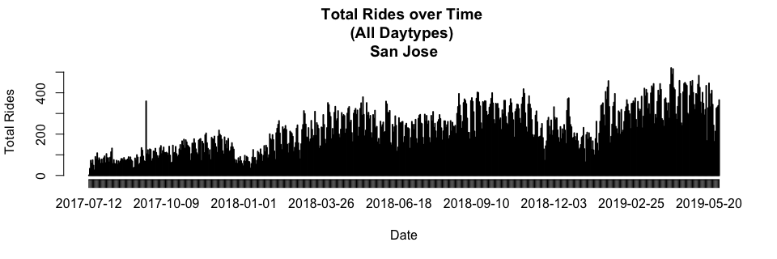

### Load Data

```r
setwd("~/Desktop/Projects/Ford-GoBike/Clean Data")
load("FGB.RData")
```

```r
abs=table(FGB[["StartCity"]][!is.na(FGB[["StartCity"]]) & !is.na(FGB[["EndCity"]])],
FGB[["EndCity"]][!is.na(FGB[["StartCity"]]) & !is.na(FGB[["EndCity"]])])
abs=cbind(abs,"Origin Total"=apply(abs,1,sum))
abs=rbind(abs,"Destination Total"=apply(abs,2,sum))
abs[,]=prettyNum(abs,",")
abs
```

```
##                   Berkeley  Emeryville Oakland   San Francisco San Jose 
## Berkeley          "179,232" "7,916"    "26,406"  "15"          "0"      
## Emeryville        "5,571"   "8,332"    "10,760"  "15"          "0"      
## Oakland           "20,975"  "13,081"   "348,713" "96"          "3"      
## San Francisco     "9"       "5"        "38"      "2,202,083"   "2"      
## San Jose          "0"       "0"        "0"       "1"           "130,819"
## Destination Total "205,787" "29,334"   "385,917" "2,202,210"   "130,824"
##                   Origin Total
## Berkeley          "213,569"   
## Emeryville        "24,678"    
## Oakland           "382,868"   
## San Francisco     "2,202,137" 
## San Jose          "130,820"   
## Destination Total "2,954,072"
```
Note: Rows=Origins, Columns=Destinations

<!-- #sum(na.omit(FGB[["StartCity"]]=="Berkeley" & FGB[["EndCity"]]=="Emeryville")) -->
<!-- #Rows=Origins -->
<!-- #Columns=Destination -->


```r
options(scipen=999)
rel=round(table(FGB[["StartCity"]][!is.na(FGB[["StartCity"]]) & !is.na(FGB[["EndCity"]])],
      FGB[["EndCity"]][!is.na(FGB[["StartCity"]]) & !is.na(FGB[["EndCity"]])])/sum(
        table(FGB[["StartCity"]][!is.na(FGB[["StartCity"]]) & !is.na(FGB[["EndCity"]])],
              FGB[["EndCity"]][!is.na(FGB[["StartCity"]]) & !is.na(FGB[["EndCity"]])])
      ),3)
rel=cbind(rel,"Origin Total"=apply(rel,1,sum))
rel=rbind(rel,"Destination Total"=apply(rel,2,sum))
rel
```

```
##                   Berkeley Emeryville Oakland San Francisco San Jose
## Berkeley             0.061      0.003   0.009         0.000    0.000
## Emeryville           0.002      0.003   0.004         0.000    0.000
## Oakland              0.007      0.004   0.118         0.000    0.000
## San Francisco        0.000      0.000   0.000         0.745    0.000
## San Jose             0.000      0.000   0.000         0.000    0.044
## Destination Total    0.070      0.010   0.131         0.745    0.044
##                   Origin Total
## Berkeley                 0.073
## Emeryville               0.009
## Oakland                  0.129
## San Francisco            0.745
## San Jose                 0.044
## Destination Total        1.000
```
Note: Rows=Origins, Columns=Destinations

2 Dimension Filter Functions

```r
filter_data=function(dt=FGB,var1,var2){
  dt=dt[!is.na(dt[[var1]]) & !is.na(dt[[var2]]) & dt[[var1]]!="NULL" & dt[[var2]]!="NULL"]
  return(dt)
}
table_data=function(dt=FGB,var1,var2,col1,col2,select1,select2){
  out=paste(
    dt[dt[[col1]]==select1][[var1]],
    dt[dt[[col2]]==select2][[var2]],sep=" , ")
  return(table(out))
}
```

### Popular ods by City

```r
ss=filter_data(FGB,"StartStationName","EndStationName")
x1=as.matrix(sort(table_data(ss,"StartStationName","EndStationName","StartCity","EndCity","San Francisco","San Francisco"),decreasing=T)[1:10])
rownames(x1)[10]=paste0(strsplit(rownames(x1)[10],"")[[1]][1:(length(strsplit(rownames(x1)[10],"")[[1]])-24)],collapse="")
x2=as.matrix(sort(table_data(ss,"StartStationName","EndStationName","StartCity","EndCity","Oakland","Oakland"),decreasing=T)[1:10])
x3=as.matrix(sort(table_data(ss,"StartStationName","EndStationName","StartCity","EndCity","Berkeley","Berkeley"),decreasing=T)[1:10])
x4=as.matrix(sort(table_data(ss,"StartStationName","EndStationName","StartCity","EndCity","San Jose","San Jose"),decreasing=T)[1:10])
x5=as.matrix(sort(table_data(ss,"StartStationName","EndStationName","StartCity","EndCity","Emeryville","Emeryville"),decreasing=T)[1:10])
ods=cbind(rownames(x1),x1,
              rownames(x2),x2,
              rownames(x3),x3,
              rownames(x4),x4,
              rownames(x5),x5)
rownames(ods)=NULL
colnames(ods)=c(rep("San Francisco",2),rep("Oakland",2),rep("Berkeley",2),rep("san Jose",2),rep("Emeryville",2))
colnames(x1)="San Francisco";colnames(x2)="Oakland";colnames(x3)="Berkeley";colnames(x4)="San Jose";colnames(x5)="Emeryville"
x1;x2;x3;x4;x5
```

```
##                                                                                    San Francisco
## San Francisco Ferry Building (Harry Bridges Plaza) , The Embarcadero at Sansome St         12223
## The Embarcadero at Sansome St , Steuart St at Market St                                     7569
## Berry St at 4th St , San Francisco Ferry Building (Harry Bridges Plaza)                     7338
## The Embarcadero at Sansome St , San Francisco Ferry Building (Harry Bridges Plaza)          6191
## Steuart St at Market St , The Embarcadero at Sansome St                                     5302
## San Francisco Ferry Building (Harry Bridges Plaza) , Berry St at 4th St                     5284
## Townsend St at 7th St , San Francisco Caltrain Station 2  (Townsend St at 4th St)           4882
## Market St at 10th St , San Francisco Caltrain Station 2  (Townsend St at 4th St)            4784
## Market St at 10th St , Powell St BART Station (Market St at 4th St)                         4300
## Montgomery St BART Station (Market St at 2nd S                                              4212
```

```
##                                                         Oakland
## Grand Ave at Perkins St , 19th Street BART Station         6407
## 19th Street BART Station , Bay Pl at Vernon St             5855
## Bay Pl at Vernon St , 19th Street BART Station             5409
## Lake Merritt BART Station , El Embarcadero at Grand Ave    3501
## MacArthur BART Station , Webster St at 2nd St              3125
## 19th Street BART Station , Grand Ave at Santa Clara Ave    2782
## 2nd Ave at E 18th St , 2nd Ave at E 18th St                2718
## Broadway at 40th St , MacArthur BART Station               2710
## 19th Street BART Station , Genoa St at 55th St             2594
## Telegraph Ave at 27th St , Grand Ave at Webster St         2553
```

```
##                                                             Berkeley
## Bancroft Way at College Ave , Ashby BART Station                3393
## Bancroft Way at Telegraph Ave , Berkeley Civic Center           2817
## Bancroft Way at College Ave , Fulton St at Bancroft Way         2810
## College Ave at Alcatraz Ave , Bancroft Way at Telegraph Ave     2353
## Ashby BART Station , Bancroft Way at Telegraph Ave              1949
## North Berkeley BART Station , Parker St at Fulton St            1860
## Bancroft Way at Telegraph Ave , Derby St at College Ave         1658
## Downtown Berkeley BART , Downtown Berkeley BART                 1530
## Hearst Ave at Euclid Ave , Telegraph Ave at Ashby Ave           1512
## Russell St at College Ave , Bancroft Way at Telegraph Ave       1455
```

```
##                                                      San Jose
## 5th St at Virginia St , San Fernando St at 4th St        2134
## San Fernando St at 4th St , 5th St at Virginia St        2080
## 5th St at Virginia St , San Salvador St at 9th St        1433
## San Fernando St at 4th St , Ryland Park                  1346
## 5th St at Virginia St , San Fernando at 7th St           1240
## Ryland Park , San Fernando St at 4th St                  1214
## San Salvador St at 9th St , 5th St at Virginia St        1096
## San Jose Diridon Station , San Fernando St at 4th St      995
## Julian St at The Alameda , The Alameda at Bush St         964
## 5th St at Virginia St , 5th St at San Salvador St         929
```

```
##                                                  Emeryville
## Horton St at 40th St , 65th St at Hollis St            1079
## Horton St at 40th St , Horton St at 40th St             915
## Adeline St at 40th St , 47th St at San Pablo Ave        821
## 65th St at Hollis St , Emeryville Public Market         692
## Emeryville Town Hall , 65th St at Hollis St             682
## 47th St at San Pablo Ave , 65th St at Hollis St         645
## 59th St at Horton St , Adeline St at 40th St            625
## Adeline St at 40th St , 59th St at Horton St            622
## Adeline St at 40th St , 65th St at Hollis St            572
## Horton St at 40th St , 59th St at Horton St             563
```

```r
#as.data.table(ods)
```

1 Dimension Filter Functions


```r
filter_data_1d=function(dt=FGB,var1,col=c(),vars=c(),not=T){
  if (length(vars)==0 & length(col)==0){
    dt=dt[!is.na(dt[[var1]]) & dt[[var1]]!="NULL"]
  } else{
    if (not){
      dt=dt[!is.na(dt[[var1]]) & !(dt[[col]] %in% vars)]
    } else {
      dt=dt[!is.na(dt[[var1]]) & (dt[[col]] %in% vars)]
    }
  }
  return(dt)
}
table_data_1d=function(dt=FGB,var1,col1,select1){
  out=paste(
    dt[dt[[col1]]==select1][[var1]])
  return(table(out))
}
```

### Popular Origins by City

```r
ss=filter_data_1d(FGB,"StartStationName")

x1=as.matrix(sort(table_data_1d(ss,"StartStationName","StartCity","San Francisco"),decreasing=T)[1:10])
x2=as.matrix(sort(table_data_1d(ss,"StartStationName","StartCity","Oakland"),decreasing=T)[1:10])
x3=as.matrix(sort(table_data_1d(ss,"StartStationName","StartCity","Berkeley"),decreasing=T)[1:10])
x4=as.matrix(sort(table_data_1d(ss,"StartStationName","StartCity","San Jose"),decreasing=T)[1:10])
x5=as.matrix(sort(table_data_1d(ss,"StartStationName","StartCity","Emeryville"),decreasing=T)[1:10])
origins=cbind(rownames(x1),x1,
              rownames(x2),x2,
              rownames(x3),x3,
              rownames(x4),x4,
              rownames(x5),x5)
rownames(origins)=NULL
colnames(origins)=c(rep("San Francisco",2),rep("Oakland",2),rep("Berkeley",2),rep("san Jose",2),rep("Emeryville",2))
colnames(x1)="San Francisco";colnames(x2)="Oakland";colnames(x3)="Berkeley";colnames(x4)="San Jose";colnames(x5)="Emeryville"
x1;x2;x3;x4;x5
```

```
##                                                           San Francisco
## San Francisco Ferry Building (Harry Bridges Plaza)                63721
## San Francisco Caltrain Station 2  (Townsend St at 4th St)         61777
## Market St at 10th St                                              59942
## San Francisco Caltrain (Townsend St at 4th St)                    56615
## Berry St at 4th St                                                54728
## The Embarcadero at Sansome St                                     54605
## Montgomery St BART Station (Market St at 2nd St)                  53370
## Powell St BART Station (Market St at 4th St)                      51525
## Steuart St at Market St                                           45844
## Howard St at Beale St                                             44293
```

```
##                             Oakland
## 19th Street BART Station      26267
## MacArthur BART Station        19902
## Lake Merritt BART Station     15500
## Grand Ave at Perkins St       14708
## El Embarcadero at Grand Ave   14547
## Frank H Ogawa Plaza           14338
## 2nd Ave at E 18th St          13762
## Bay Pl at Vernon St           13649
## West Oakland BART Station     13194
## Grand Ave at Webster St       13009
```

```
##                               Berkeley
## Bancroft Way at College Ave      22336
## Bancroft Way at Telegraph Ave    17836
## Downtown Berkeley BART           14709
## Ashby BART Station               11575
## Haste St at Telegraph Ave         9643
## Hearst Ave at Euclid Ave          9343
## Parker St at Fulton St            8504
## Berkeley Civic Center             7871
## Haste St at College Ave           7094
## Fulton St at Bancroft Way         6676
```

```
##                                San Jose
## San Fernando St at 4th St         11244
## 5th St at Virginia St             10494
## San Jose Diridon Station           9567
## Ryland Park                        7188
## San Salvador St at 9th St          5947
## Julian St at The Alameda           5264
## Paseo De San Antonio at 2nd St     4972
## The Alameda at Bush St             4705
## San Pedro Square                   4120
## San Jose City Hall                 4000
```

```
##                           Emeryville
## 65th St at Hollis St            3611
## Horton St at 40th St            3595
## Adeline St at 40th St           3265
## 59th St at Horton St            2426
## Emeryville Public Market        2392
## Emeryville Town Hall            2321
## Doyle St at 59th St             2229
## Stanford Ave at Hollis St       2096
## 47th St at San Pablo Ave        2031
## 53rd St at Hollis St            1004
```

```r
#as.data.table(origins)
```

### Popular Destinations by City

```r
ss=filter_data_1d(FGB,"EndStationName")
x1=as.matrix(sort(table_data_1d(ss,"EndStationName","EndCity","San Francisco"),decreasing=T)[1:10])
x2=as.matrix(sort(table_data_1d(ss,"EndStationName","EndCity","Oakland"),decreasing=T)[1:10])
x3=as.matrix(sort(table_data_1d(ss,"EndStationName","EndCity","Berkeley"),decreasing=T)[1:10])
x4=as.matrix(sort(table_data_1d(ss,"EndStationName","EndCity","San Jose"),decreasing=T)[1:10])
x5=as.matrix(sort(table_data_1d(ss,"EndStationName","EndCity","Emeryville"),decreasing=T)[1:10])
destinations=cbind(rownames(x1),x1,
              rownames(x2),x2,
              rownames(x3),x3,
              rownames(x4),x4,
              rownames(x5),x5)
rownames(destinations)=NULL
colnames(destinations)=c(rep("San Francisco",2),rep("Oakland",2),rep("Berkeley",2),rep("san Jose",2),rep("Emeryville",2))
colnames(x1)="San Francisco";colnames(x2)="Oakland";colnames(x3)="Berkeley";colnames(x4)="San Jose";colnames(x5)="Emeryville"
x1;x2;x3;x4;x5
```

```
##                                                           San Francisco
## San Francisco Caltrain Station 2  (Townsend St at 4th St)         80898
## San Francisco Ferry Building (Harry Bridges Plaza)                73192
## San Francisco Caltrain (Townsend St at 4th St)                    69887
## The Embarcadero at Sansome St                                     64688
## Montgomery St BART Station (Market St at 2nd St)                  61524
## Market St at 10th St                                              58925
## Powell St BART Station (Market St at 4th St)                      54246
## Berry St at 4th St                                                52976
## Steuart St at Market St                                           46151
## Powell St BART Station (Market St at 5th St)                      42927
```

```
##                             Oakland
## 19th Street BART Station      29171
## MacArthur BART Station        22009
## El Embarcadero at Grand Ave   16565
## Grand Ave at Perkins St       15857
## 2nd Ave at E 18th St          14968
## Frank H Ogawa Plaza           14421
## West Oakland BART Station     13491
## Bay Pl at Vernon St           13225
## Grand Ave at Webster St       13084
## Lake Merritt BART Station     11386
```

```
##                               Berkeley
## Downtown Berkeley BART           19075
## Bancroft Way at Telegraph Ave    16466
## Ashby BART Station               12632
## Bancroft Way at College Ave       9613
## Parker St at Fulton St            9327
## Berkeley Civic Center             8897
## Haste St at Telegraph Ave         7559
## Fulton St at Bancroft Way         7463
## MLK Jr Way at University Ave      7201
## Telegraph Ave at Ashby Ave        6460
```

```
##                                San Jose
## San Fernando St at 4th St         11646
## 5th St at Virginia St              9667
## San Jose Diridon Station           9633
## Ryland Park                        6951
## San Salvador St at 9th St          6239
## Julian St at The Alameda           5282
## Paseo De San Antonio at 2nd St     5184
## The Alameda at Bush St             4970
## San Pedro Square                   4109
## San Fernando at 7th St             3992
```

```
##                           Emeryville
## 65th St at Hollis St            5190
## Horton St at 40th St            3906
## Adeline St at 40th St           3542
## 59th St at Horton St            3033
## Emeryville Public Market        2949
## Doyle St at 59th St             2583
## Stanford Ave at Hollis St       2495
## 47th St at San Pablo Ave        2340
## Emeryville Town Hall            2316
## 53rd St at Hollis St            1444
```

```r
#as.data.table(destinations)
```


### Total Rides Over Time

```r
ss=filter_data_1d(FGB,"StartDate",col="StartDayType")[['StartDate']]
```


```r
plot(table(ss),xlab="Date",ylab="Total Rides",main="Total Rides over Time \n(All Daytypes)")
```

<!-- -->


```r
plot(table(filter_data_1d(FGB,"StartDate",col="StartDayType",vars=wday(c(1,7),T),not=T)[["StartDate"]]),xlab="Date",ylab="Total Rides",main="Total Rides over Time \n(Weekdays)")
```

<!-- -->


```r
plot(table(filter_data_1d(FGB,"StartDate",col="StartDayType",vars=c("Sat"),not=F)[["StartDate"]]),xlab="Date",ylab="Total Rides",main="Total Rides over Time \n(Sats)")
```

<!-- -->


```r
plot(table(filter_data_1d(FGB,"StartDate",col="StartDayType",vars=c("Sun"),not=F)[["StartDate"]]),xlab="Date",ylab="Total Rides",main="Total Rides over Time \n(Suns)")
```

<!-- -->


```r
berk=FGB[FGB[["StartCity"]]=="Berkeley" & FGB[["EndCity"]]=="Berkeley",]
ss=filter_data_1d(berk,"StartDate",col="StartDayType")[['StartDate']]
```

```r
plot(table(ss),xlab="Date",ylab="Total Rides",main="Total Rides over Time \n(All Daytypes) \nBerkeley")
```

<!-- -->

```r
plot(table(filter_data_1d(berk,"StartDate",col="StartDayType",vars=c("Sat"),not=F)[["StartDate"]]),
     xlab="Date",ylab="Total Rides",main="Total Rides over Time \n(Sats) \nBerkeley")
```

<!-- -->

```r
plot(table(filter_data_1d(berk,"StartDate",col="StartDayType",vars=c("Sun"),not=F)[["StartDate"]]),
     xlab="Date",ylab="Total Rides",main="Total Rides over Time \n(Suns) \nBerkeley")
```

<!-- -->

```r
sanjose=FGB[FGB[["StartCity"]]=="San Jose" & FGB[["EndCity"]]=="San Jose",]
ss=filter_data_1d(sanjose,"StartDate",col="StartDayType")[['StartDate']]
```

```r
plot(table(ss),xlab="Date",ylab="Total Rides",main="Total Rides over Time \n(All Daytypes) \nSan Jose")
```

<!-- -->

```r
plot(table(filter_data_1d(sanjose,"StartDate",col="StartDayType",vars=c("Sat"),not=F)[["StartDate"]]),
     xlab="Date",ylab="Total Rides",main="Total Rides over Time \n(Sats) \nSan Jose")
```

<!-- -->

```r
plot(table(filter_data_1d(sanjose,"StartDate",col="StartDayType",vars=c("Sun"),not=F)[["StartDate"]]),
     xlab="Date",ylab="Total Rides",main="Total Rides over Time \n(Suns) \nSan Jose")
```

<!-- -->

```r
sanFrancisco=FGB[FGB[["StartCity"]]=="San Francisco" & FGB[["EndCity"]]=="San Francisco",]
ss=filter_data_1d(sanFrancisco,"StartDate",col="StartDayType")[['StartDate']]
```

```r
plot(table(ss),xlab="Date",ylab="Total Rides",main="Total Rides over Time \n(All Daytypes) \nSan Francisco")
```

<!-- -->

```r
plot(table(filter_data_1d(sanFrancisco,"StartDate",col="StartDayType",vars=c("Sat"),not=F)[["StartDate"]]),
     xlab="Date",ylab="Total Rides",main="Total Rides over Time \n(Sats) \nSan Francisco")
```

<!-- -->

```r
plot(table(filter_data_1d(sanFrancisco,"StartDate",col="StartDayType",vars=c("Sun"),not=F)[["StartDate"]]),
     xlab="Date",ylab="Total Rides",main="Total Rides over Time \n(Suns) \nSan Francisco")
```

<!-- -->

```r
Oakland=FGB[FGB[["StartCity"]]=="Oakland" & FGB[["EndCity"]]=="Oakland",]
ss=filter_data_1d(Oakland,"StartDate",col="StartDayType")[['StartDate']]
```

```r
plot(table(ss),xlab="Date",ylab="Total Rides",main="Total Rides over Time \n(All Daytypes) \nOakland")
```

<!-- -->

```r
plot(table(filter_data_1d(Oakland,"StartDate",col="StartDayType",vars=c("Sat"),not=F)[["StartDate"]]),
     xlab="Date",ylab="Total Rides",main="Total Rides over Time \n(Sats) \nOakland")
```

<!-- -->

```r
plot(table(filter_data_1d(Oakland,"StartDate",col="StartDayType",vars=c("Sun"),not=F)[["StartDate"]]),
     xlab="Date",ylab="Total Rides",main="Total Rides over Time \n(Suns) \nOakland")
```

<!-- -->

```r
Emeryville=FGB[FGB[["StartCity"]]=="Emeryville" & FGB[["EndCity"]]=="Emeryville",]
ss=filter_data_1d(Emeryville,"StartDate",col="StartDayType")[['StartDate']]
```

```r
plot(table(ss),xlab="Date",ylab="Total Rides",main="Total Rides over Time \n(All Daytypes) \nEmeryville")
```

<!-- -->

```r
plot(table(filter_data_1d(Emeryville,"StartDate",col="StartDayType",vars=c("Sat"),not=F)[["StartDate"]]),
     xlab="Date",ylab="Total Rides",main="Total Rides over Time \n(Sats) \nEmeryville")
```

<!-- -->

```r
plot(table(filter_data_1d(Emeryville,"StartDate",col="StartDayType",vars=c("Sun"),not=F)[["StartDate"]]),
     xlab="Date",ylab="Total Rides",main="Total Rides over Time \n(Suns) \nEmeryville")
```

<!-- -->
