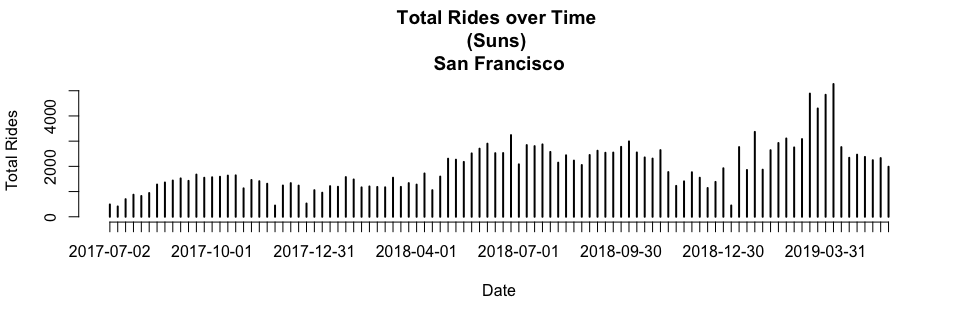

### Load Data

```r
setwd("~/Desktop/Projects/Ford-GoBike/Clean Data")
load("FGB.RData")
```

```r
abs=table(FGB[["StartCity"]][!is.na(FGB[["StartCity"]]) & !is.na(FGB[["EndCity"]])],
FGB[["EndCity"]][!is.na(FGB[["StartCity"]]) & !is.na(FGB[["EndCity"]])])
abs=cbind(abs,"Origin Total"=apply(abs,1,sum))
abs=rbind(abs,"Destination Total"=apply(abs,2,sum))
abs[,]=prettyNum(abs,",")
abs
```

```
##                   Berkeley  Emeryville Oakland   San Francisco San Jose 
## Berkeley          "157,017" "7,173"    "23,962"  "15"          "0"      
## Emeryville        "4,879"   "7,643"    "9,661"   "15"          "0"      
## Oakland           "18,789"  "11,819"   "324,800" "88"          "3"      
## San Francisco     "8"       "5"        "33"      "2,012,011"   "2"      
## San Jose          "0"       "0"        "0"       "1"           "120,090"
## Destination Total "180,693" "26,640"   "358,456" "2,012,130"   "120,095"
##                   Origin Total
## Berkeley          "188,167"   
## Emeryville        "22,198"    
## Oakland           "355,499"   
## San Francisco     "2,012,059" 
## San Jose          "120,091"   
## Destination Total "2,698,014"
```
Note: Rows=Origins, Columns=Destinations

<!-- #sum(na.omit(FGB[["StartCity"]]=="Berkeley" & FGB[["EndCity"]]=="Emeryville")) -->
<!-- #Rows=Origins -->
<!-- #Columns=Destination -->


```r
options(scipen=999)
rel=round(table(FGB[["StartCity"]][!is.na(FGB[["StartCity"]]) & !is.na(FGB[["EndCity"]])],
      FGB[["EndCity"]][!is.na(FGB[["StartCity"]]) & !is.na(FGB[["EndCity"]])])/sum(
        table(FGB[["StartCity"]][!is.na(FGB[["StartCity"]]) & !is.na(FGB[["EndCity"]])],
              FGB[["EndCity"]][!is.na(FGB[["StartCity"]]) & !is.na(FGB[["EndCity"]])])
      ),3)
rel=cbind(rel,"Origin Total"=apply(rel,1,sum))
rel=rbind(rel,"Destination Total"=apply(rel,2,sum))
rel
```

```
##                   Berkeley Emeryville Oakland San Francisco San Jose
## Berkeley             0.058      0.003   0.009         0.000    0.000
## Emeryville           0.002      0.003   0.004         0.000    0.000
## Oakland              0.007      0.004   0.120         0.000    0.000
## San Francisco        0.000      0.000   0.000         0.746    0.000
## San Jose             0.000      0.000   0.000         0.000    0.045
## Destination Total    0.067      0.010   0.133         0.746    0.045
##                   Origin Total
## Berkeley                 0.070
## Emeryville               0.009
## Oakland                  0.131
## San Francisco            0.746
## San Jose                 0.045
## Destination Total        1.001
```
Note: Rows=Origins, Columns=Destinations

2 Dimension Filter Functions

```r
filter_data=function(dt=FGB,var1,var2){
  dt=dt[!is.na(dt[[var1]]) & !is.na(dt[[var2]]) & dt[[var1]]!="NULL" & dt[[var2]]!="NULL"]
  return(dt)
}
table_data=function(dt=FGB,var1,var2,col1,col2,select1,select2){
  out=paste(
    dt[dt[[col1]]==select1][[var1]],
    dt[dt[[col2]]==select2][[var2]],sep=" , ")
  return(table(out))
}
```

### Popular ods by City

```r
ss=filter_data(FGB,"StartStationName","EndStationName")
x1=as.matrix(sort(table_data(ss,"StartStationName","EndStationName","StartCity","EndCity","San Francisco","San Francisco"),decreasing=T)[1:10])
rownames(x1)[10]=paste0(strsplit(rownames(x1)[10],"")[[1]][1:(length(strsplit(rownames(x1)[10],"")[[1]])-24)],collapse="")
x2=as.matrix(sort(table_data(ss,"StartStationName","EndStationName","StartCity","EndCity","Oakland","Oakland"),decreasing=T)[1:10])
x3=as.matrix(sort(table_data(ss,"StartStationName","EndStationName","StartCity","EndCity","Berkeley","Berkeley"),decreasing=T)[1:10])
x4=as.matrix(sort(table_data(ss,"StartStationName","EndStationName","StartCity","EndCity","San Jose","San Jose"),decreasing=T)[1:10])
x5=as.matrix(sort(table_data(ss,"StartStationName","EndStationName","StartCity","EndCity","Emeryville","Emeryville"),decreasing=T)[1:10])
ods=cbind(rownames(x1),x1,
              rownames(x2),x2,
              rownames(x3),x3,
              rownames(x4),x4,
              rownames(x5),x5)
rownames(ods)=NULL
colnames(ods)=c(rep("San Francisco",2),rep("Oakland",2),rep("Berkeley",2),rep("san Jose",2),rep("Emeryville",2))
colnames(x1)="San Francisco";colnames(x2)="Oakland";colnames(x3)="Berkeley";colnames(x4)="San Jose";colnames(x5)="Emeryville"
x1;x2;x3;x4;x5
```

```
##                                                                                    San Francisco
## San Francisco Ferry Building (Harry Bridges Plaza) , The Embarcadero at Sansome St         11696
## The Embarcadero at Sansome St , Steuart St at Market St                                     7196
## Berry St at 4th St , San Francisco Ferry Building (Harry Bridges Plaza)                     6924
## The Embarcadero at Sansome St , San Francisco Ferry Building (Harry Bridges Plaza)          5905
## Steuart St at Market St , The Embarcadero at Sansome St                                     5046
## San Francisco Ferry Building (Harry Bridges Plaza) , Berry St at 4th St                     5021
## Market St at 10th St , San Francisco Caltrain Station 2  (Townsend St at 4th St)            4462
## Townsend St at 7th St , San Francisco Caltrain Station 2  (Townsend St at 4th St)           4360
## Montgomery St BART Station (Market St at 2nd St) , S Park St at 3rd St                      4067
## Market St at 10th St , Powell St BART Stati                                                 4020
```

```
##                                                         Oakland
## Grand Ave at Perkins St , 19th Street BART Station         5974
## 19th Street BART Station , Bay Pl at Vernon St             5551
## Bay Pl at Vernon St , 19th Street BART Station             5176
## Lake Merritt BART Station , El Embarcadero at Grand Ave    3300
## MacArthur BART Station , Webster St at 2nd St              2886
## 2nd Ave at E 18th St , 2nd Ave at E 18th St                2532
## Broadway at 40th St , MacArthur BART Station               2503
## 19th Street BART Station , Genoa St at 55th St             2451
## Telegraph Ave at 27th St , Grand Ave at Webster St         2389
## 19th Street BART Station , Grand Ave at Santa Clara Ave    2323
```

```
##                                                             Berkeley
## Bancroft Way at College Ave , Ashby BART Station                3304
## Bancroft Way at College Ave , Fulton St at Bancroft Way         2876
## Bancroft Way at Telegraph Ave , Berkeley Civic Center           2675
## College Ave at Alcatraz Ave , Bancroft Way at Telegraph Ave     2168
## North Berkeley BART Station , Parker St at Fulton St            1715
## Bancroft Way at Telegraph Ave , Derby St at College Ave         1521
## Downtown Berkeley BART , Milvia St at Derby St                  1482
## Ashby BART Station , Bancroft Way at Telegraph Ave              1383
## Telegraph Ave at Ashby Ave , Downtown Berkeley BART             1383
## Downtown Berkeley BART , Downtown Berkeley BART                 1374
```

```
##                                                      San Jose
## 5th St at Virginia St , San Fernando St at 4th St        1853
## San Fernando St at 4th St , 5th St at Virginia St        1790
## 5th St at Virginia St , San Salvador St at 9th St        1298
## San Fernando St at 4th St , Ryland Park                  1243
## 5th St at Virginia St , San Fernando at 7th St           1240
## Ryland Park , San Fernando St at 4th St                  1117
## San Salvador St at 9th St , 5th St at Virginia St        1004
## San Jose Diridon Station , San Fernando St at 4th St      940
## Julian St at The Alameda , The Alameda at Bush St         875
## 5th St at Virginia St , 5th St at San Salvador St         841
```

```
##                                                  Emeryville
## Horton St at 40th St , 65th St at Hollis St             995
## Horton St at 40th St , Horton St at 40th St             865
## Adeline St at 40th St , 47th St at San Pablo Ave        782
## 65th St at Hollis St , Emeryville Public Market         639
## Emeryville Town Hall , 65th St at Hollis St             621
## 59th St at Horton St , Adeline St at 40th St            598
## 47th St at San Pablo Ave , 65th St at Hollis St         596
## Adeline St at 40th St , 59th St at Horton St            592
## Horton St at 40th St , 59th St at Horton St             546
## 59th St at Horton St , 65th St at Hollis St             512
```

```r
#as.data.table(ods)
```

1 Dimension Filter Functions


```r
filter_data_1d=function(dt=FGB,var1,col=c(),vars=c(),not=T){
  if (length(vars)==0 & length(col)==0){
    dt=dt[!is.na(dt[[var1]]) & dt[[var1]]!="NULL"]
  } else{
    if (not){
      dt=dt[!is.na(dt[[var1]]) & !(dt[[col]] %in% vars)]
    } else {
      dt=dt[!is.na(dt[[var1]]) & (dt[[col]] %in% vars)]
    }
  }
  return(dt)
}
table_data_1d=function(dt=FGB,var1,col1,select1){
  out=paste(
    dt[dt[[col1]]==select1][[var1]])
  return(table(out))
}
```

### Popular Origins by City

```r
ss=filter_data_1d(FGB,"StartStationName")

x1=as.matrix(sort(table_data_1d(ss,"StartStationName","StartCity","San Francisco"),decreasing=T)[1:10])
x2=as.matrix(sort(table_data_1d(ss,"StartStationName","StartCity","Oakland"),decreasing=T)[1:10])
x3=as.matrix(sort(table_data_1d(ss,"StartStationName","StartCity","Berkeley"),decreasing=T)[1:10])
x4=as.matrix(sort(table_data_1d(ss,"StartStationName","StartCity","San Jose"),decreasing=T)[1:10])
x5=as.matrix(sort(table_data_1d(ss,"StartStationName","StartCity","Emeryville"),decreasing=T)[1:10])
origins=cbind(rownames(x1),x1,
              rownames(x2),x2,
              rownames(x3),x3,
              rownames(x4),x4,
              rownames(x5),x5)
rownames(origins)=NULL
colnames(origins)=c(rep("San Francisco",2),rep("Oakland",2),rep("Berkeley",2),rep("san Jose",2),rep("Emeryville",2))
colnames(x1)="San Francisco";colnames(x2)="Oakland";colnames(x3)="Berkeley";colnames(x4)="San Jose";colnames(x5)="Emeryville"
x1;x2;x3;x4;x5
```

```
##                                                           San Francisco
## San Francisco Ferry Building (Harry Bridges Plaza)                59473
## San Francisco Caltrain Station 2  (Townsend St at 4th St)         56991
## Market St at 10th St                                              54635
## San Francisco Caltrain (Townsend St at 4th St)                    53396
## The Embarcadero at Sansome St                                     51414
## Berry St at 4th St                                                50857
## Montgomery St BART Station (Market St at 2nd St)                  49526
## Powell St BART Station (Market St at 4th St)                      47671
## Steuart St at Market St                                           42623
## Howard St at Beale St                                             41388
```

```
##                             Oakland
## 19th Street BART Station      24714
## MacArthur BART Station        18582
## Lake Merritt BART Station     14663
## Grand Ave at Perkins St       13811
## El Embarcadero at Grand Ave   13616
## Frank H Ogawa Plaza           13286
## Bay Pl at Vernon St           12890
## 2nd Ave at E 18th St          12815
## Grand Ave at Webster St       12173
## West Oakland BART Station     12096
```

```
##                               Berkeley
## Bancroft Way at College Ave      20435
## Bancroft Way at Telegraph Ave    15742
## Downtown Berkeley BART           12960
## Ashby BART Station               10590
## Haste St at Telegraph Ave         8639
## Hearst Ave at Euclid Ave          7829
## Parker St at Fulton St            7501
## Berkeley Civic Center             6985
## Haste St at College Ave           6034
## Telegraph Ave at Ashby Ave        5994
```

```
##                                San Jose
## San Fernando St at 4th St         10169
## 5th St at Virginia St              9376
## San Jose Diridon Station           9005
## Ryland Park                        6677
## San Salvador St at 9th St          5493
## Julian St at The Alameda           4881
## Paseo De San Antonio at 2nd St     4565
## The Alameda at Bush St             4257
## San Pedro Square                   3829
## San Jose City Hall                 3738
```

```
##                           Emeryville
## 65th St at Hollis St            3292
## Horton St at 40th St            3268
## Adeline St at 40th St           2952
## 59th St at Horton St            2259
## Emeryville Town Hall            2148
## Emeryville Public Market        2101
## Doyle St at 59th St             1911
## Stanford Ave at Hollis St       1903
## 47th St at San Pablo Ave        1807
## 53rd St at Hollis St             849
```

```r
#as.data.table(origins)
```

### Popular Destinations by City

```r
ss=filter_data_1d(FGB,"EndStationName")
x1=as.matrix(sort(table_data_1d(ss,"EndStationName","EndCity","San Francisco"),decreasing=T)[1:10])
x2=as.matrix(sort(table_data_1d(ss,"EndStationName","EndCity","Oakland"),decreasing=T)[1:10])
x3=as.matrix(sort(table_data_1d(ss,"EndStationName","EndCity","Berkeley"),decreasing=T)[1:10])
x4=as.matrix(sort(table_data_1d(ss,"EndStationName","EndCity","San Jose"),decreasing=T)[1:10])
x5=as.matrix(sort(table_data_1d(ss,"EndStationName","EndCity","Emeryville"),decreasing=T)[1:10])
destinations=cbind(rownames(x1),x1,
              rownames(x2),x2,
              rownames(x3),x3,
              rownames(x4),x4,
              rownames(x5),x5)
rownames(destinations)=NULL
colnames(destinations)=c(rep("San Francisco",2),rep("Oakland",2),rep("Berkeley",2),rep("san Jose",2),rep("Emeryville",2))
colnames(x1)="San Francisco";colnames(x2)="Oakland";colnames(x3)="Berkeley";colnames(x4)="San Jose";colnames(x5)="Emeryville"
x1;x2;x3;x4;x5
```

```
##                                                           San Francisco
## San Francisco Caltrain Station 2  (Townsend St at 4th St)         73759
## San Francisco Ferry Building (Harry Bridges Plaza)                68282
## San Francisco Caltrain (Townsend St at 4th St)                    66877
## The Embarcadero at Sansome St                                     61017
## Montgomery St BART Station (Market St at 2nd St)                  56778
## Market St at 10th St                                              53621
## Powell St BART Station (Market St at 4th St)                      50386
## Berry St at 4th St                                                49307
## Steuart St at Market St                                           42914
## Powell St BART Station (Market St at 5th St)                      39411
```

```
##                             Oakland
## 19th Street BART Station      27379
## MacArthur BART Station        20524
## El Embarcadero at Grand Ave   15539
## Grand Ave at Perkins St       14951
## 2nd Ave at E 18th St          13966
## Frank H Ogawa Plaza           13383
## West Oakland BART Station     12474
## Bay Pl at Vernon St           12443
## Grand Ave at Webster St       12208
## Lake Merritt BART Station     10645
```

```
##                               Berkeley
## Downtown Berkeley BART           17319
## Bancroft Way at Telegraph Ave    14422
## Ashby BART Station               11581
## Parker St at Fulton St            8320
## Bancroft Way at College Ave       8167
## Berkeley Civic Center             7935
## Haste St at Telegraph Ave         6691
## Fulton St at Bancroft Way         6659
## MLK Jr Way at University Ave      6252
## Telegraph Ave at Ashby Ave        5837
```

```
##                                San Jose
## San Fernando St at 4th St         10533
## San Jose Diridon Station           9096
## 5th St at Virginia St              8580
## Ryland Park                        6436
## San Salvador St at 9th St          5780
## Julian St at The Alameda           4895
## Paseo De San Antonio at 2nd St     4767
## The Alameda at Bush St             4518
## San Fernando at 7th St             3992
## San Pedro Square                   3825
```

```
##                           Emeryville
## 65th St at Hollis St            4821
## Horton St at 40th St            3592
## Adeline St at 40th St           3228
## 59th St at Horton St            2846
## Emeryville Public Market        2646
## Stanford Ave at Hollis St       2273
## Doyle St at 59th St             2208
## Emeryville Town Hall            2134
## 47th St at San Pablo Ave        2084
## 53rd St at Hollis St            1272
```

```r
#as.data.table(destinations)
```


### Total Rides Over Time

```r
ss=filter_data_1d(FGB,"StartDate",col="StartDayType")[['StartDate']]
```


```r
plot(table(ss),xlab="Date",ylab="Total Rides",main="Total Rides over Time \n(All Daytypes)")
```

<!-- -->


```r
plot(table(filter_data_1d(FGB,"StartDate",col="StartDayType",vars=wday(c(1,7),T),not=T)[["StartDate"]]),xlab="Date",ylab="Total Rides",main="Total Rides over Time \n(Weekdays)")
```

<!-- -->


```r
plot(table(filter_data_1d(FGB,"StartDate",col="StartDayType",vars=c("Sat"),not=F)[["StartDate"]]),xlab="Date",ylab="Total Rides",main="Total Rides over Time \n(Sats)")
```

<!-- -->


```r
plot(table(filter_data_1d(FGB,"StartDate",col="StartDayType",vars=c("Sun"),not=F)[["StartDate"]]),xlab="Date",ylab="Total Rides",main="Total Rides over Time \n(Suns)")
```

<!-- -->


```r
berk=FGB[FGB[["StartCity"]]=="Berkeley" & FGB[["EndCity"]]=="Berkeley",]
ss=filter_data_1d(berk,"StartDate",col="StartDayType")[['StartDate']]
```

```r
plot(table(ss),xlab="Date",ylab="Total Rides",main="Total Rides over Time \n(All Daytypes) \nBerkeley")
```

<!-- -->

```r
plot(table(filter_data_1d(berk,"StartDate",col="StartDayType",vars=c("Sat"),not=F)[["StartDate"]]),
     xlab="Date",ylab="Total Rides",main="Total Rides over Time \n(Sats) \nBerkeley")
```

<!-- -->

```r
plot(table(filter_data_1d(berk,"StartDate",col="StartDayType",vars=c("Sun"),not=F)[["StartDate"]]),
     xlab="Date",ylab="Total Rides",main="Total Rides over Time \n(Suns) \nBerkeley")
```

<!-- -->

```r
sanjose=FGB[FGB[["StartCity"]]=="San Jose" & FGB[["EndCity"]]=="San Jose",]
ss=filter_data_1d(sanjose,"StartDate",col="StartDayType")[['StartDate']]
```

```r
plot(table(ss),xlab="Date",ylab="Total Rides",main="Total Rides over Time \n(All Daytypes) \nSan Jose")
```

<!-- -->

```r
plot(table(filter_data_1d(sanjose,"StartDate",col="StartDayType",vars=c("Sat"),not=F)[["StartDate"]]),
     xlab="Date",ylab="Total Rides",main="Total Rides over Time \n(Sats) \nSan Jose")
```

<!-- -->

```r
plot(table(filter_data_1d(sanjose,"StartDate",col="StartDayType",vars=c("Sun"),not=F)[["StartDate"]]),
     xlab="Date",ylab="Total Rides",main="Total Rides over Time \n(Suns) \nSan Jose")
```

<!-- -->

```r
sanFrancisco=FGB[FGB[["StartCity"]]=="San Francisco" & FGB[["EndCity"]]=="San Francisco",]
ss=filter_data_1d(sanFrancisco,"StartDate",col="StartDayType")[['StartDate']]
```

```r
plot(table(ss),xlab="Date",ylab="Total Rides",main="Total Rides over Time \n(All Daytypes) \nSan Francisco")
```

<!-- -->

```r
plot(table(filter_data_1d(sanFrancisco,"StartDate",col="StartDayType",vars=c("Sat"),not=F)[["StartDate"]]),
     xlab="Date",ylab="Total Rides",main="Total Rides over Time \n(Sats) \nSan Francisco")
```

<!-- -->

```r
plot(table(filter_data_1d(sanFrancisco,"StartDate",col="StartDayType",vars=c("Sun"),not=F)[["StartDate"]]),
     xlab="Date",ylab="Total Rides",main="Total Rides over Time \n(Suns) \nSan Francisco")
```

<!-- -->

```r
Oakland=FGB[FGB[["StartCity"]]=="Oakland" & FGB[["EndCity"]]=="Oakland",]
ss=filter_data_1d(Oakland,"StartDate",col="StartDayType")[['StartDate']]
```

```r
plot(table(ss),xlab="Date",ylab="Total Rides",main="Total Rides over Time \n(All Daytypes) \nOakland")
```

<!-- -->

```r
plot(table(filter_data_1d(Oakland,"StartDate",col="StartDayType",vars=c("Sat"),not=F)[["StartDate"]]),
     xlab="Date",ylab="Total Rides",main="Total Rides over Time \n(Sats) \nOakland")
```

<!-- -->

```r
plot(table(filter_data_1d(Oakland,"StartDate",col="StartDayType",vars=c("Sun"),not=F)[["StartDate"]]),
     xlab="Date",ylab="Total Rides",main="Total Rides over Time \n(Suns) \nOakland")
```

<!-- -->

```r
Emeryville=FGB[FGB[["StartCity"]]=="Emeryville" & FGB[["EndCity"]]=="Emeryville",]
ss=filter_data_1d(Emeryville,"StartDate",col="StartDayType")[['StartDate']]
```

```r
plot(table(ss),xlab="Date",ylab="Total Rides",main="Total Rides over Time \n(All Daytypes) \nEmeryville")
```

<!-- -->

```r
plot(table(filter_data_1d(Emeryville,"StartDate",col="StartDayType",vars=c("Sat"),not=F)[["StartDate"]]),
     xlab="Date",ylab="Total Rides",main="Total Rides over Time \n(Sats) \nEmeryville")
```

<!-- -->

```r
plot(table(filter_data_1d(Emeryville,"StartDate",col="StartDayType",vars=c("Sun"),not=F)[["StartDate"]]),
     xlab="Date",ylab="Total Rides",main="Total Rides over Time \n(Suns) \nEmeryville")
```

<!-- -->
