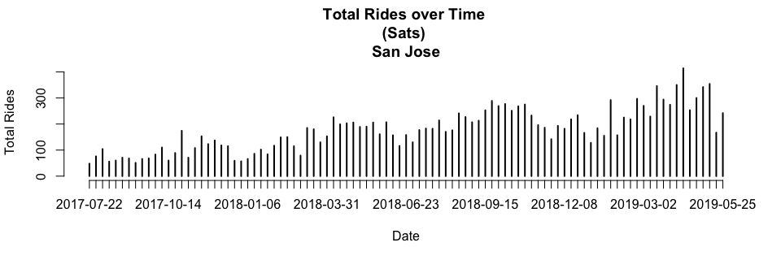
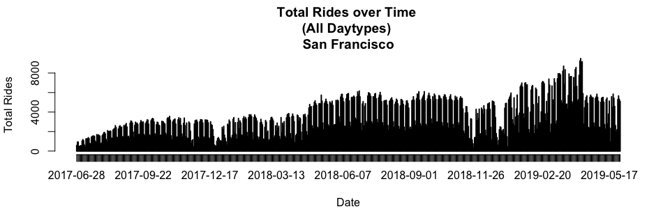

### Load Data

```r
setwd("~/Ford-GoBike/Clean Data")
load("FGB.RData")
```

```r
abs=table(FGB[["start city"]][!is.na(FGB[["start city"]]) & !is.na(FGB[["end city"]])],
FGB[["end city"]][!is.na(FGB[["start city"]]) & !is.na(FGB[["end city"]])])
abs=cbind(abs,"Origin Total"=apply(abs,1,sum))
abs=rbind(abs,"Destination Total"=apply(abs,2,sum))
abs[,]=prettyNum(abs,",")
abs
```

```
##                   Berkeley  Emeryville Oakland   San Francisco San Jose 
## Berkeley          "128,615" "6,224"    "20,900"  "15"          "0"      
## Emeryville        "4,092"   "6,723"    "8,145"   "15"          "0"      
## Oakland           "16,175"  "10,008"   "286,407" "76"          "2"      
## San Francisco     "8"       "5"        "31"      "1,714,976"   "1"      
## San Jose          "0"       "0"        "0"       "1"           "105,023"
## Destination Total "148,890" "22,960"   "315,483" "1,715,083"   "105,026"
##                   Origin Total
## Berkeley          "155,754"   
## Emeryville        "18,975"    
## Oakland           "312,668"   
## San Francisco     "1,715,021" 
## San Jose          "105,024"   
## Destination Total "2,307,442"
```
Note: Rows=Origins, Columns=Destinations

<!-- #sum(na.omit(FGB[["start city"]]=="Berkeley" & FGB[["end city"]]=="Emeryville")) -->
<!-- #Rows=Origins -->
<!-- #Columns=Destination -->


```r
options(scipen=999)
rel=round(table(FGB[["start city"]][!is.na(FGB[["start city"]]) & !is.na(FGB[["end city"]])],
      FGB[["end city"]][!is.na(FGB[["start city"]]) & !is.na(FGB[["end city"]])])/sum(
        table(FGB[["start city"]][!is.na(FGB[["start city"]]) & !is.na(FGB[["end city"]])],
              FGB[["end city"]][!is.na(FGB[["start city"]]) & !is.na(FGB[["end city"]])])
      ),3)
rel=cbind(rel,"Origin Total"=apply(rel,1,sum))
rel=rbind(rel,"Destination Total"=apply(rel,2,sum))
rel
```

```
##                   Berkeley Emeryville Oakland San Francisco San Jose
## Berkeley             0.056      0.003   0.009         0.000    0.000
## Emeryville           0.002      0.003   0.004         0.000    0.000
## Oakland              0.007      0.004   0.124         0.000    0.000
## San Francisco        0.000      0.000   0.000         0.743    0.000
## San Jose             0.000      0.000   0.000         0.000    0.046
## Destination Total    0.065      0.010   0.137         0.743    0.046
##                   Origin Total
## Berkeley                 0.068
## Emeryville               0.009
## Oakland                  0.135
## San Francisco            0.743
## San Jose                 0.046
## Destination Total        1.001
```
Note: Rows=Origins, Columns=Destinations

2 Dimension Filter Functions

```r
filter_data=function(dt=FGB,var1,var2){
  dt=dt[!is.na(dt[[var1]]) & !is.na(dt[[var2]]) & dt[[var1]]!="NULL" & dt[[var2]]!="NULL"]
  return(dt)
}
table_data=function(dt=FGB,var1,var2,col1,col2,select1,select2){
  out=paste(
    dt[dt[[col1]]==select1][[var1]],
    dt[dt[[col2]]==select2][[var2]],sep=" , ")
  return(table(out))
}
```

### Popular ods by City

```r
ss=filter_data(FGB,"start_station_name","end_station_name")
x1=as.matrix(sort(table_data(ss,"start_station_name","end_station_name","start city","end city","San Francisco","San Francisco"),decreasing=T)[1:10])
rownames(x1)[10]=paste0(strsplit(rownames(x1)[10],"")[[1]][1:(length(strsplit(rownames(x1)[10],"")[[1]])-24)],collapse="")
x2=as.matrix(sort(table_data(ss,"start_station_name","end_station_name","start city","end city","Oakland","Oakland"),decreasing=T)[1:10])
x3=as.matrix(sort(table_data(ss,"start_station_name","end_station_name","start city","end city","Berkeley","Berkeley"),decreasing=T)[1:10])
x4=as.matrix(sort(table_data(ss,"start_station_name","end_station_name","start city","end city","San Jose","San Jose"),decreasing=T)[1:10])
x5=as.matrix(sort(table_data(ss,"start_station_name","end_station_name","start city","end city","Emeryville","Emeryville"),decreasing=T)[1:10])
ods=cbind(rownames(x1),x1,
              rownames(x2),x2,
              rownames(x3),x3,
              rownames(x4),x4,
              rownames(x5),x5)
rownames(ods)=NULL
colnames(ods)=c(rep("San Francisco",2),rep("Oakland",2),rep("Berkeley",2),rep("san Jose",2),rep("Emeryville",2))
colnames(x1)="San Francisco";colnames(x2)="Oakland";colnames(x3)="Berkeley";colnames(x4)="San Jose";colnames(x5)="Emeryville"
x1;x2;x3;x4;x5
```

```
##                                                                                    San Francisco
## San Francisco Ferry Building (Harry Bridges Plaza) , The Embarcadero at Sansome St         10560
## The Embarcadero at Sansome St , Steuart St at Market St                                     6368
## Berry St at 4th St , San Francisco Ferry Building (Harry Bridges Plaza)                     6220
## The Embarcadero at Sansome St , San Francisco Ferry Building (Harry Bridges Plaza)          5803
## San Francisco Ferry Building (Harry Bridges Plaza) , Berry St at 4th St                     4470
## Steuart St at Market St , The Embarcadero at Sansome St                                     4415
## Market St at 10th St , San Francisco Caltrain Station 2  (Townsend St at 4th St)            3984
## Townsend St at 7th St , San Francisco Caltrain Station 2  (Townsend St at 4th St)           3800
## The Embarcadero at Sansome St , The Embarcadero at Sansome St                               3733
## Howard St at Beale St , San Francisco Caltrain                                              3719
```

```
##                                                         Oakland
## Grand Ave at Perkins St , 19th Street BART Station         5084
## 19th Street BART Station , Bay Pl at Vernon St             4762
## Bay Pl at Vernon St , 19th Street BART Station             4610
## Lake Merritt BART Station , El Embarcadero at Grand Ave    2790
## MacArthur BART Station , Webster St at 2nd St              2542
## Broadway at 40th St , MacArthur BART Station               2165
## 19th Street BART Station , Genoa St at 55th St             2121
## 2nd Ave at E 18th St , 2nd Ave at E 18th St                2115
## 2nd Ave at E 18th St , College Ave at Harwood Ave          1992
## Telegraph Ave at 27th St , Grand Ave at Webster St         1952
```

```
##                                                               Berkeley
## Bancroft Way at College Ave , Fulton St at Bancroft Way           3170
## Bancroft Way at Telegraph Ave , Berkeley Civic Center             2587
## Bancroft Way at College Ave , Ashby BART Station                  1791
## College Ave at Alcatraz Ave , Bancroft Way at Telegraph Ave       1737
## Bancroft Way at College Ave , Milvia St at Derby St               1609
## Ashby BART Station , Haste St at Telegraph Ave                    1376
## Derby St at College Ave , Bancroft Way at Telegraph Ave           1375
## Downtown Berkeley BART , Downtown Berkeley BART                   1197
## Parker St at Fulton St , Downtown Berkeley BART                   1172
## Bancroft Way at College Ave , California St at University Ave     1153
```

```
##                                                                        San Jose
## 5th St at Virginia St , San Fernando St at 4th St                          1476
## San Fernando St at 4th St , 5th St at Virginia St                          1425
## 5th St at Virginia St , San Fernando at 7th St                             1240
## 5th St at Virginia St , San Salvador St at 9th St                          1095
## San Fernando St at 4th St , Ryland Park                                    1089
## Ryland Park , San Fernando St at 4th St                                     983
## San Jose Diridon Station , San Fernando St at 4th St                        872
## San Salvador St at 9th St , 5th St at Virginia St                           851
## San Fernando at 7th St , 5th St at Virginia St                              808
## 6th St at San Fernando St (Temporary Location) , 5th St at Virginia St      765
```

```
##                                                  Emeryville
## Horton St at 40th St , 65th St at Hollis St             939
## Horton St at 40th St , Horton St at 40th St             746
## Adeline St at 40th St , 47th St at San Pablo Ave        664
## 65th St at Hollis St , Emeryville Public Market         592
## Emeryville Town Hall , 65th St at Hollis St             531
## Adeline St at 40th St , 59th St at Horton St            507
## 59th St at Horton St , Adeline St at 40th St            495
## 65th St at Hollis St , Adeline St at 40th St            473
## Horton St at 40th St , 59th St at Horton St             473
## 65th St at Hollis St , 65th St at Hollis St             460
```

```r
#as.data.table(ods)
```

1 Dimension Filter Functions

```r
filter_data_1d=function(dt=FGB,var1,col=c(),vars=c(),not=T){
  if (length(vars)==0 & length(col)==0){
    dt=dt[!is.na(dt[[var1]]) & dt[[var1]]!="NULL"]
  } else{
    if (not){
      dt=dt[!is.na(dt[[var1]]) & dt[[var1]]!="NULL" & !(dt[[col]] %in% vars)]
    } else {
      dt=dt[!is.na(dt[[var1]]) & dt[[var1]]!="NULL" & (dt[[col]] %in% vars)]
    }
  }
  return(dt)
}
table_data_1d=function(dt=FGB,var1,col1,select1){
  out=paste(
    dt[dt[[col1]]==select1][[var1]])
  return(table(out))
}
```

### Popular Origins by City

```r
ss=filter_data_1d(FGB,"start_station_name")

x1=as.matrix(sort(table_data_1d(ss,"start_station_name","start city","San Francisco"),decreasing=T)[1:10])
x2=as.matrix(sort(table_data_1d(ss,"start_station_name","start city","Oakland"),decreasing=T)[1:10])
x3=as.matrix(sort(table_data_1d(ss,"start_station_name","start city","Berkeley"),decreasing=T)[1:10])
x4=as.matrix(sort(table_data_1d(ss,"start_station_name","start city","San Jose"),decreasing=T)[1:10])
x5=as.matrix(sort(table_data_1d(ss,"start_station_name","start city","Emeryville"),decreasing=T)[1:10])
origins=cbind(rownames(x1),x1,
              rownames(x2),x2,
              rownames(x3),x3,
              rownames(x4),x4,
              rownames(x5),x5)
rownames(origins)=NULL
colnames(origins)=c(rep("San Francisco",2),rep("Oakland",2),rep("Berkeley",2),rep("san Jose",2),rep("Emeryville",2))
colnames(x1)="San Francisco";colnames(x2)="Oakland";colnames(x3)="Berkeley";colnames(x4)="San Jose";colnames(x5)="Emeryville"
x1;x2;x3;x4;x5
```

```
##                                                           San Francisco
## San Francisco Ferry Building (Harry Bridges Plaza)                53648
## San Francisco Caltrain Station 2  (Townsend St at 4th St)         49672
## San Francisco Caltrain (Townsend St at 4th St)                    47638
## The Embarcadero at Sansome St                                     47054
## Market St at 10th St                                              46878
## Berry St at 4th St                                                44672
## Montgomery St BART Station (Market St at 2nd St)                  43465
## Powell St BART Station (Market St at 4th St)                      41798
## Steuart St at Market St                                           37714
## Howard St at Beale St                                             36461
```

```
##                             Oakland
## 19th Street BART Station      21993
## MacArthur BART Station        16604
## Lake Merritt BART Station     13136
## Grand Ave at Perkins St       12291
## El Embarcadero at Grand Ave   12227
## Bay Pl at Vernon St           11698
## Frank H Ogawa Plaza           11593
## 2nd Ave at E 18th St          11185
## Grand Ave at Webster St       10764
## West Oakland BART Station     10338
```

```
##                               Berkeley
## Bancroft Way at College Ave      17262
## Bancroft Way at Telegraph Ave    12734
## Downtown Berkeley BART           10378
## Ashby BART Station                9012
## Haste St at Telegraph Ave         7389
## Parker St at Fulton St            6070
## Hearst Ave at Euclid Ave          5927
## Berkeley Civic Center             5733
## Telegraph Ave at Ashby Ave        5141
## Derby St at College Ave           4861
```

```
##                                San Jose
## San Fernando St at 4th St          8707
## San Jose Diridon Station           8106
## 5th St at Virginia St              7735
## Ryland Park                        5919
## San Salvador St at 9th St          4877
## Julian St at The Alameda           4203
## Paseo De San Antonio at 2nd St     3990
## The Alameda at Bush St             3671
## San Fernando at 7th St             3506
## San Jose City Hall                 3444
```

```
##                           Emeryville
## 65th St at Hollis St            2847
## Horton St at 40th St            2755
## Adeline St at 40th St           2554
## 59th St at Horton St            1935
## Emeryville Town Hall            1921
## Emeryville Public Market        1696
## Stanford Ave at Hollis St       1564
## 47th St at San Pablo Ave        1541
## Doyle St at 59th St             1531
## 53rd St at Hollis St             674
```

```r
#as.data.table(origins)
```

### Popular Destinations by City

```r
ss=filter_data_1d(FGB,"end_station_name")
x1=as.matrix(sort(table_data_1d(ss,"end_station_name","end city","San Francisco"),decreasing=T)[1:10])
x2=as.matrix(sort(table_data_1d(ss,"end_station_name","end city","Oakland"),decreasing=T)[1:10])
x3=as.matrix(sort(table_data_1d(ss,"end_station_name","end city","Berkeley"),decreasing=T)[1:10])
x4=as.matrix(sort(table_data_1d(ss,"end_station_name","end city","San Jose"),decreasing=T)[1:10])
x5=as.matrix(sort(table_data_1d(ss,"end_station_name","end city","Emeryville"),decreasing=T)[1:10])
destinations=cbind(rownames(x1),x1,
              rownames(x2),x2,
              rownames(x3),x3,
              rownames(x4),x4,
              rownames(x5),x5)
rownames(destinations)=NULL
colnames(destinations)=c(rep("San Francisco",2),rep("Oakland",2),rep("Berkeley",2),rep("san Jose",2),rep("Emeryville",2))
colnames(x1)="San Francisco";colnames(x2)="Oakland";colnames(x3)="Berkeley";colnames(x4)="San Jose";colnames(x5)="Emeryville"
x1;x2;x3;x4;x5
```

```
##                                                           San Francisco
## San Francisco Caltrain Station 2  (Townsend St at 4th St)         63658
## San Francisco Ferry Building (Harry Bridges Plaza)                61222
## San Francisco Caltrain (Townsend St at 4th St)                    60348
## The Embarcadero at Sansome St                                     55753
## Montgomery St BART Station (Market St at 2nd St)                  49398
## Market St at 10th St                                              45663
## Powell St BART Station (Market St at 4th St)                      44150
## Berry St at 4th St                                                43397
## Steuart St at Market St                                           37913
## Powell St BART Station (Market St at 5th St)                      34565
```

```
##                             Oakland
## 19th Street BART Station      24346
## MacArthur BART Station        18219
## El Embarcadero at Grand Ave   13962
## Grand Ave at Perkins St       13355
## 2nd Ave at E 18th St          12205
## Frank H Ogawa Plaza           11696
## Bay Pl at Vernon St           11218
## Grand Ave at Webster St       10798
## West Oakland BART Station     10538
## Lake Merritt BART Station      9394
```

```
##                               Berkeley
## Downtown Berkeley BART           14750
## Bancroft Way at Telegraph Ave    11333
## Ashby BART Station                9928
## Parker St at Fulton St            6843
## Berkeley Civic Center             6649
## Bancroft Way at College Ave       6225
## Haste St at Telegraph Ave         5632
## Fulton St at Bancroft Way         5479
## Telegraph Ave at Ashby Ave        4956
## Addison St at Fourth St           4855
```

```
##                                San Jose
## San Fernando St at 4th St          9055
## San Jose Diridon Station           8225
## 5th St at Virginia St              6981
## Ryland Park                        5714
## San Salvador St at 9th St          5128
## Julian St at The Alameda           4233
## Paseo De San Antonio at 2nd St     4166
## San Fernando at 7th St             3992
## The Alameda at Bush St             3934
## San Pedro Square                   3363
```

```
##                           Emeryville
## 65th St at Hollis St            4286
## Horton St at 40th St            3051
## Adeline St at 40th St           2766
## 59th St at Horton St            2434
## Emeryville Public Market        2155
## Emeryville Town Hall            1907
## Stanford Ave at Hollis St       1884
## 47th St at San Pablo Ave        1776
## Doyle St at 59th St             1727
## 53rd St at Hollis St            1057
```

```r
#as.data.table(destinations)
```


### Total Rides Over Time

```r
ss=filter_data_1d(FGB,"start_date",col="start_daytype")[['start_date']]
```


```r
plot(table(ss),xlab="Date",ylab="Total Rides",main="Total Rides over Time \n(All Daytypes)")
```

<!-- -->


```r
plot(table(filter_data_1d(FGB,"start_date",col="start_daytype",vars=c("Saturday","Sunday"),not=T)[["start_date"]]),xlab="Date",ylab="Total Rides",main="Total Rides over Time \n(Weekdays)")
```

<!-- -->


```r
plot(table(filter_data_1d(FGB,"start_date",col="start_daytype",vars=c("Saturday"),not=F)[["start_date"]]),xlab="Date",ylab="Total Rides",main="Total Rides over Time \n(Saturdays)")
```

<!-- -->


```r
plot(table(filter_data_1d(FGB,"start_date",col="start_daytype",vars=c("Sunday"),not=F)[["start_date"]]),xlab="Date",ylab="Total Rides",main="Total Rides over Time \n(Sundays)")
```

<!-- -->


```r
berk=FGB[FGB[["start city"]]=="Berkeley" & FGB[["end city"]]=="Berkeley",]
ss=filter_data_1d(berk,"start_date",col="start_daytype")[['start_date']]
```

```r
plot(table(ss),xlab="Date",ylab="Total Rides",main="Total Rides over Time \n(All Daytypes) \nBerkeley")
```

<!-- -->

```r
plot(table(filter_data_1d(berk,"start_date",col="start_daytype",vars=c("Saturday"),not=F)[["start_date"]]),
     xlab="Date",ylab="Total Rides",main="Total Rides over Time \n(Saturdays) \nBerkeley")
```

<!-- -->

```r
plot(table(filter_data_1d(berk,"start_date",col="start_daytype",vars=c("Sunday"),not=F)[["start_date"]]),
     xlab="Date",ylab="Total Rides",main="Total Rides over Time \n(Sundays) \nBerkeley")
```

<!-- -->

```r
sanjose=FGB[FGB[["start city"]]=="San Jose" & FGB[["end city"]]=="San Jose",]
ss=filter_data_1d(sanjose,"start_date",col="start_daytype")[['start_date']]
```

```r
plot(table(ss),xlab="Date",ylab="Total Rides",main="Total Rides over Time \n(All Daytypes) \nSan Jose")
```

<!-- -->

```r
plot(table(filter_data_1d(sanjose,"start_date",col="start_daytype",vars=c("Saturday"),not=F)[["start_date"]]),
     xlab="Date",ylab="Total Rides",main="Total Rides over Time \n(Saturdays) \nSan Jose")
```

<!-- -->

```r
plot(table(filter_data_1d(sanjose,"start_date",col="start_daytype",vars=c("Sunday"),not=F)[["start_date"]]),
     xlab="Date",ylab="Total Rides",main="Total Rides over Time \n(Sundays) \nSan Jose")
```

<!-- -->

```r
sanFrancisco=FGB[FGB[["start city"]]=="San Francisco" & FGB[["end city"]]=="San Francisco",]
ss=filter_data_1d(sanFrancisco,"start_date",col="start_daytype")[['start_date']]
```

```r
plot(table(ss),xlab="Date",ylab="Total Rides",main="Total Rides over Time \n(All Daytypes) \nSan Francisco")
```

<!-- -->

```r
plot(table(filter_data_1d(sanFrancisco,"start_date",col="start_daytype",vars=c("Saturday"),not=F)[["start_date"]]),
     xlab="Date",ylab="Total Rides",main="Total Rides over Time \n(Saturdays) \nSan Francisco")
```

<!-- -->

```r
plot(table(filter_data_1d(sanFrancisco,"start_date",col="start_daytype",vars=c("Sunday"),not=F)[["start_date"]]),
     xlab="Date",ylab="Total Rides",main="Total Rides over Time \n(Sundays) \nSan Francisco")
```

<!-- -->

```r
Oakland=FGB[FGB[["start city"]]=="Oakland" & FGB[["end city"]]=="Oakland",]
ss=filter_data_1d(Oakland,"start_date",col="start_daytype")[['start_date']]
```

```r
plot(table(ss),xlab="Date",ylab="Total Rides",main="Total Rides over Time \n(All Daytypes) \nOakland")
```

<!-- -->

```r
plot(table(filter_data_1d(Oakland,"start_date",col="start_daytype",vars=c("Saturday"),not=F)[["start_date"]]),
     xlab="Date",ylab="Total Rides",main="Total Rides over Time \n(Saturdays) \nOakland")
```

<!-- -->

```r
plot(table(filter_data_1d(Oakland,"start_date",col="start_daytype",vars=c("Sunday"),not=F)[["start_date"]]),
     xlab="Date",ylab="Total Rides",main="Total Rides over Time \n(Sundays) \nOakland")
```

<!-- -->

```r
Emeryville=FGB[FGB[["start city"]]=="Emeryville" & FGB[["end city"]]=="Emeryville",]
ss=filter_data_1d(Emeryville,"start_date",col="start_daytype")[['start_date']]
```

```r
plot(table(ss),xlab="Date",ylab="Total Rides",main="Total Rides over Time \n(All Daytypes) \nEmeryville")
```

<!-- -->

```r
plot(table(filter_data_1d(Emeryville,"start_date",col="start_daytype",vars=c("Saturday"),not=F)[["start_date"]]),
     xlab="Date",ylab="Total Rides",main="Total Rides over Time \n(Saturdays) \nEmeryville")
```

<!-- -->

```r
plot(table(filter_data_1d(Emeryville,"start_date",col="start_daytype",vars=c("Sunday"),not=F)[["start_date"]]),
     xlab="Date",ylab="Total Rides",main="Total Rides over Time \n(Sundays) \nEmeryville")
```

<!-- -->
