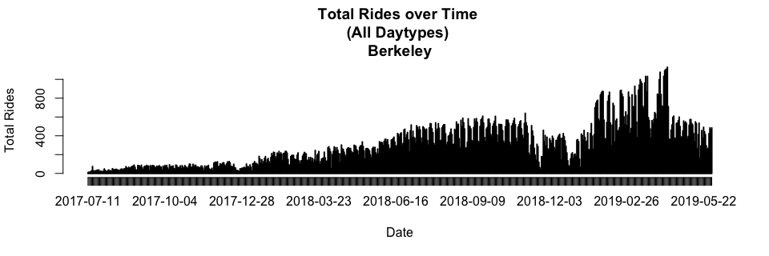
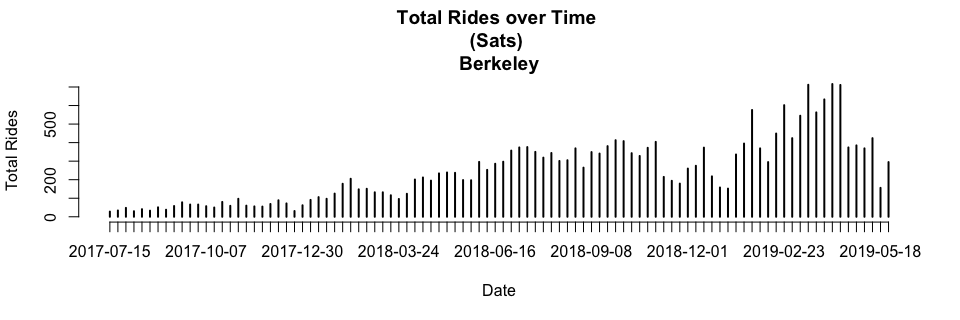
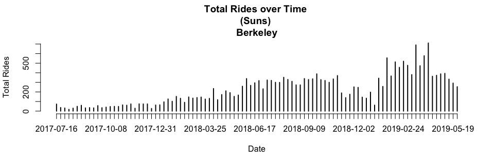

### Load Data

```r
setwd("~/Ford-GoBike/Clean Data")
load("FGB.RData")
```

```r
abs=table(FGB[["start city"]][!is.na(FGB[["start city"]]) & !is.na(FGB[["end city"]])],
FGB[["end city"]][!is.na(FGB[["start city"]]) & !is.na(FGB[["end city"]])])
abs=cbind(abs,"Origin Total"=apply(abs,1,sum))
abs=rbind(abs,"Destination Total"=apply(abs,2,sum))
abs[,]=prettyNum(abs,",")
abs
```

```
##                   Berkeley  Emeryville Oakland   San Francisco San Jose
## Berkeley          "119,888" "5,733"    "19,739"  "15"          "0"     
## Emeryville        "3,770"   "6,321"    "7,652"   "15"          "0"     
## Oakland           "15,218"  "9,446"    "272,561" "70"          "2"     
## San Francisco     "8"       "5"        "28"      "1,618,251"   "1"     
## San Jose          "0"       "0"        "0"       "1"           "98,079"
## Destination Total "138,884" "21,505"   "299,980" "1,618,352"   "98,082"
##                   Origin Total
## Berkeley          "145,375"   
## Emeryville        "17,758"    
## Oakland           "297,297"   
## San Francisco     "1,618,293" 
## San Jose          "98,080"    
## Destination Total "2,176,803"
```
Note: Rows=Origins, Columns=Destinations

<!-- #sum(na.omit(FGB[["start city"]]=="Berkeley" & FGB[["end city"]]=="Emeryville")) -->
<!-- #Rows=Origins -->
<!-- #Columns=Destination -->


```r
options(scipen=999)
rel=round(table(FGB[["start city"]][!is.na(FGB[["start city"]]) & !is.na(FGB[["end city"]])],
      FGB[["end city"]][!is.na(FGB[["start city"]]) & !is.na(FGB[["end city"]])])/sum(
        table(FGB[["start city"]][!is.na(FGB[["start city"]]) & !is.na(FGB[["end city"]])],
              FGB[["end city"]][!is.na(FGB[["start city"]]) & !is.na(FGB[["end city"]])])
      ),3)
rel=cbind(rel,"Origin Total"=apply(rel,1,sum))
rel=rbind(rel,"Destination Total"=apply(rel,2,sum))
rel
```

```
##                   Berkeley Emeryville Oakland San Francisco San Jose
## Berkeley             0.055      0.003   0.009         0.000    0.000
## Emeryville           0.002      0.003   0.004         0.000    0.000
## Oakland              0.007      0.004   0.125         0.000    0.000
## San Francisco        0.000      0.000   0.000         0.743    0.000
## San Jose             0.000      0.000   0.000         0.000    0.045
## Destination Total    0.064      0.010   0.138         0.743    0.045
##                   Origin Total
## Berkeley                 0.067
## Emeryville               0.009
## Oakland                  0.136
## San Francisco            0.743
## San Jose                 0.045
## Destination Total        1.000
```
Note: Rows=Origins, Columns=Destinations

2 Dimension Filter Functions

```r
filter_data=function(dt=FGB,var1,var2){
  dt=dt[!is.na(dt[[var1]]) & !is.na(dt[[var2]]) & dt[[var1]]!="NULL" & dt[[var2]]!="NULL"]
  return(dt)
}
table_data=function(dt=FGB,var1,var2,col1,col2,select1,select2){
  out=paste(
    dt[dt[[col1]]==select1][[var1]],
    dt[dt[[col2]]==select2][[var2]],sep=" , ")
  return(table(out))
}
```

### Popular ods by City

```r
ss=filter_data(FGB,"start_station_name","end_station_name")
x1=as.matrix(sort(table_data(ss,"start_station_name","end_station_name","start city","end city","San Francisco","San Francisco"),decreasing=T)[1:10])
rownames(x1)[10]=paste0(strsplit(rownames(x1)[10],"")[[1]][1:(length(strsplit(rownames(x1)[10],"")[[1]])-24)],collapse="")
x2=as.matrix(sort(table_data(ss,"start_station_name","end_station_name","start city","end city","Oakland","Oakland"),decreasing=T)[1:10])
x3=as.matrix(sort(table_data(ss,"start_station_name","end_station_name","start city","end city","Berkeley","Berkeley"),decreasing=T)[1:10])
x4=as.matrix(sort(table_data(ss,"start_station_name","end_station_name","start city","end city","San Jose","San Jose"),decreasing=T)[1:10])
x5=as.matrix(sort(table_data(ss,"start_station_name","end_station_name","start city","end city","Emeryville","Emeryville"),decreasing=T)[1:10])
ods=cbind(rownames(x1),x1,
              rownames(x2),x2,
              rownames(x3),x3,
              rownames(x4),x4,
              rownames(x5),x5)
rownames(ods)=NULL
colnames(ods)=c(rep("San Francisco",2),rep("Oakland",2),rep("Berkeley",2),rep("san Jose",2),rep("Emeryville",2))
colnames(x1)="San Francisco";colnames(x2)="Oakland";colnames(x3)="Berkeley";colnames(x4)="San Jose";colnames(x5)="Emeryville"
x1;x2;x3;x4;x5
```

```
##                                                                                    San Francisco
## San Francisco Ferry Building (Harry Bridges Plaza) , The Embarcadero at Sansome St         10551
## The Embarcadero at Sansome St , Steuart St at Market St                                     6297
## Berry St at 4th St , San Francisco Ferry Building (Harry Bridges Plaza)                     5956
## The Embarcadero at Sansome St , San Francisco Ferry Building (Harry Bridges Plaza)          5313
## San Francisco Ferry Building (Harry Bridges Plaza) , Berry St at 4th St                     4460
## Steuart St at Market St , The Embarcadero at Sansome St                                     4405
## Market St at 10th St , San Francisco Caltrain Station 2  (Townsend St at 4th St)            3754
## Howard St at Beale St , San Francisco Caltrain (Townsend St at 4th St)                      3702
## The Embarcadero at Sansome St , The Embarcadero at Sansome St                               3611
## Townsend St at 7th St , San Francisco Caltrain Station 2                                    3591
```

```
##                                                         Oakland
## Grand Ave at Perkins St , 19th Street BART Station         5018
## 19th Street BART Station , Bay Pl at Vernon St             4749
## Bay Pl at Vernon St , 19th Street BART Station             4533
## Lake Merritt BART Station , El Embarcadero at Grand Ave    2773
## MacArthur BART Station , Webster St at 2nd St              2500
## Broadway at 40th St , MacArthur BART Station               2142
## 19th Street BART Station , Genoa St at 55th St             2116
## 2nd Ave at E 18th St , 2nd Ave at E 18th St                2102
## 2nd Ave at E 18th St , College Ave at Harwood Ave          1992
## Telegraph Ave at 27th St , Grand Ave at Webster St         1941
```

```
##                                                               Berkeley
## Bancroft Way at College Ave , Fulton St at Bancroft Way           3167
## Bancroft Way at Telegraph Ave , Berkeley Civic Center             2578
## College Ave at Alcatraz Ave , Bancroft Way at Telegraph Ave       1695
## Bancroft Way at College Ave , Milvia St at Derby St               1609
## Bancroft Way at College Ave , Ashby BART Station                  1549
## Derby St at College Ave , Bancroft Way at Telegraph Ave           1375
## Downtown Berkeley BART , Downtown Berkeley BART                   1197
## Telegraph Ave at Ashby Ave , Downtown Berkeley BART               1151
## Bancroft Way at Telegraph Ave , Ashby BART Station                1137
## Bancroft Way at College Ave , California St at University Ave     1125
```

```
##                                                           San Jose
## 5th St at Virginia St , San Fernando St at 4th St             1256
## 5th St at Virginia St , San Fernando at 7th St                1240
## San Fernando St at 4th St , 5th St at Virginia St             1220
## San Fernando St at 4th St , Ryland Park                       1030
## 5th St at Virginia St , San Salvador St at 9th St              995
## Ryland Park , San Fernando St at 4th St                        926
## San Jose Diridon Station , San Fernando St at 4th St           830
## San Fernando at 7th St , 5th St at Virginia St                 808
## San Salvador St at 9th St , 5th St at Virginia St              777
## San Jose Diridon Station , Santa Clara St at Almaden Blvd      691
```

```
##                                                  Emeryville
## Horton St at 40th St , 65th St at Hollis St             892
## Horton St at 40th St , Horton St at 40th St             746
## Adeline St at 40th St , 47th St at San Pablo Ave        664
## Emeryville Town Hall , 65th St at Hollis St             538
## 59th St at Horton St , Adeline St at 40th St            495
## 47th St at San Pablo Ave , 65th St at Hollis St         490
## Adeline St at 40th St , 59th St at Horton St            487
## 65th St at Hollis St , Adeline St at 40th St            473
## 65th St at Hollis St , Emeryville Public Market         454
## Emeryville Town Hall , Horton St at 40th St             433
```

```r
#as.data.table(ods)
```

1 Dimension Filter Functions

```r
filter_data_1d=function(dt=FGB,var1,col=c(),vars=c(),not=T){
  if (length(vars)==0 & length(col)==0){
    dt=dt[!is.na(dt[[var1]]) & dt[[var1]]!="NULL"]
  } else{
    if (not){
      dt=dt[!is.na(dt[[var1]]) & dt[[var1]]!="NULL" & !(dt[[col]] %in% vars)]
    } else {
      dt=dt[!is.na(dt[[var1]]) & dt[[var1]]!="NULL" & (dt[[col]] %in% vars)]
    }
  }
  return(dt)
}
table_data_1d=function(dt=FGB,var1,col1,select1){
  out=paste(
    dt[dt[[col1]]==select1][[var1]])
  return(table(out))
}
```

### Popular Origins by City

```r
ss=filter_data_1d(FGB,"start_station_name")

x1=as.matrix(sort(table_data_1d(ss,"start_station_name","start city","San Francisco"),decreasing=T)[1:10])
x2=as.matrix(sort(table_data_1d(ss,"start_station_name","start city","Oakland"),decreasing=T)[1:10])
x3=as.matrix(sort(table_data_1d(ss,"start_station_name","start city","Berkeley"),decreasing=T)[1:10])
x4=as.matrix(sort(table_data_1d(ss,"start_station_name","start city","San Jose"),decreasing=T)[1:10])
x5=as.matrix(sort(table_data_1d(ss,"start_station_name","start city","Emeryville"),decreasing=T)[1:10])
origins=cbind(rownames(x1),x1,
              rownames(x2),x2,
              rownames(x3),x3,
              rownames(x4),x4,
              rownames(x5),x5)
rownames(origins)=NULL
colnames(origins)=c(rep("San Francisco",2),rep("Oakland",2),rep("Berkeley",2),rep("san Jose",2),rep("Emeryville",2))
colnames(x1)="San Francisco";colnames(x2)="Oakland";colnames(x3)="Berkeley";colnames(x4)="San Jose";colnames(x5)="Emeryville"
x1;x2;x3;x4;x5
```

```
##                                                           San Francisco
## San Francisco Ferry Building (Harry Bridges Plaza)                51231
## San Francisco Caltrain Station 2  (Townsend St at 4th St)         46868
## San Francisco Caltrain (Townsend St at 4th St)                    45469
## The Embarcadero at Sansome St                                     45169
## Market St at 10th St                                              44330
## Berry St at 4th St                                                42627
## Montgomery St BART Station (Market St at 2nd St)                  41452
## Powell St BART Station (Market St at 4th St)                      39518
## Steuart St at Market St                                           35823
## Howard St at Beale St                                             34739
```

```
##                             Oakland
## 19th Street BART Station      21081
## MacArthur BART Station        15911
## Lake Merritt BART Station     12518
## Grand Ave at Perkins St       11773
## El Embarcadero at Grand Ave   11750
## Bay Pl at Vernon St           11199
## Frank H Ogawa Plaza           11058
## 2nd Ave at E 18th St          10629
## Grand Ave at Webster St       10302
## West Oakland BART Station      9757
```

```
##                               Berkeley
## Bancroft Way at College Ave      16503
## Bancroft Way at Telegraph Ave    12028
## Downtown Berkeley BART            9553
## Ashby BART Station                8447
## Haste St at Telegraph Ave         7017
## Parker St at Fulton St            5701
## Hearst Ave at Euclid Ave          5488
## Berkeley Civic Center             5337
## Telegraph Ave at Ashby Ave        4861
## Derby St at College Ave           4583
```

```
##                                San Jose
## San Fernando St at 4th St          8007
## San Jose Diridon Station           7775
## 5th St at Virginia St              6954
## Ryland Park                        5552
## San Salvador St at 9th St          4559
## Julian St at The Alameda           3851
## Paseo De San Antonio at 2nd St     3737
## San Fernando at 7th St             3506
## The Alameda at Bush St             3383
## San Jose City Hall                 3291
```

```
##                           Emeryville
## 65th St at Hollis St            2670
## Horton St at 40th St            2592
## Adeline St at 40th St           2408
## Emeryville Town Hall            1815
## 59th St at Horton St            1791
## Emeryville Public Market        1524
## Doyle St at 59th St             1458
## Stanford Ave at Hollis St       1451
## 47th St at San Pablo Ave        1449
## 53rd St at Hollis St             617
```

```r
#as.data.table(origins)
```

### Popular Destinations by City

```r
ss=filter_data_1d(FGB,"end_station_name")
x1=as.matrix(sort(table_data_1d(ss,"end_station_name","end city","San Francisco"),decreasing=T)[1:10])
x2=as.matrix(sort(table_data_1d(ss,"end_station_name","end city","Oakland"),decreasing=T)[1:10])
x3=as.matrix(sort(table_data_1d(ss,"end_station_name","end city","Berkeley"),decreasing=T)[1:10])
x4=as.matrix(sort(table_data_1d(ss,"end_station_name","end city","San Jose"),decreasing=T)[1:10])
x5=as.matrix(sort(table_data_1d(ss,"end_station_name","end city","Emeryville"),decreasing=T)[1:10])
destinations=cbind(rownames(x1),x1,
              rownames(x2),x2,
              rownames(x3),x3,
              rownames(x4),x4,
              rownames(x5),x5)
rownames(destinations)=NULL
colnames(destinations)=c(rep("San Francisco",2),rep("Oakland",2),rep("Berkeley",2),rep("san Jose",2),rep("Emeryville",2))
colnames(x1)="San Francisco";colnames(x2)="Oakland";colnames(x3)="Berkeley";colnames(x4)="San Jose";colnames(x5)="Emeryville"
x1;x2;x3;x4;x5
```

```
##                                                           San Francisco
## San Francisco Caltrain Station 2  (Townsend St at 4th St)         60304
## San Francisco Ferry Building (Harry Bridges Plaza)                58410
## San Francisco Caltrain (Townsend St at 4th St)                    57669
## The Embarcadero at Sansome St                                     53435
## Montgomery St BART Station (Market St at 2nd St)                  47207
## Market St at 10th St                                              43009
## Powell St BART Station (Market St at 4th St)                      41711
## Berry St at 4th St                                                41330
## Steuart St at Market St                                           35983
## Powell St BART Station (Market St at 5th St)                      32651
```

```
##                             Oakland
## 19th Street BART Station      23200
## MacArthur BART Station        17344
## El Embarcadero at Grand Ave   13385
## Grand Ave at Perkins St       12828
## 2nd Ave at E 18th St          11580
## Frank H Ogawa Plaza           11155
## Bay Pl at Vernon St           10731
## Grand Ave at Webster St       10357
## West Oakland BART Station      9910
## Lake Merritt BART Station      8900
```

```
##                               Berkeley
## Downtown Berkeley BART           13827
## Bancroft Way at Telegraph Ave    10696
## Ashby BART Station                9243
## Parker St at Fulton St            6424
## Berkeley Civic Center             6238
## Bancroft Way at College Ave       5997
## Haste St at Telegraph Ave         5338
## Fulton St at Bancroft Way         5173
## Telegraph Ave at Ashby Ave        4691
## Addison St at Fourth St           4569
```

```
##                                San Jose
## San Fernando St at 4th St          8345
## San Jose Diridon Station           7914
## 5th St at Virginia St              6240
## Ryland Park                        5354
## San Salvador St at 9th St          4783
## San Fernando at 7th St             3992
## Paseo De San Antonio at 2nd St     3909
## Julian St at The Alameda           3906
## The Alameda at Bush St             3650
## San Pedro Square                   3181
```

```
##                           Emeryville
## 65th St at Hollis St            4059
## Horton St at 40th St            2883
## Adeline St at 40th St           2584
## 59th St at Horton St            2231
## Emeryville Public Market        1920
## Emeryville Town Hall            1801
## Stanford Ave at Hollis St       1758
## 47th St at San Pablo Ave        1668
## Doyle St at 59th St             1627
## 53rd St at Hollis St             992
```

```r
#as.data.table(destinations)
```


### Total Rides Over Time

```r
ss=filter_data_1d(FGB,"start_date",col="start_daytype")[['start_date']]
```


```r
plot(table(ss),xlab="Date",ylab="Total Rides",main="Total Rides over Time \n(All Daytypes)")
```

<!-- -->


```r
plot(table(filter_data_1d(FGB,"start_date",col="start_daytype",vars=c("Saturday","Sunday"),not=T)[["start_date"]]),xlab="Date",ylab="Total Rides",main="Total Rides over Time \n(Weekdays)")
```

<!-- -->


```r
plot(table(filter_data_1d(FGB,"start_date",col="start_daytype",vars=c("Saturday"),not=F)[["start_date"]]),xlab="Date",ylab="Total Rides",main="Total Rides over Time \n(Saturdays)")
```

<!-- -->


```r
plot(table(filter_data_1d(FGB,"start_date",col="start_daytype",vars=c("Sunday"),not=F)[["start_date"]]),xlab="Date",ylab="Total Rides",main="Total Rides over Time \n(Sundays)")
```

<!-- -->


```r
berk=FGB[FGB[["start city"]]=="Berkeley" & FGB[["end city"]]=="Berkeley",]
ss=filter_data_1d(berk,"start_date",col="start_daytype")[['start_date']]
```

```r
plot(table(ss),xlab="Date",ylab="Total Rides",main="Total Rides over Time \n(All Daytypes) \nBerkeley")
```

<!-- -->

```r
plot(table(filter_data_1d(berk,"start_date",col="start_daytype",vars=c("Saturday"),not=F)[["start_date"]]),
     xlab="Date",ylab="Total Rides",main="Total Rides over Time \n(Saturdays) \nBerkeley")
```

<!-- -->

```r
plot(table(filter_data_1d(berk,"start_date",col="start_daytype",vars=c("Sunday"),not=F)[["start_date"]]),
     xlab="Date",ylab="Total Rides",main="Total Rides over Time \n(Sundays) \nBerkeley")
```

<!-- -->

```r
sanjose=FGB[FGB[["start city"]]=="San Jose" & FGB[["end city"]]=="San Jose",]
ss=filter_data_1d(sanjose,"start_date",col="start_daytype")[['start_date']]
```

```r
plot(table(ss),xlab="Date",ylab="Total Rides",main="Total Rides over Time \n(All Daytypes) \nSan Jose")
```

<!-- -->

```r
plot(table(filter_data_1d(sanjose,"start_date",col="start_daytype",vars=c("Saturday"),not=F)[["start_date"]]),
     xlab="Date",ylab="Total Rides",main="Total Rides over Time \n(Saturdays) \nSan Jose")
```

<!-- -->

```r
plot(table(filter_data_1d(sanjose,"start_date",col="start_daytype",vars=c("Sunday"),not=F)[["start_date"]]),
     xlab="Date",ylab="Total Rides",main="Total Rides over Time \n(Sundays) \nSan Jose")
```

<!-- -->

```r
sanFrancisco=FGB[FGB[["start city"]]=="San Francisco" & FGB[["end city"]]=="San Francisco",]
ss=filter_data_1d(sanFrancisco,"start_date",col="start_daytype")[['start_date']]
```

```r
plot(table(ss),xlab="Date",ylab="Total Rides",main="Total Rides over Time \n(All Daytypes) \nSan Francisco")
```

<!-- -->

```r
plot(table(filter_data_1d(sanFrancisco,"start_date",col="start_daytype",vars=c("Saturday"),not=F)[["start_date"]]),
     xlab="Date",ylab="Total Rides",main="Total Rides over Time \n(Saturdays) \nSan Francisco")
```

<!-- -->

```r
plot(table(filter_data_1d(sanFrancisco,"start_date",col="start_daytype",vars=c("Sunday"),not=F)[["start_date"]]),
     xlab="Date",ylab="Total Rides",main="Total Rides over Time \n(Sundays) \nSan Francisco")
```

<!-- -->

```r
Oakland=FGB[FGB[["start city"]]=="Oakland" & FGB[["end city"]]=="Oakland",]
ss=filter_data_1d(Oakland,"start_date",col="start_daytype")[['start_date']]
```

```r
plot(table(ss),xlab="Date",ylab="Total Rides",main="Total Rides over Time \n(All Daytypes) \nOakland")
```

<!-- -->

```r
plot(table(filter_data_1d(Oakland,"start_date",col="start_daytype",vars=c("Saturday"),not=F)[["start_date"]]),
     xlab="Date",ylab="Total Rides",main="Total Rides over Time \n(Saturdays) \nOakland")
```

<!-- -->

```r
plot(table(filter_data_1d(Oakland,"start_date",col="start_daytype",vars=c("Sunday"),not=F)[["start_date"]]),
     xlab="Date",ylab="Total Rides",main="Total Rides over Time \n(Sundays) \nOakland")
```

<!-- -->

```r
Emeryville=FGB[FGB[["start city"]]=="Emeryville" & FGB[["end city"]]=="Emeryville",]
ss=filter_data_1d(Emeryville,"start_date",col="start_daytype")[['start_date']]
```

```r
plot(table(ss),xlab="Date",ylab="Total Rides",main="Total Rides over Time \n(All Daytypes) \nEmeryville")
```

<!-- -->

```r
plot(table(filter_data_1d(Emeryville,"start_date",col="start_daytype",vars=c("Saturday"),not=F)[["start_date"]]),
     xlab="Date",ylab="Total Rides",main="Total Rides over Time \n(Saturdays) \nEmeryville")
```

<!-- -->

```r
plot(table(filter_data_1d(Emeryville,"start_date",col="start_daytype",vars=c("Sunday"),not=F)[["start_date"]]),
     xlab="Date",ylab="Total Rides",main="Total Rides over Time \n(Sundays) \nEmeryville")
```

<!-- -->
