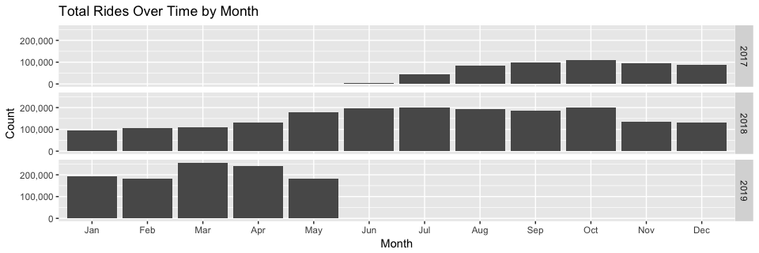
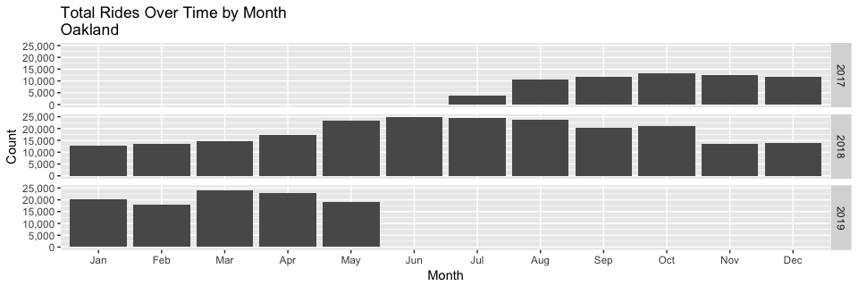
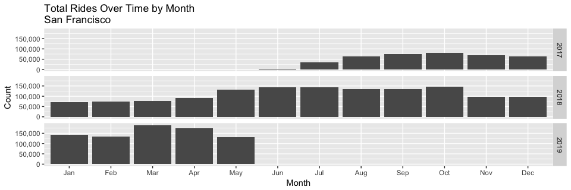

### Load Data

```r
setwd("~/Ford-GoBike/Clean Data")
load("FGB.RData")
```

```r
FGB %>% ggplot(aes(x=start_monthlabel)) + geom_bar() + facet_grid(start_year ~ .) + 
  xlab("Month") + scale_y_continuous(name="Count", labels = scales::comma) +
  ggtitle("Total Rides Over Time by Month")
```

<!-- -->


```r
berk=FGB[FGB[["start city"]]=="Berkeley" & FGB[["end city"]]=="Berkeley",]
berk %>% ggplot(aes(x=start_monthlabel)) + geom_bar() + facet_grid(start_year ~ .) +xlab("Month") + scale_y_continuous(name="Count", labels = scales::comma) +
  ggtitle("Total Rides Over Time by Month\nBerkeley")
```

<!-- -->

```r
sanjose=FGB[FGB[["start city"]]=="San Jose" & FGB[["end city"]]=="San Jose",]
sanjose %>% ggplot(aes(x=start_monthlabel)) + geom_bar() + facet_grid(start_year ~ .) +xlab("Month") + scale_y_continuous(name="Count", labels = scales::comma) +
  ggtitle("Total Rides Over Time by Month\nSan Jose")
```

<!-- -->

```r
Oakland=FGB[FGB[["start city"]]=="Oakland" & FGB[["end city"]]=="Oakland",]
Oakland %>% ggplot(aes(x=start_monthlabel)) + geom_bar() + facet_grid(start_year ~ .) +xlab("Month") + scale_y_continuous(name="Count", labels = scales::comma) +
  ggtitle("Total Rides Over Time by Month\nOakland")
```

<!-- -->

```r
SF=FGB[FGB[["start city"]]=="San Francisco" & FGB[["end city"]]=="San Francisco",]
SF %>% ggplot(aes(x=start_monthlabel)) + geom_bar() + facet_grid(start_year ~ .) +xlab("Month") + scale_y_continuous(name="Count", labels = scales::comma) +
  ggtitle("Total Rides Over Time by Month \nSan Francisco")
```

<!-- -->

```r
Emeryville=FGB[FGB[["start city"]]=="Emeryville" & FGB[["end city"]]=="Emeryville",]
Emeryville %>% ggplot(aes(x=start_monthlabel)) + geom_bar() + facet_grid(start_year ~ .) +xlab("Month") + scale_y_continuous(name="Count", labels = scales::comma) +
  ggtitle("Total Rides Over Time by Month \nEmeryville")
```

<!-- -->
