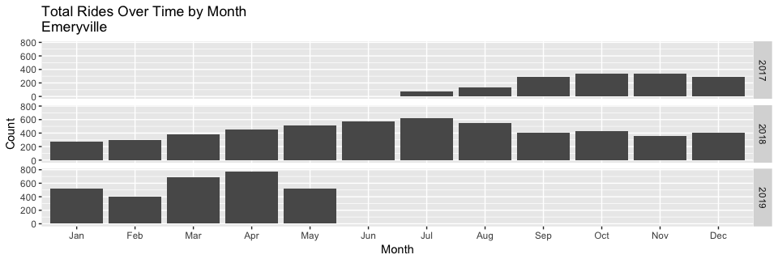

### Load Data

```r
setwd("~/Desktop/Projects/Ford-GoBike/Clean Data")
load("FGB.RData")
```

```r
FGB %>% ggplot(aes(x=StartMonthLabel)) + geom_bar() + facet_grid(StartYear ~ .) + 
  xlab("Month") + scale_y_continuous(name="Count", labels = scales::comma) +
  ggtitle("Total Rides Over Time by Month")
```

<!-- -->


```r
berk=FGB[FGB[["StartCity"]]=="Berkeley" & FGB[["EndCity"]]=="Berkeley",]
berk %>% ggplot(aes(x=StartMonthLabel)) + geom_bar() + facet_grid(StartYear ~ .) +xlab("Month") + scale_y_continuous(name="Count", labels = scales::comma) +
  ggtitle("Total Rides Over Time by Month\nBerkeley")
```

<!-- -->

```r
sanjose=FGB[FGB[["StartCity"]]=="San Jose" & FGB[["EndCity"]]=="San Jose",]
sanjose %>% ggplot(aes(x=StartMonthLabel)) + geom_bar() + facet_grid(StartYear ~ .) +xlab("Month") + scale_y_continuous(name="Count", labels = scales::comma) +
  ggtitle("Total Rides Over Time by Month\nSan Jose")
```

<!-- -->

```r
Oakland=FGB[FGB[["StartCity"]]=="Oakland" & FGB[["EndCity"]]=="Oakland",]
Oakland %>% ggplot(aes(x=StartMonthLabel)) + geom_bar() + facet_grid(StartYear ~ .) +xlab("Month") + scale_y_continuous(name="Count", labels = scales::comma) +
  ggtitle("Total Rides Over Time by Month\nOakland")
```

<!-- -->

```r
SF=FGB[FGB[["StartCity"]]=="San Francisco" & FGB[["EndCity"]]=="San Francisco",]
SF %>% ggplot(aes(x=StartMonthLabel)) + geom_bar() + facet_grid(StartYear ~ .) +xlab("Month") + scale_y_continuous(name="Count", labels = scales::comma) +
  ggtitle("Total Rides Over Time by Month \nSan Francisco")
```

<!-- -->

```r
Emeryville=FGB[FGB[["StartCity"]]=="Emeryville" & FGB[["EndCity"]]=="Emeryville",]
Emeryville %>% ggplot(aes(x=StartMonthLabel)) + geom_bar() + facet_grid(StartYear ~ .) +xlab("Month") + scale_y_continuous(name="Count", labels = scales::comma) +
  ggtitle("Total Rides Over Time by Month \nEmeryville")
```

<!-- -->
