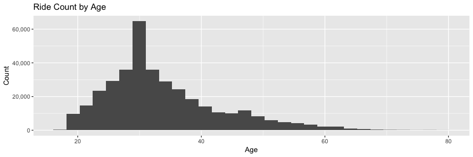
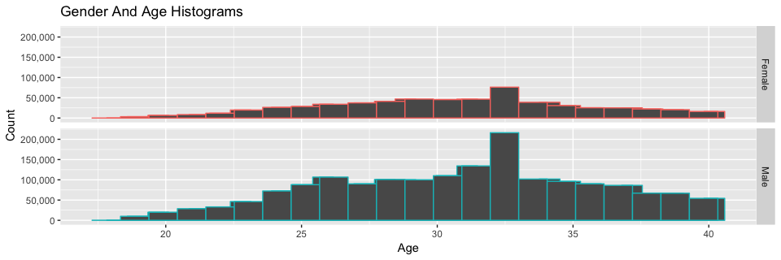
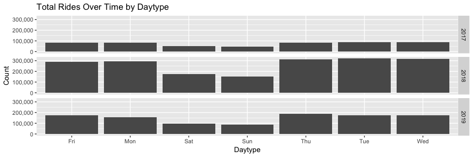
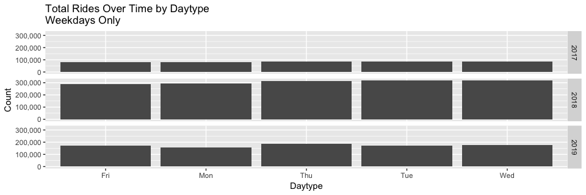
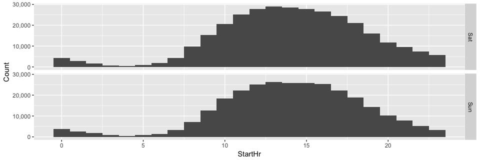

### Load Data

```r
setwd("~/Desktop/Projects/Ford-GoBike/Clean Data")
load("FGB.RData")
```
## Visualizations
Note: These visualizations are based on individual trip records and not by individual unique users.

```r
FGB %>% filter(Age <= 80 & UserType=="Subscriber") %>% ggplot(aes(x=Age)) + geom_histogram() + 
xlab("Age") + ylab("Count") + ggtitle("Ride Count by Age") + scale_y_continuous(name="Count", labels = scales::comma)
```

<!-- -->


```r
FGB %>% filter(Age <= 80 & UserType=="Customer") %>% ggplot(aes(x=Age)) + geom_histogram() +
  xlab("Age") + ylab("Count") + scale_y_continuous(name="Count", labels = scales::comma) +
  ggtitle("Ride Count by Age")
```

<!-- -->


```r
FGB %>% ggplot(aes(x=MemberGender)) + geom_bar() + 
  xlab("Gender")+ylab("Count") + scale_y_continuous(name="Count", labels = scales::comma) +
  ggtitle("Ride Gender Count")
```

<!-- -->


```r
FGB %>% filter(Age <= 80) %>% filter(MemberGender!="Other") %>% ggplot(aes(x=Age, color=MemberGender)) + 
  geom_histogram(position="identity") +
  xlab("Age") + ylab("Count") + scale_y_continuous(name="Count", labels = scales::comma) + 
  facet_grid(MemberGender ~ .) + theme(legend.position="none") +
  ggtitle("Gender And Age Histograms")
```

<!-- -->

```r
FGB %>% filter(Age <= 40) %>% filter(MemberGender!="Other") %>% ggplot(aes(x=Age, color=MemberGender)) + 
  geom_histogram(position="identity") +
  xlab("Age") + ylab("Count") + scale_y_continuous(name="Count", labels = scales::comma) + 
  facet_grid(MemberGender ~ .) + theme(legend.position="none") + stat_bin(bins=(40-18)) +
  ggtitle("Gender And Age Histograms")
```

<!-- -->


```r
FGB %>% ggplot(aes(x=StartDayType)) + geom_bar() + facet_grid(StartYear ~ .) + 
  xlab("Daytype") + scale_y_continuous(name="Count", labels = scales::comma) + 
  ggtitle("Total Rides Over Time by Daytype")
```

<!-- -->

```r
FGB %>% filter(StartDayType %in% wday(c(1,7),T)) %>% ggplot(aes(x=StartDayType)) + geom_bar() + facet_grid(StartYear ~ .) + 
  xlab("Daytype") + scale_y_continuous(name="Count", labels = scales::comma) + 
  ggtitle("Total Rides Over Time by Daytype \nWeekends Only")
```

<!-- -->

```r
FGB %>% filter(StartDayType %in% wday(seq(2,6),T)) %>% ggplot(aes(x=StartDayType)) + geom_bar() + facet_grid(StartYear ~ .) + 
  xlab("Daytype") + scale_y_continuous(name="Count", labels = scales::comma) + 
  ggtitle("Total Rides Over Time by Daytype \nWeekdays Only")
```

<!-- -->


```r
FGB %>% filter(DurationSec/60<30) %>% ggplot(aes(x=DurationSec/60)) + 
  stat_ecdf()  + scale_y_continuous(name="Cumulative Proportion", labels = scales::percent) + 
  scale_x_continuous(name="Duraction in Minutes", labels = scales::comma)+
  ggtitle(("Cumulative Duration Distribution \n(below 30 minutes)"))
```

<!-- -->


```r
FGB %>% filter(DurationSec/60<30) %>% ggplot(aes(x=DurationSec/60)) + 
  stat_ecdf()  + scale_y_continuous(name="Cumulative Proportion", labels = scales::percent) + 
  scale_x_continuous(name="Duraction in Minutes", labels = scales::comma)+
  ggtitle("Cumulative Duration Distribution by Year \n(below 30 minutes)")+facet_grid(StartYear~.)
```

<!-- -->


```r
FGB %>% filter(StartHr %in% seq(0,23)) %>% ggplot(aes(x=StartHr)) + 
  geom_histogram(aes(y=..density..),position="identity") + stat_bin(bins=24) + 
  xlab("Start Hour") + 
  scale_y_continuous(name="Count", labels = scales::comma)+
  facet_grid(StartDayType ~ .)
```

<!-- -->


```r
FGB %>% filter(StartHr %in% seq(0,23) & StartDayType %in% wday(seq(2,6),T)) %>% ggplot(aes(x=StartHr)) + 
  geom_histogram(aes(y=..density..),position="identity") + stat_bin(bins=24) + 
  xlab("Start Hour") + 
  scale_y_continuous(name="Count", labels = scales::comma)+
  facet_grid(StartDayType ~ .)
```

<!-- -->


```r
FGB %>% filter(StartHr %in% seq(0,23) & StartDayType %in% wday(c(1,7),T)) %>% ggplot(aes(x=StartHr)) + 
  geom_histogram(aes(y=..density..),position="identity") + stat_bin(bins=24)+
  scale_y_continuous(name="Count", labels = scales::comma)+
  facet_grid(StartDayType ~ .)
```

<!-- -->
