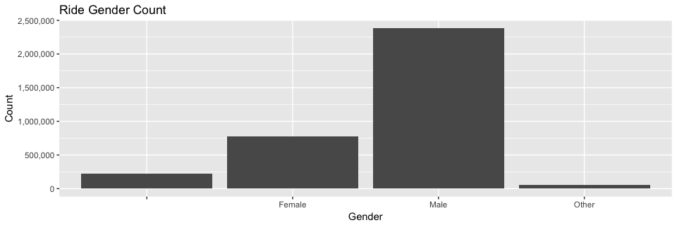
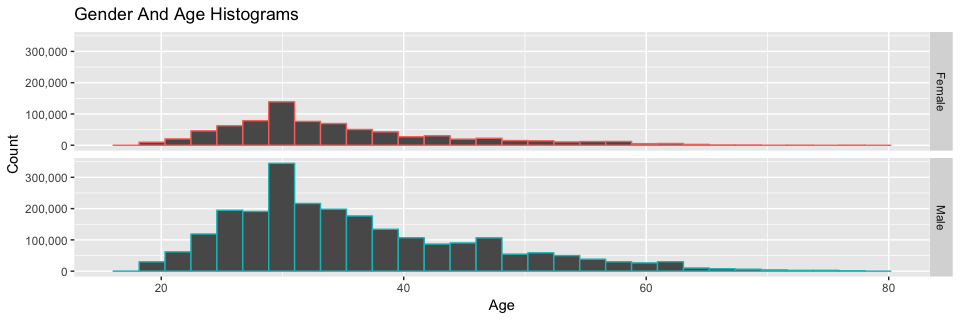
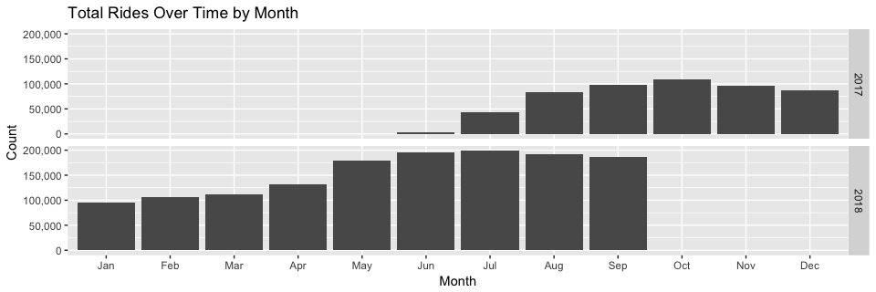
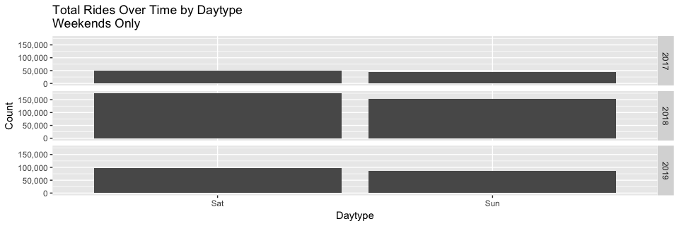

### Load Data

```r
setwd("~/Ford-GoBike/Clean Data")
load("FGB.RData")
```
## Visualizations
Note: These visualizations are based on individual trip records and not by individual unique users.

```r
FGB %>% filter(age <= 80 & user_type=="Subscriber") %>% ggplot(aes(x=age)) + geom_histogram() + 
xlab("Age") + ylab("Count") + ggtitle("Ride Count by Age") + scale_y_continuous(name="Count", labels = scales::comma)
```

<!-- -->


```r
FGB %>% filter(age <= 80 & user_type=="Customer") %>% ggplot(aes(x=age)) + geom_histogram() +
  xlab("Age") + ylab("Count") + scale_y_continuous(name="Count", labels = scales::comma) +
  ggtitle("Ride Count by Age")
```

<!-- -->


```r
FGB %>% ggplot(aes(x=member_gender)) + geom_bar() + 
  xlab("Gender")+ylab("Count") + scale_y_continuous(name="Count", labels = scales::comma) +
  ggtitle("Ride Gender Count")
```

<!-- -->


```r
FGB %>% filter(age <= 80) %>% filter(member_gender!="Other") %>% ggplot(aes(x=age, color=member_gender)) + 
  geom_histogram(position="identity") +
  xlab("Age") + ylab("Count") + scale_y_continuous(name="Count", labels = scales::comma) + 
  facet_grid(member_gender ~ .) + theme(legend.position="none") +
  ggtitle("Gender And Age Histograms")
```

<!-- -->

```r
FGB %>% filter(age <= 40) %>% filter(member_gender!="Other") %>% ggplot(aes(x=age, color=member_gender)) + 
  geom_histogram(position="identity") +
  xlab("Age") + ylab("Count") + scale_y_continuous(name="Count", labels = scales::comma) + 
  facet_grid(member_gender ~ .) + theme(legend.position="none") + stat_bin(bins=(40-18)) +
  ggtitle("Gender And Age Histograms")
```

<!-- -->


```r
FGB %>% ggplot(aes(x=start_monthlabel)) + geom_bar() + facet_grid(start_year ~ .) + 
  xlab("Month") + scale_y_continuous(name="Count", labels = scales::comma) +
  ggtitle("Total Rides Over Time by Month")
```

<!-- -->


```r
FGB %>% ggplot(aes(x=start_daytype)) + geom_bar() + facet_grid(start_year ~ .) + 
  xlab("Daytype") + scale_y_continuous(name="Count", labels = scales::comma) + 
  ggtitle("Total Rides Over Time by Daytype")
```

<!-- -->

```r
FGB %>% filter(start_daytype %in% c("Saturday","Sunday")) %>% ggplot(aes(x=start_daytype)) + geom_bar() + facet_grid(start_year ~ .) + 
  xlab("Daytype") + scale_y_continuous(name="Count", labels = scales::comma) + 
  ggtitle("Total Rides Over Time by Daytype \nWeekends Only")
```

<!-- -->

```r
FGB %>% filter(start_daytype %in% c("Monday","Tuesday","Wednesday","Thursday","Friday")) %>% ggplot(aes(x=start_daytype)) + geom_bar() + facet_grid(start_year ~ .) + 
  xlab("Daytype") + scale_y_continuous(name="Count", labels = scales::comma) + 
  ggtitle("Total Rides Over Time by Daytype \nWeekdays Only")
```

<!-- -->


```r
FGB %>% filter(duration_sec/60<30) %>% ggplot(aes(x=duration_sec/60)) + 
  stat_ecdf()  + scale_y_continuous(name="Cumulative Proportion", labels = scales::percent) + 
  scale_x_continuous(name="Duraction in Minutes", labels = scales::comma)+
  ggtitle(("Cumulative Duration Distribution \n(below 30 minutes)"))
```

<!-- -->


```r
FGB %>% filter(duration_sec/60<30) %>% ggplot(aes(x=duration_sec/60)) + 
  stat_ecdf()  + scale_y_continuous(name="Cumulative Proportion", labels = scales::percent) + 
  scale_x_continuous(name="Duraction in Minutes", labels = scales::comma)+
  ggtitle("Cumulative Duration Distribution by Year \n(below 30 minutes)")+facet_grid("start_year")
```

<!-- -->


```r
FGB %>% filter(start_hr %in% seq(0,23)) %>% ggplot(aes(x=start_hr)) + 
  geom_histogram(aes(y=..density..),position="identity") + stat_bin(bins=24) + 
  xlab("Start Hour") + 
  scale_y_continuous(name="Count", labels = scales::comma)+
  facet_grid(start_daytype ~ .)
```

<!-- -->


```r
FGB %>% filter(start_hr %in% seq(0,23) & start_daytype %in% c("Monday","Tuesday","Wednesday","Thursday","Friday")) %>% ggplot(aes(x=start_hr)) + 
  geom_histogram(aes(y=..density..),position="identity") + stat_bin(bins=24) + 
  xlab("Start Hour") + 
  scale_y_continuous(name="Count", labels = scales::comma)+
  facet_grid(start_daytype ~ .)
```

<!-- -->


```r
FGB %>% filter(start_hr %in% seq(0,23) & start_daytype %in% c("Saturday","Sunday")) %>% ggplot(aes(x=start_hr)) + 
  geom_histogram(aes(y=..density..),position="identity") + stat_bin(bins=24)+
  scale_y_continuous(name="Count", labels = scales::comma)+
  facet_grid(start_daytype ~ .)
```

<!-- -->


